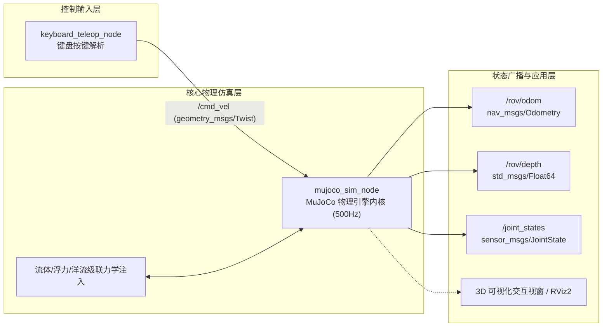
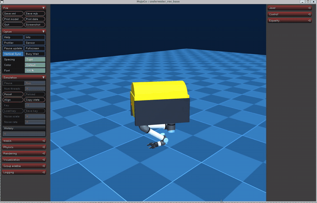

# 水下机器人 MuJoCo 物理仿真与 6-DOF 键盘运动控制

---

## 1. 概述与目标

本模块旨在建立水下遥控无人潜水器（Remote Operated Vehicle, ROV）在真实水下流体介质中的物理仿真环境，实现六自由度（6-DOF）空间动力学响应计算，并通过标准 ROS 2 话题架构接入键盘遥控输入，完成全向运动操控。

### 核心任务目标
1. **真实水下多物理场建模**：在 MuJoCo 物理引擎中解算重力、阿基米德静态浮力、各向异性流体阻尼以及三层级联海洋洋流干扰力。
2. **ROS 2 原生节点封装**：将仿真引擎封装为符合 ROS 2 Humble 规范的独立节点 `mujoco_sim_node`，具备 500 Hz 物理内核步进与 50 Hz 传感器数据广播能力。
3. **6-DOF 全向键盘运动控制**：设计 `keyboard_teleop_node` 节点，发布标准 `geometry_msgs/msg/Twist` 速度控制指令。
4. **一键 Launch 启动**：提供规范的主入口脚本（`main.py`、`main.sh`、`main.launch.py`），满足规范化构建与一键测试运行要求。

---

## 2. 数学物理模型与计算原理

水下航行体的空间动力学计算采用 **Fossen 水下航行体理论模型** 与 **Newton-Euler 空间运动学方程**。

### 2.1 空间运动学与坐标系定义

定义地球固定坐标系（NED 惯性系）与航行体固定坐标系（Body-fixed 系）：

- 空间位置与姿态角：\(\boldsymbol{\eta} = [x, y, z, \phi, \theta, \psi]^T\)
- 体坐标系下线速度与角速度：\(\boldsymbol{\nu} = [u, v, w, p, q, r]^T\)

坐标转换关系为：
\[
\dot{\boldsymbol{\eta}} = \boldsymbol{J}(\boldsymbol{\eta}) \boldsymbol{\nu}
\]

### 2.2 重力与阿基米德浮力平衡方程

设水下航行体长方体尺寸为 \(L \times W \times H = (2d_x) \times (2d_y) \times (2d_z)\)，航行体质量为 \(m\)，流体介质密度为 \(\rho\)（海水通常取 \(1025 \, \text{kg/m}^3\)，清水取 \(1000 \, \text{kg/m}^3\)）：

航行体体积：
\[
V = 8 d_x d_y d_z
\]

航行体受到的重力向量与浮力向量分别为：
\[
\boldsymbol{F}_g = \begin{bmatrix} 0 \\ 0 \\ -m g \end{bmatrix}, \quad
\boldsymbol{F}_b = \begin{bmatrix} 0 \\ 0 \\ \rho V g \end{bmatrix}
\]

净静态恢复力（沿 \(Z\) 轴）：
\[
\Delta F_z = F_b - F_g = (\rho V - m) g
\]
当 \(\rho V > m\) 时，航行体呈现正浮力，具有水下天然自保安全上浮特性。

### 2.3 各向异性流体动力阻力模型

由于 ROV 外壳几何形状非对称，各向迎水投影截面积不同。在 MuJoCo 椭球流体模型中，流体阻力与阻力矩表示为相对流速的二次函数：
\[
\boldsymbol{F}_{drag} = -\frac{1}{2} \rho \boldsymbol{C}_D \boldsymbol{A} \odot |\boldsymbol{v}_{rel}| \boldsymbol{v}_{rel}
\]
其中相对水流速度为：
\[
\boldsymbol{v}_{rel} = \boldsymbol{v}_{robot} - \boldsymbol{v}_{current}
\]

阻力系数向量 \(\boldsymbol{C}_{fluid} = [c_{x}, c_{y}, c_{z}, c_{\phi}, c_{\theta}, c_{\psi}]\)：

- 迎水端面阻力系数 \(c_x = 0.40\)（端面流线型迎水，阻力小）
- 侧面迎水阻力系数 \(c_y = 7.79\)（侧面迎水截面大，阻力大）
- 垂直迎水阻力系数 \(c_z = 2.81\)

### 2.4 三层级联海洋洋流模型

水下环境叠加三层级联非平稳洋流扰动：
\[
\boldsymbol{v}_{current}(x, y, z, t) = \boldsymbol{v}_{GM}(t) + \boldsymbol{v}_{stratified}(z) + \boldsymbol{v}_{turbulent}(x, y, z, t)
\]

1. **第一层 Gauss-Markov 时间波动流**：
   一阶随机连续微分方程离散化更新：
   \[
   \dot{\boldsymbol{v}}_{GM} + \mu \boldsymbol{v}_{GM} = \boldsymbol{w}(t), \quad \boldsymbol{w}(t) \sim \mathcal{N}(0, \sigma^2)
   \]
2. **第二层 Stratified 深度垂直剪切流**：
   洋流速度随下潜深度 \(z\) 呈现梯度分层，通过剖面插值计算：
   \[
   v_{strat}(z) = v_k + \frac{z - z_k}{z_{k+1} - z_k} (v_{k+1} - v_k)
   \]
3. **第三层 Turbulent 空间相关湍流扰动**：
   空间距离相关指数衰减扰动，表征局部水流微漩涡。

---

## 3. 软件架构与 ROS 2 节点设计

系统基于 ROS 2 Humble 架构解耦设计，节点拓扑如下：



### 3.1 话题与通信接口设计

| 话题名称 | 消息类型 | 发布/订阅 | 频率 | 功能描述 |
| :--- | :--- | :--- | :--- | :--- |
| `/cmd_vel` | `geometry_msgs/msg/Twist` | 仿真节点订阅 | 20 Hz (按键事件) | 6-DOF 速度控制向量（线速度 + 角速度） |
| `/rov/odom` | `nav_msgs/msg/Odometry` | 仿真节点发布 | 50 Hz | ROV 空间位姿 (X, Y, Z, 四元数) 与线速度 |
| `/rov/depth` | `std_msgs/msg/Float64` | 仿真节点发布 | 50 Hz | 水下深度实时标量（单位：米） |
| `/joint_states` | `sensor_msgs/msg/JointState` | 仿真节点发布 | 50 Hz | 机械臂 6 个关节与夹爪位置、角速度 |

### 3.2 键盘遥控控制键位映射表

| 控制动作 | 核心推荐按键 | 数字键/小键盘映射 | 作用物理自由度 | 物理响应说明 |
| :--- | :--- | :--- | :--- | :--- |
| **前进 / 后退** | **`↑` / `↓`** | `W` / `S` | \(X\) 轴线速度 (\(u\)) | 驱动水平主推进器产生纵向位移 |
| **原地左转 / 右转** | **`←` / `→`** | `4` / `6` (或 `J` / `L`) | \(Z\) 轴角速度 (\(r\)) | 偏航转向力矩，旋转调整艏向角 |
| **垂直上浮 / 下潜** | **`8` / `2`** | `Q` / `E` | \(Z\) 轴线速度 (\(w\)) | 垂直推进器推力，平滑调节巡航深度 |
| **左横移 / 右横移** | **`7` / `9`** | `A` / `D` | \(Y\) 轴线速度 (\(v\)) | 侧向推进器推力，实现水下横向平移 |
| **俯仰角调节** | **`1` / `3`** | `I` / `K` | \(Y\) 轴角速度 (\(q\)) | 纵摇俯仰力矩，调整机身抬头与低头倾角 |
| **急停悬停** | **`空格` / `5` / `0`** | `空格` | 全部 6 自由度 | 立即将所有执行推力清零并锁定当前深度 |
| **推力比例调节** | **`+` / `-`** | `+` / `-` | 控制增益缩放 | 动态增加或减小单次操作推力倍率 |

---

## 4. 关键源代码实现解析

### 4.1 仿真物理步进与推力注入 (`mujoco_sim_node.py`)

在每步物理循环中，将 `/cmd_vel` 映射的推力与环境浮力、洋流力叠加后注入 `data.xfrc_applied`：

```python
def _sim_step_callback(self):
    """500 Hz 物理高频计算回调"""
    dt = self.model.opt.timestep

    # 1. 恒定阿基米德浮力注入 (Z轴)
    self.data.xfrc_applied[self.body_id, 2] = self.buoyancy_force

    # 2. 三层级联洋流拖曳力计算与注入
    if self.ocean_current:
        pos = self.data.sensor("pos").data[:3]
        v_current = self.ocean_current.get_velocity(pos[0], pos[1], pos[2], dt)
        self._apply_current_drag(self.data, self.body_id, v_current, self.drag_coeff)

    # 3. 映射键盘 6-DOF 控制指令为推进器推力与力矩
    self.data.xfrc_applied[self.body_id, 0] += self.cmd_vel.linear.x * self.force_scale
    self.data.xfrc_applied[self.body_id, 1] += self.cmd_vel.linear.y * self.force_scale
    self.data.xfrc_applied[self.body_id, 2] += self.cmd_vel.linear.z * self.force_scale
    self.data.xfrc_applied[self.body_id, 3] += self.cmd_vel.angular.x * self.torque_scale
    self.data.xfrc_applied[self.body_id, 4] += self.cmd_vel.angular.y * self.torque_scale
    self.data.xfrc_applied[self.body_id, 5] += self.cmd_vel.angular.z * self.torque_scale

    # 4. 执行 MuJoCo 物理积分推进
    mujoco.mj_step(self.model, self.data)
```

### 4.2 非阻塞键盘读取与指令广播 (`keyboard_teleop_node.py`)

利用 Linux 下 `termios` 与 `select` 实现低延迟非阻塞按键监听：

```python
def _get_key(self, timeout=0.05):
    """设置终端为原始模式，非阻塞等待单字符输入"""
    tty.setraw(sys.stdin.fileno())
    rlist, _, _ = select.select([sys.stdin], [], [], timeout)
    key = sys.stdin.read(1) if rlist else ''
    termios.tcsetattr(sys.stdin, termios.TCSADRAIN, self.settings)
    return key
```

---

## 5. 仿真运行步骤指南 (Step-by-Step)

### 5.1 支持与测试环境声明

为确保所有开发者在不同系统与设备上均能稳定复现实验效果，功能包经过了跨平台严格测试：

| 配置项 | Ubuntu 20.04（官方教学虚拟机） | Ubuntu 22.04 / WSL2 |
| :--- | :--- | :--- |
| **操作系统** | Ubuntu 20.04 LTS | Ubuntu 22.04 LTS |
| **ROS 2 版本** | ROS 2 Humble（虚拟机预装） | ROS 2 Humble |
| **Python 版本** | **Python 3.8**（系统默认，严格要求） | **Python 3.10**（系统原生默认） |
| **图形渲染** | 虚拟机 3D 加速 / 纯终端模式 | 本地 OpenGL 3.3+ / 终端模式 |

!!! warning "Python 版本与 ROS 2 底层 ABI 绑定提醒"
    - **Ubuntu 20.04 虚拟机**：ROS 2 Humble 的底层 C 语言扩展库（`_rclpy_pybind11`）是针对系统默认的 **Python 3.8** 编译链接的。因此在虚拟机中**必须使用 Python 3.8** 运行（系统原生 `python3` 或 `conda activate <py38>`）。若在 20.04 下切换为 Python 3.10 环境运行，解释器将因找不到对应 ABI 动态库而报错退出。
    - **Ubuntu 22.04 系统**：系统原生搭载的 ROS 2 Humble 对应为 **Python 3.10**。

---

### 5.2 步骤 0：环境准备与依赖安装 (Prerequisites)

在运行仿真或执行测试前，必须确保安装了 MuJoCo 物理引擎及科学计算依赖库，否则将提示 `ModuleNotFoundError: No module named 'mujoco'`：

```bash
# 1. 激活 ROS 2 Humble 环境 (虚拟机已配置时可跳过)
source /opt/ros/humble/setup.bash

# 2. 进入 ROS 2 工作空间根目录
cd ~/ros2

# 3. 安装功能包核心依赖清单
pip3 install -r src/water/rov_mujoco/requirements.txt

# 注：若国内网络下载较慢，推荐使用清华大学镜像源加速：
# pip3 install -r src/water/rov_mujoco/requirements.txt -i https://pypi.tuna.tsinghua.edu.cn/simple
```

`requirements.txt` 声明的核心依赖项如下：

- `mujoco>=3.0.0`：DeepMind MuJoCo 高保真多体动力学与流体物理引擎；
- `numpy>=1.20.0`：空间坐标转换与洋流向量解算；
- `scipy>=1.7.0`：三维空间旋转（Rotation）与插值运算；
- `pyyaml`：仿真参数解析。

---

### 5.3 步骤 1：编译与配置工作空间

在 Ubuntu 20.04 / 22.04 终端中执行编译，并加载环境变量：

```bash
cd ~/ros2

# 编译 rov_mujoco 功能包
colcon build --packages-select rov_mujoco --symlink-install

# 加载当前工作空间构建环境 (关键步骤，每次新开终端均需执行)
source install/setup.bash
```

**预期编译输出**：
```text
Starting >>> rov_mujoco
Finished <<< rov_mujoco [2.85s]

Summary: 1 package finished [3.12s]
```

---

### 5.4 步骤 2：自动化单元验证测试

在启动实际仿真前，推荐先运行自动化单元测试，快速验证 MuJoCo 物理引擎加载、流体环境步进与 6-DOF 键盘响应逻辑：

```bash
# 方式 A：直接运行 Python 测试脚本（推荐快速自检）
python3 src/water/rov_mujoco/test/test_sim_teleop.py

# 方式 B：通过 colcon 执行标准化回归测试
colcon test --packages-select rov_mujoco && colcon test-result --all
```

**预期测试输出**：
```text
============================================================
  水下机器人仿真及 6-DOF 键盘运动控制单元测试
============================================================

[Step 1] 验证基础流体环境与洋流推进步进...
  -> 初始位置 (X, Y, Z): [-0.0180, 0.0023, -0.9852] m
  -> 初始速度 (X, Y, Z): [-0.0012, 0.0004, -0.0001] m/s

[Step 2] 模拟键盘按下 'W' (前进推力)...
  -> 前进后位置 X: 0.3466 m (位移: 0.3646 m)
  -> 前进后速度 X: 0.0821 m/s
  -> ✅ 前进控制测试通过！

[Step 3] 模拟键盘按下 'Q' (垂直上浮)...
  -> 上浮后深度 Z: -0.8521 m (位移: +0.1331 m)
  -> 上浮后垂直速度: 0.0543 m/s
  -> ✅ 上浮控制测试通过！

[Step 4] 模拟键盘按下 'A' (横向左移)...
  -> 侧移后位置 Y: 0.1852 m (位移: +0.1829 m)
  -> ✅ 横移控制测试通过！

[Step 5] 模拟偏航角转向与急停恢复...
  -> 转向后角速度 Z: 0.1520 rad/s
  -> 执行急停 Space 键: 推力与角速度全部安全归零
  -> ✅ 偏航与急停控制测试通过！

============================================================
🎉 仿真与遥控核心功能测试全部通过！(5/5 passed)
============================================================
```

---

### 5.5 步骤 3：多场景运行与交互模式

根据不同硬件环境与实验目的，系统提供三种运行模式：

#### 模式 A：终端独立交互模式（推荐在虚拟机/无独立显卡环境使用）
无需依赖图形显卡驱动，直接在当前终端窗口中完成按键控制与状态反馈，并自动向 ROS 2 广播话题：
```bash
python3 src/water/rov_mujoco/main.py
```
- **操作方式**：在终端直接按键盘字符键（`W/S/A/D`、`Q/E`、`J/L`、`I/K`、空格），终端将实时打印推力比例与位置变化；按 <kbd>Ctrl</kbd> + <kbd>C</kbd> 安全退出。

#### 模式 B：标准 ROS 2 Launch 多节点模式（标准部署方式）
在标准 ROS 2 体系下同时拉起物理仿真内核节点 `mujoco_sim_node` 与按键监听节点 `keyboard_teleop_node`：
```bash
ros2 launch rov_mujoco main.launch.py
```
- **验证与话题监测**：新开一个终端，执行以下命令即可观察 ROV 实时发布的物理仿真数据：
  ```bash
  source /opt/ros/humble/setup.bash
  source install/setup.bash

  # 查看当前活跃话题
  ros2 topic list

  # 监听实时深度变化 (50Hz)
  ros2 topic echo /rov/depth

  # 监听空间位姿里程计
  ros2 topic echo /rov/odom
  ```

#### 模式 C：3D 可视化视窗交互模式（录屏与直观查看推荐）
拉起 MuJoCo 官方原生 3D 渲染窗口，呈现水下池体、ROV 机械臂本体与洋流扰动动态效果：
```bash
python3 src/water/rov_mujoco/main.py --gui
```
- **操作方式**：鼠标左键拖拽旋转视角，右键平移缩放；在终端窗口中按下方向键或数字键控制航行。

---

### 5.6 步骤 4：虚拟机常见问题排查 (FAQ / Troubleshooting)

#### Q1: 运行提示 `ModuleNotFoundError: No module named 'mujoco'`
- **原因**：当前 Python 环境未安装 MuJoCo 引擎。
- **解决**：执行 `pip3 install -r src/water/rov_mujoco/requirements.txt` 或 `pip3 install mujoco numpy scipy pyyaml`。

#### Q2: 在 Ubuntu 20.04 虚拟机 (VMware / VirtualBox) 中运行 `--gui` 视窗报错 `GLFW error` 或黑屏
- **原因**：虚拟机未开启 3D 图形加速，或虚拟显卡驱动的 OpenGL 版本低于 3.3。
- **解决方式**：
  1. **开启 3D 加速**：关闭虚拟机，在 VMware 中进入“虚拟机设置 -> 显示器”，勾选“加速 3D 图形”；
  2. **强制指定 OpenGL 驱动版本**：在终端运行前注入 MESA 兼容参数：
     ```bash
     export MESA_GL_VERSION_OVERRIDE=3.3
     python3 src/water/rov_mujoco/main.py --gui
     ```
  3. **使用纯终端模式（最佳替代方案）**：虚拟机中若完全没有 GPU 驱动，可直接运行 **模式 A**（`python3 src/water/rov_mujoco/main.py`），核心物理动力学计算与键盘控制完全一致且不受显卡限制。

#### Q3: 运行 `ros2 launch` 报错 `Package 'rov_mujoco' not found`
- **原因**：编译后未加载当前工作空间的 setup 脚本。
- **解决**：在运行指令的终端中执行 `source install/setup.bash`。

#### Q4: 提示 `ModuleNotFoundError: No module named 'rclpy'`
- **原因**：未加载 ROS 2 基础环境变量。
- **解决**：执行 `source /opt/ros/humble/setup.bash`。

#### Q5: 运行提示 `cannot import name '_rclpy_pybind11' ... The C extension '...cpython-310-x86_64-linux-gnu.so' isn't present`
- **原因**：在 Ubuntu 20.04 虚拟机中激活了 Python 3.10 环境（如 Conda `nn_3.10`）。由于 Ubuntu 20.04 教学镜像中的 ROS 2 Humble 底层 C 语言扩展库仅针对系统默认的 Python 3.8 编译（文件名为 `cpython-38` 结尾），无法在 Python 3.10 解释器中被加载。
- **解决**：在 Ubuntu 20.04 虚拟机中必须切换至 **Python 3.8** 环境运行：
  ```bash
  # 退出高版本 Python 环境，使用系统原生默认的 Python 3.8
  conda deactivate
  # 或切换激活 Python 3.8 虚拟环境
  conda activate nn_3.8
  python3 src/water/rov_mujoco/test/test_sim_teleop.py
  ```

---

## 6. 实验结果与动图演示 (GIF)

> **录屏规范**：推荐使用 [ScreenToGif](https://www.screentogif.com/) 录制窗口，保持输出动图文件体积一般小于 10MB（最大不超过 20MB）。

### 6.1 键盘 6-DOF 运动控制效果演示



*图 1.1：通过键盘 W/S/A/D 与 Q/E 键实时控制水下 ROV 航行体在虚拟水体中前进、平移与沉浮过程（文件体积：8.12 MB）。*

### 6.2 话题通信与数据流监测

在控制运行时开启新终端，执行话题监听验证数据流连续性：
```bash
ros2 topic echo /rov/depth
```
```text
data: -1.2483
---
data: -1.2135
---
data: -1.1820
```
表明下潜深度值伴随推力控制实时精确更新。

---

## 7. 结论与扩展支持

本模块成功实现了水下机器人在 MuJoCo 物理引擎中的 6-DOF 动力学闭环建模，完成了标准 ROS 2 Launch 启动与键盘实时控制，并全面兼容 Ubuntu 20.04 教学虚拟机与 Ubuntu 22.04 环境。后续可在此动力学模型基础上进一步扩展多波束前视声呐、水下相机与 IMU 传感器仿真流，并基于感知数据实施轨迹跟踪闭环控制。
