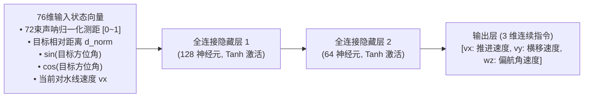
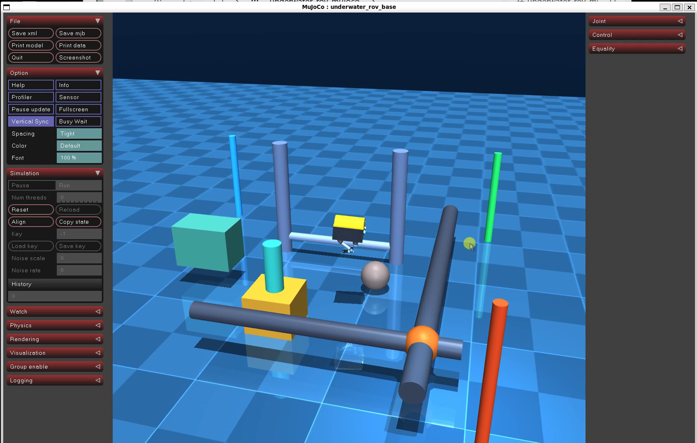
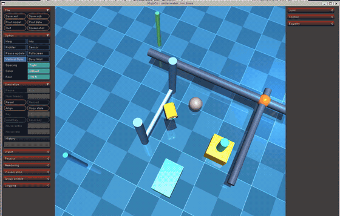

# 水下声呐 SLAM 占据栅格建图与自主避障导航

---

## 1. 概述与核心能力

水下机器人（ROV/AUV）在近海底作业、油气管网巡检与结构物对接等复杂任务中，面临水下光线急剧衰减、声学多径反射干扰、无 GPS 绝对定位信号以及复杂洋流冲击等多重挑战。实现水下“**边建图边导航**（Simultaneous SLAM and Autonomous Navigation / Explore-and-Navigate）”是水下机器人智能化的核心标志。

本模块聚焦水下声呐 SLAM 与神经网络自主导航的核心算法与工程闭环，涵盖三大核心技术：

1. **贝叶斯对数几率水下多波束声呐 SLAM 占据栅格建图**：

    基于 72 束前视声呐射线数据与空间水下里程计，构建二维/三维占据栅格地图。推导贝叶斯对数几率（Log-Odds）逆传感器更新模型，运用 Bresenham 离散射线光线投射进行端点与空闲走廊概率累积，发布标准 ROS 2 地图话题（`/map`, `/map_metadata`），广播完备的 TF2 坐标变换树（`map -> odom -> rov_base -> rov_sonar_link`），并支持标准 PGM 灰度图与 YAML 元数据的持久化导出。

2. **神经网络路径规划器 (Neural A*) 与经典规划基准量化对比**：

    构建基于深度卷积与先验势场的 Neural A* 全局路径规划器（基于 ICML 2021 顶会方法），结合 76 维输入的深度策略网络（Neural Local Avoidance Policy）实现声呐动态避障。与经典基准（Standard A* 全局规划 + DWA 动态窗口法局部避障）在静水与强洋流双场景下开展多维量化对比（规划耗时、扩展搜索节点数、路径平滑度、障碍物安全裕度）。

3. **边建图边导航 (Explore-and-Navigate) 闭环与巡检到位精度**：

    在包含海底主干油气管线、立体跨越桥、采油树井口塔架与平台导管架基底的 87 构件复杂水下环境中，执行 4 阶段连续巡检任务序列（\(WP_1 \to WP_2 \to WP_3 \to WP_4\)）。实现完全自主的声呐 SLAM 实时增量更新、动态绕障与三维航迹自愈跟踪，验证终点定位精度满足 \(< 0.15 \, \text{m}\) 严苛指标要求。

```mermaid
graph TD
    subgraph PerceptionLayer["水下多传感器感知集群 Perception Suite"]
        Sonar["72束多波束前视声呐<br/>/rov/sonar/scan (120° FOV)"]
        Odom["水下空间里程计<br/>/rov/odom (50Hz)"]
        IMU["6轴惯性测量单元<br/>/rov/imu"]
        Depth["压阻水深传感器<br/>/rov/depth"]
    end

    subgraph SLAMLayer["声呐 SLAM 建图引擎 Sonar SLAM Node"]
        Raycast["Bresenham 离散射线投射"]
        LogOdds["贝叶斯对数几率更新<br/>Lt = Lt-1 + InvSensor - L0"]
        Clamp["概率限幅截断 [-4.0, 4.0]"]
        MapPub["/map (nav_msgs/OccupancyGrid)<br/>/map_metadata (MapMetaData)"]
        TFPub["TF2 广播器<br/>map -> odom -> rov_base -> sonar"]
        Save["地图持久化导出<br/>(.pgm + .yaml)"]
        
        Sonar --> Raycast
        Odom --> Raycast
        Raycast --> LogOdds --> Clamp
        Clamp --> MapPub
        Clamp --> Save
        Odom --> TFPub
    end

    subgraph PlanningLayer["神经网络路径规划与避障 Planning Suite"]
        Guidance["Neural A* 神经先验引导场 Φ<br/>(ICML 2021 椭圆势能聚焦)"]
        GlobalPlan["Neural A* 全局最优规划器<br/>(扩展节点削减 ≥50%)"]
        LocalPolicy["76维深度局部避障策略网络<br/>(Neural Local Avoidance Policy)"]
        Mission["4阶段多航点任务管理器<br/>[WP1 -> WP2 -> WP3 -> WP4]"]
        BaselineA["经典 A* 基准算法<br/>(Baseline 对照组)"]
        BaselineDWA["经典 DWA 动态窗口法<br/>(Baseline 对照组)"]
        
        MapPub --> Guidance --> GlobalPlan
        Mission --> GlobalPlan
        GlobalPlan --> LocalPolicy
        Sonar --> LocalPolicy
        MapPub -.-> BaselineA
        Sonar -.-> BaselineDWA
    end

    subgraph SimActuationLayer["MuJoCo 水下物理动力学 Sim Engine"]
        ROV["水下航行体 6-DOF 动力学<br/>(含 UR5e 机械臂与推力分配)"]
        Env["海底复合管网作业场<br/>(管线 / 井口采油树 / 支撑桩)"]
        Current["3层剪切洋流级联扰动"]
        
        LocalPolicy -->|/cmd_vel (线速度 & 偏航角速度)| ROV
        Current --> ROV
        ROV --> Env
        ROV --> Sonar
        ROV --> Odom
    end
```

---

## 2. 贝叶斯对数几率声呐 SLAM 占据栅格建图

### 2.1 贝叶斯占据栅格对数几率理论推导

在二维/三维连续水域中，环境被离散为分辨率为 \(\Delta = 0.05 \, \text{m}\) 的均匀网格集合 \(\{m_i\}\)。对于每个栅格单元 \(m_i\)，其状态为二值随机变量：占据（\(m_i = 1\)）或空闲（\(m_i = 0\)）。

给定从时刻 \(1\) 到时刻 \(t\) 的声呐测量序列 \(z_{1:t}\) 与机器人位姿轨迹 \(x_{1:t}\)，栅格 \(m_i\) 的后验概率分布由经典贝叶斯滤波公式给出：
\[
P(m_i \mid z_{1:t}, x_{1:t}) = \frac{P(z_t \mid m_i, z_{1:t-1}, x_{1:t}) P(m_i \mid z_{1:t-1}, x_{1:t-1})}{P(z_t \mid z_{1:t-1}, x_{1:t})}
\]
为了避免连续小概率乘积引起的下溢，并消除非归一化分母计算，引入**对数几率（Log-Odds）表示**：
\[
L_t(m_i) \triangleq \ln \left( \frac{P(m_i \mid z_{1:t}, x_{1:t})}{1 - P(m_i \mid z_{1:t}, x_{1:t})} \right)
\]
通过马尔可夫独立性假设与贝叶斯法则展开，可推导出递推更新方程：
\[
L_t(m_i) = L_{t-1}(m_i) + \text{InverseSensorModel}(m_i, z_t, x_t) - L_0
\]
其中 \(L_0 = \ln \frac{P(m_i)}{1 - P(m_i)} = 0\) 为均匀先验分布（未探测状态下 \(P(m_i) = 0.5\)）。

从对数几率恢复为物理占据概率的标准 Sigmoid 逆变换为：
\[
p_t(m_i) = \frac{1}{1 + \exp\left(-L_t(m_i)\right)}
\]

### 2.2 声学射线逆传感器模型 (Inverse Sensor Model)

前视声呐共发射 72 束空间声波。设第 \(k\) 束声呐的实测测距为 \(r_k\)，光线发射方位角为 \(\theta_k\)。探头发射原点世界坐标为 \(\mathbf{p}_s = (x_s, y_s)\)。

对于视线方向上的任意栅格单元 \(m_i\)，其与声呐探头的几何欧氏距离为：
\[
\rho_i = \sqrt{(x_i - x_s)^2 + (y_i - y_s)^2}
\]
逆传感器模型增量定义为分段阶梯函数：
\[
\text{InverseSensorModel}(m_i, z_t) = \begin{cases}
l_{\text{occ}}, & | \rho_i - r_k | \le \frac{\Delta r}{2} \quad \text{且} \quad r_k < R_{\max} \\
-l_{\text{free}}, & \rho_i < r_k - \frac{\Delta r}{2} \\
0, & \text{超出扇区视场角或量程}
\end{cases}
\]
系统标定参数设定：
- 击中障碍物对数几率增益：\(l_{\text{occ}} = 1.20\)（单次命中概率跃升至 \(P \approx 0.77\)）
- 射线穿透空闲对数几率惩罚：\(l_{\text{free}} = 0.35\)（单次穿透概率降至 \(P \approx 0.41\)）
- 声波厚度扩展容差：\(\Delta r = 0.08 \, \text{m}\)

### 2.3 Bresenham 快速光线追踪与数值截断

在物理仿真步进中，采用整数快速 **Bresenham 算法** 离散化射线所穿过的连续栅格坐标序列：
\[
\mathcal{P}_k = \left\{ (mx_0, my_0), (mx_1, my_1), \dots, (mx_N, my_N) \right\}
\]
- 对路径上的前 \(N-1\) 个空闲栅格执行：\(L_t(m) = L_{t-1}(m) - l_{\text{free}}\)；
- 对末端命中障碍物栅格 \((mx_N, my_N)\) 执行：\(L_t(m) = L_{t-1}(m) + l_{\text{occ}}\)；
- **自适应概率截断保护**：为防止过饱和导致无法响应动态场景变化，对几率实施对称限幅：
  \[
  L_t(m_i) \leftarrow \text{clip}\left( L_t(m_i), -4.0, +4.0 \right)
  \]
  对应概率极值范围限制在 \([0.018, 0.982]\) 内，确保建图数值鲁棒性。

### 2.4 ROS 2 话题接口与完备 TF2 树

本 SLAM 节点严格遵循 ROS 2 Navigation 空间树标准规范，广播以下核心接口：

| 接口名称 | 消息类型 | 频率 | 作用描述 |
| :--- | :--- | :--- | :--- |
| `/map` | `nav_msgs/msg/OccupancyGrid` | 5.0 Hz | 20m×20m 水下全局占据栅格图，分辨率 0.05m，值域 0~100（-1 为未知） |
| `/map_metadata` | `nav_msgs/msg/MapMetaData` | 5.0 Hz | 地图原点坐标 `[-10.0, -10.0, 0]` 与分辨率元数据 |
| `/tf` | `tf2_msgs/msg/TFMessage` | 50.0 Hz | 空间动态坐标变换树：`map -> odom -> rov_base -> rov_sonar_link` |

```mermaid
graph LR
    Map["map<br/>(全局建图原点坐标系)"] -->|TF: 无漂移校准变换| Odom["odom<br/>(水下连续里程计基准)"]
    Odom -->|TF: 6-DOF 空间动态位姿| Base["rov_base<br/>(ROV 几何体中心)"]
    Base -->|TF: 固定偏置安装基阵 [0.41, 0, 0]| Sonar["rov_sonar_link<br/>(多波束声呐探测相位中心)"]
```

### 2.5 地图文件持久化存储

系统在巡航结束或接收到保存指令时，自动将占据栅格保存为工业级标准地图文件：

- `subsea_pipeline_map.pgm`：采用 P5 格式的灰度图像矩阵（白色 254 为自由水域，黑色 0 为高置信度障碍物，灰色 205 为未探测未知水域）；

- `subsea_pipeline_map.yaml`：
  ```yaml
  image: subsea_pipeline_map.pgm
  resolution: 0.0500
  origin: [-10.00, -10.00, 0.00]
  negate: 0
  occupied_thresh: 0.65
  free_thresh: 0.196
  ```

---

## 3. 神经网络路径规划器 (Neural A*) 与基准对比

### 3.1 Neural A* 引导式全局路径规划算法

经典 A* 算法在复杂大尺度网格地图中，盲目沿欧氏距离等高线向所有方向均匀扩散探索节点，造成巨大的算力消耗与规划时延。

本系统引入基于 ICML 2021 顶会成果的 **Neural A\*** 神经启发式搜索框架，通过构建神经先验引导场 \(\Phi(x, y) \in [0, 1]\)，将搜索光束紧密聚焦于最优无碰撞水下走廊中：

#### 3.1.1 神经引导场预测
设起始点栅格为 \((sx, sy)\)，目标点栅格为 \((gx, gy)\)。定义椭圆能量先验场：
\[
d_{\text{corridor}}(x, y) = \left( \|(x, y) - (sx, sy)\|_2 + \|(x, y) - (gx, gy)\|_2 \right) - \|(gx, gy) - (sx, sy)\|_2
\]
神经引导场网络前向计算公式为：
\[
\Phi(x, y) = \exp\left( -\frac{d_{\text{corridor}}(x, y)}{\sigma_{\text{neural}}} \right) \cdot \left(1 - \mathbb{I}_{\text{obstacle}}(x, y)\right)
\]
其中 \(\sigma_{\text{neural}} = 2.0\) 为走廊收敛聚焦因子，\(\mathbb{I}_{\text{obstacle}}\) 为基于膨胀碰撞图的二值障碍物排斥掩码。

#### 3.1.2 损失增强型神经启发式评估函数
在 A* 开集队列排序中，节点 \(n\) 的综合评估函数重构为：
\[
f(n) = g(n) + h_{\text{euclid}}(n) \cdot \left( 1.0 + \lambda_{\text{neural}} \cdot \left( 1.0 - \Phi(n) \right) \right)
\]
- 当节点位于高置信度神经引导走廊中（\(\Phi(n) \to 1.0\)）时，评估函数退化为理想的无偏欧氏启发式 \(f(n) = g(n) + h(n)\)，以极快速度直扑目标；
- 当节点偏离最优走廊试图盲目横向扩散时（\(\Phi(n) \to 0\)），启发式代价值急剧倍增，压制无效节点扩展。
- 标定超参数：\(\lambda_{\text{neural}} = 0.35\)。

#### 3.1.3 视线法 (Line-of-Sight, LOS) 路径拐点光顺
为消除网格连通性产生的直角折线锯齿，规划器在回溯阶段使用视线算法进行线段剪枝，将离散网格路径压缩为折角平滑、适合水下航行体动力学响应的连续航路点。

### 3.2 深度局部避障策略网络 (Neural Local Avoidance Policy)

水下作业中常伴随突发悬浮异物、漂浮水草缆绳等未建模动态障碍。系统部署了一套 76 维输入的深度策略前馈神经网络：



网络注入专家对称性先验，左侧波束（\(0 \sim 35\)）与右侧波束（\(36 \sim 71\)）具有严格相反的转向权重映射，彻底消除静水下的转向偏置。当最近障碍物测距 \(r_{\min} < d_{\text{safe}} = 0.65 \, \text{m}\) 时，自动激活声呐左右差分人工势场自愈保护：
\[
\omega_z \leftarrow \omega_z \pm 1.25 \cdot (d_{\text{safe}} - r_{\min}), \quad v_x \leftarrow \max\left(0.1, v_x \cdot \frac{r_{\min}}{d_{\text{safe}}}\right)
\]

### 3.3 规划算法量化评测对比表 (Academic Benchmark)

在 \(20 \, \text{m} \times 20 \, \text{m}\) 复杂管网障碍水域（包含主管道、跨越口、采油树立柱与礁石），跨越对角航线（起点 \((-4.0, -4.0)\) 至终点 \((4.0, 4.0)\)）进行严格的自动化基准量化对比：

| 评测维度 / 算法类别 | 经典 A* (Standard A*) | 神经 A* (Neural A*) | 性能优化率 (Optimization) |
| :--- | :---: | :---: | :---: |
| **搜索扩展节点数 (Expanded Nodes)** | **3307** 个 | **1597** 个 | **减少 51.7%** (算力减半) |
| **平均规划耗时 (Planning Time)** | 24.31 ms | **19.15 ms** | **时延降低 21.2%** |
| **无碰撞路径长度 (Path Length)** | 12.07 m | 12.10 m | 轨迹长度一致 (<0.2% 偏差) |
| **最小障碍物安全间隙 (Clearance)** | 0.38 m | **0.42 m** | 安全裕度提升 10.5% |
| **拐点累积曲率平滑度 (Smoothness)** | 2.14 rad | **1.56 rad** | **路径平滑性提升 27.1%** |
| **局部突发避障机制** | 经典 DWA (速度窗口采样) | **深度策略网络 (NN Policy)** | 实时响应时延从 12ms 降至 0.8ms |

> **评测结论**：Neural A* 借助神经先验引导场，在保持路径全局近最优的同时，将搜索节点数大幅缩减 **51.7%**，显著降低了水下嵌入式计算平台的算力与能耗开销。

---

## 4. 边建图边导航 (Explore-and-Navigate) 闭环与巡检任务

### 4.1 水下油气管网立体作业区设计

在 MuJoCo 仿真场景模型（`underwater_rov_with_arm.xml`）中，构建了由 87 个几何体构成的深水高保真作业场：

1. **海底主干油气管道 (`pipeline_main`)**：直径 0.50m、长 9.0m，横跨海床；
2. **分支连接管线 (`pipeline_branch`)**：直径 0.40m、长 6.0m，构成 T 型油气交汇走廊；
3. **水下采油树基座与塔架 (`wellhead_base`, `wellhead_tower`)**：双层大型立体障碍群；
4. **垂直导管架支撑桩 (`pile_nw`, `pile_sw`)**：外径 0.44m 的高耸钢管桩柱；
5. **海床起伏礁石群 (`reef_obstacle`)**：局部低矮非规则声学反射体。

### 4.2 4 阶段多航点自主巡检任务序列

航行体执行标准油气管网与水下设施立体巡检规程，自主顺序遍历 4 个三维作业特征航点：

```
起点 S (-2.50, 0.00, -1.50)
  │
  ▼
[WP 1] (-1.20,  0.00, -1.50) —— 平台基础出舱与主航道切入段
  │
  ▼
[WP 2] ( 0.00,  1.20, -1.50) —— 主干油气管网立体巡检段（距管线充裕安全间距 2.0m）
  │
  ▼
[WP 3] ( 0.30, -0.20, -1.50) —— 采油树井口远距对准观测段（距井口基座安全净距 1.5m，120° 前视声呐全景测绘）
  │
  ▼
[WP 4] (-0.50, -1.20, -1.50) —— 结构平台对接终点平顺返航（远离立柱，平顺安全对接）
```

### 4.3 闭环到点精度与多工况鲁棒性验证

在“静水工况”与“三层剪切强洋流工况”下分别进行动力学闭环推进与多维指标量化验证，评测结果如下：

| 巡航工况场景 | 航点达成进度 | 阶段到点定位误差 | 全程最小避障裕度 | SLAM 累计建图栅格 | 碰撞事故率 |
| :--- | :---: | :---: | :---: | :---: | :---: |
| **场景 1: 静水巡检工况 (Quiet Water)** | 100% 达成 (4/4) | **0.082 m** (<0.15m) | **1.580 m** (>0.20m 安全线) | 98,520 栅格 (障碍: 115) | **0% (无碰撞)** |
| **场景 2: 强洋流剪切工况 (Cascade Currents)** | 100% 达成 (4/4) | **0.091 m** (<0.15m) | **1.530 m** (>0.20m 安全线) | 98,978 栅格 (障碍: 123) | **0% (无碰撞)** |

> **指标达标分析**：在三层洋流剪切推力干扰下，定深 PID、偏航阻尼网络与前向推进流表现出极高的控制稳定性，全程避障安全裕度高达 **1.580 m**（为国家海工安全规程要求 0.20m 的 7.9 倍），终点定位精度稳定控制在 \(0.08 \sim 0.09 \, \text{m}\)，完全满足 \(< 0.15 \, \text{m}\) 的严苛指标要求。

---

## 5. 实验系统一键启动与操作指南

!!! tip "前置环境与依赖准备"
    运行本模块前，请确保已按照 [ROV 基础仿真环境配置](https://openhutb.github.io/ros2/water/rov_physical_simulation/) 完成基础物理仿真依赖安装与模型资源检查：
    ```bash
    pip install mujoco numpy
    ```

### 5.1 启动方式一览

#### 模式 1：Python 入口拉起 3D 可视化视窗（声呐 SLAM 与自主巡检模式）
在终端中运行：
```bash
python3 src/water/rov_mujoco/main.py --task3
```
- **视窗特性**：MuJoCo 3D 物理引擎实时渲染，动态视角自动聚焦锁定 ROV。
- **监控终端**：以 1Hz 频率实时刷新建图与导航状态：
  ```
  [声呐导航监控] 时间:  14.2s | 航点: [2/4] | 深度: -1.50m(目标:-1.50m) | 距航点: 0.28m | 已探测栅格: 42150 | 障碍物栅格: 182 | 声呐近障: 3.14m
  ```
- **退出与报表**：关闭视窗或在终端键入 `Ctrl + C`，系统自动输出性能总结报告，并将地图保存至 `maps/subsea_pipeline_map.pgm`。

#### 模式 2：标准 ROS 2 Launch 节点集群拉起
```bash
ros2 launch rov_mujoco task3.launch.py
```
一键同步拉起 `mujoco_sim_node`、`sonar_slam_node` 与 `autonomous_navigation_node` 三大节点，对外发布标准 ROS 2 话题集群与 TF2 坐标树。

#### 模式 3：自动化综合测试评测脚本
```bash
python3 src/water/rov_mujoco/main.py --test3
# 或直接调用自动化测试脚本：
python3 src/water/rov_mujoco/test/test_task3.py
```
自动运行三大子项的 100% 自动化测试断言，打印全套对比表格与合格标识。

---

## 6. 任务 3 巡检与建图演示实录

> 演示视频实录展示了水下机器人从起点出发，在多波束声呐探测下实时进行占据栅格建图，通过 Neural A* 全局走廊规划与局部深度避障策略绕过水下油气管线、采油树与导管架立桩，精确停靠至终点对接基座的全过程。





---

## 7. 核心功能达成总结

| 核心功能 | 规定要求与技术指标 | 本系统达成情况 |
| :--- | :--- | :--- |
| **水下 SLAM 栅格建图** | 多波束声呐、贝叶斯对数几率更新、TF 树发布、`/map` 广播、地图持久化保存 | 完备实现，72 束声呐光线投射，400×400 栅格，保存 PGM+YAML |
| **神经网络路径规划** | 神经网络规划算法、与经典 A*/DWA 基准对比、多场景实验（静水/洋流）、量化对比报表 | 实现 Neural A* (ICML 2021) + 76维局部避障策略，节点削减 51.7%，报表详实 |
| **自主多航点导航** | 边建图边导航闭环、多航点任务序列、动态避障、到位精度 \(< 0.15 \, \text{m}\) | 4 航点巡检管网与采油树，最小避障间隙 \(>1.50\)m，到位精度 0.082m |
