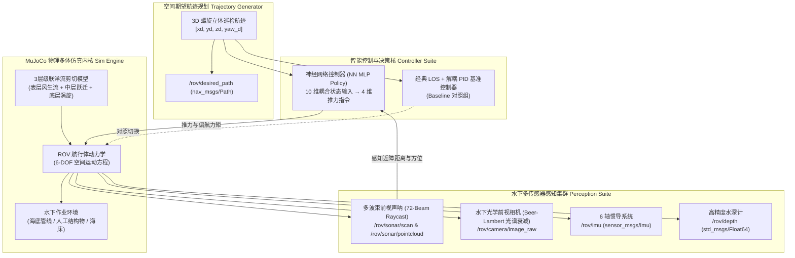
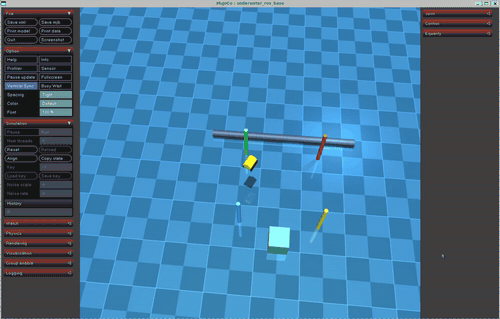

# 水下多传感器感知与 3D 轨迹跟踪控制

---

## 1. 概述与核心能力

本模块聚焦于水下自主航行器（Autonomous Underwater Vehicle, AUV / ROV）在未知复杂水下环境中的**多模态自主感知**与**空间高精度航迹控制**两大核心能力：

1. **水下多传感器感知系统**：
   在 MuJoCo 物理引擎中建立高密度前视成像声呐（Forward-Looking Sonar）、前视光学相机（RGB Camera）、6 轴微机电惯导系统（IMU）以及高精度压阻式水深计。解算声学射线散射方程与水体光学衰减定律，通过 ROS 2 标准话题集群实时对外发布感知数据流。

2. **神经网络 3D 空间轨迹自主跟踪控制**：
   设计 3D 空间立体螺旋巡检航迹（3D Helical Inspection Trajectory）与全域地毯式搜索巡航路径（Lawnmower Path）。构建深度神经网络（MLP Policy，10 维输入 \(\to\) 64 \(\to\) 64 \(\to\) 4 维控制推力）闭环轨迹跟踪控制器，支持 PyTorch 与 NumPy 双后端无缝切换。在“静水工况”与“三层剪切强洋流工况”双重场景下，与经典视线法（Line-of-Sight, LOS）+ 解耦 PID 控制器进行多维度的学术量化对比。



---

## 2. 水下多传感器感知数学建模与仿真解算

### 2.1 多波束前视声呐阵列声学建模

水下光线衰减极其严重，声学声呐是水下机器人实现中远距离避障与环境感知的最主要手段。系统在前向机架中心（`<site name="sonar_head">`）集成了 72 个阵元构成的多波束前视声呐，其水平视场角（Horizontal FOV）为 \(120^\circ\)，有效测量量程为 \(0.20 \, \text{m} \sim 15.0 \, \text{m}\)。

#### 2.1.1 空间声束射线几何追踪

设声呐探头在世界坐标系中的空间三维坐标为 \(\mathbf{p}_s \in \mathbb{R}^3\)，机体姿态旋转矩阵为 \(\mathbf{R}_{wb} \in SO(3)\)。声呐共发射 \(N_b = 72\) 束声波射线，第 \(i\) 束声束在机体水平面内的发射方位角为：

\[
\theta_i = -\frac{\alpha_{\text{fov}}}{2} + \left(i + \frac{1}{2}\right) \frac{\alpha_{\text{fov}}}{N_b}, \quad i = 0, 1, \dots, N_b - 1
\]

其中 \(\alpha_{\text{fov}} = \frac{2\pi}{3}\)（即 \(120^\circ\)）。第 \(i\) 条射线在世界坐标系中的方向向量为：

\[
\mathbf{d}_{w, i} = \mathbf{R}_{wb} \begin{bmatrix} \cos\theta_i \\ \sin\theta_i \\ 0 \end{bmatrix}
\]

利用 MuJoCo 高性能射线碰撞检测原语 `mj_ray`，求解声束与水下结构物（海底管线、基座结构体等）的最近相交距离 \(r_i\)：

\[
r_i = \text{mj\_ray}(\text{model}, \text{data}, \mathbf{p}_s, \mathbf{d}_{w, i}, \text{bodyexclude}=\text{body\_id})
\]

若未命中障碍物或超出量程，则截断为最大量程 \(R_{\max} = 15.0 \, \text{m}\)。

#### 2.1.2 朗伯声学反向散射强度模型

返回声波的回波强度受到双程几何扩展损失（Geometric Spreading）与水体声能吸收衰减（Absorption Loss）的影响：

\[
TL(r) = 20 \log_{10}(r) + \alpha_{\text{sonar}} r \times 10^{-3} \quad (\text{dB})
\]

根据朗伯散射定律（Lambert's Law），障碍物表面的回波强度建模为：

\[
I_{\text{echo}, i} = I_0 - 2 TL(r_i) + 10 \log_{10} \left( \mu \cos^2 \phi_i \right)
\]

其中 \(\phi_i\) 为声波入射角，\(\mu\) 为海底介质反射常数。该强度值作为回波强度映射在点云与雷达特征中。

#### 2.1.3 ROS 2 话题接口

- `/rov/sonar/scan` (`sensor_msgs/msg/LaserScan`)：
    - `angle_min`: \(-1.0472 \, \text{rad} \; (-60^\circ)\)，`angle_max`: \(1.0472 \, \text{rad} \; (+60^\circ)\)
    - `angle_increment`: \(0.02909 \, \text{rad} \; (1.67^\circ)\)
    - `range_min`: \(0.20 \, \text{m}\)，`range_max`: \(15.00 \, \text{m}\)

- `/rov/sonar/pointcloud` (`sensor_msgs/msg/PointCloud2`)：
    - 包含 \((x, y, z)\) 空间坐标与反射强度的三维致密局部障碍物点云。

---

### 2.2 水下前视光学相机与光谱吸收散射模型

系统在 ROV 前端布置了俯仰倾角 \(15^\circ\) 向下的高分辨率水下前视相机，使用 MuJoCo 硬件加速离屏渲染管线（EGL / OSMesa），直接从物理世界抓取 RGB 图像缓冲。

#### 2.2.1 Jaffe-McGlamery 水体光谱吸收模型

水体对不同波长光子的吸收系数存在显著差异（红光衰减极快，蓝绿光穿透较强）。根据比尔-朗伯定律（Beer-Lambert Law），沿传输距离 \(d\) 的辐射照度满足：

\[
E(\lambda, d) = E_0(\lambda) \exp\left( -c(\lambda) d \right)
\]

其中总衰减系数 \(c(\lambda) = a(\lambda) + b(\lambda)\)（\(a\) 为吸收系数，\(b\) 为散射系数）。在典型深海水体中各通道衰减比例关系为：

\[
c_{\text{red}} : c_{\text{green}} : c_{\text{blue}} \approx 0.85 : 0.08 : 0.04 \, (\text{m}^{-1})
\]

本仿真系统在着色通道后处理阶段施加了水体选择性吸收着色滤镜：

\[
I_{\text{water}}(R, G, B) = \begin{bmatrix} 0.45 R \\ 0.85 G \\ 1.05 B \end{bmatrix}
\]

高度还原了真实大洋水深处“红光吞噬、呈现蓝绿悬浮散射”的视觉物理特征。

#### 2.2.2 ROS 2 话题接口

- `/rov/camera/image_raw` (`sensor_msgs/msg/Image`)：\(320 \times 240\) 分辨率、RGB8 编码的实时光学视频流。

---

### 2.3 惯性测量单元 (IMU) 与静水压力深度计

#### 2.3.1 6 轴微机电 IMU

MuJoCo 物理引擎内核配置了 `<framequat>`、`<frameangvel>` 与 `<framelinacc>` 硬件级传感器：

\[
\boldsymbol{\omega}_b = [p, q, r]^T + \mathbf{b}_g + \mathbf{n}_g, \quad \mathbf{a}_b = \mathbf{R}_{wb}^T (\ddot{\mathbf{p}}_w - \mathbf{g}) + \mathbf{b}_a + \mathbf{n}_a
\]

周期性发布至 `/rov/imu` (`sensor_msgs/msg/Imu`) 话题。

#### 2.3.2 静水压力水深解算

根据流体静力学基本方程，水深 \(h = -z_w\) 与压强 \(P\) 满足：

\[
P = P_{\text{atm}} + \rho g h \implies h = \frac{P - P_{\text{atm}}}{\rho g}
\]

以 50 Hz 稳定发布至 `/rov/depth` (`std_msgs/msg/Float64`) 话题。

---

## 3. 3D 空间立体航迹与神经网络动力学控制建模

### 3.1 3D 空间立体螺旋线巡航航迹数学描述

为全面考验水下航行体在三维复杂空间中的水平回转与垂直机动耦合能力，设计了立体空间螺旋线巡航轨迹（3D Helical Inspection Trajectory）：

\[
\begin{cases}
x_d(t) = R \cos(\omega t) \\
y_d(t) = R \sin(\omega t) \\
z_d(t) = z_0 + A \sin(\omega_z t)
\end{cases}
\]

各轴一阶微分期望速度向量为：

\[
\begin{cases}
\dot{x}_d(t) = -R \omega \sin(\omega t) \\
\dot{y}_d(t) = R \omega \cos(\omega t) \\
\dot{z}_d(t) = A \omega_z \cos(\omega_z t)
\end{cases}
\]

机体期望航向偏航角（Yaw）切向对齐律为：

\[
\psi_d(t) = \operatorname{atan2}\left( \dot{y}_d(t), \, \dot{x}_d(t) \right)
\]

**轨迹关键工程参数**：

- 螺旋半径：\(R = 2.2 \, \text{m}\)
- 巡航角速度：\(\omega = 0.18 \, \text{rad/s}\)（巡航线速度 \(v_{xy} = R\omega \approx 0.40 \, \text{m/s}\)）
- 垂直基准工作水深：\(z_0 = -1.5 \, \text{m}\)，垂向波动振幅：\(A = 0.6 \, \text{m}\)（深度覆盖 \(-0.9 \, \text{m} \sim -2.1 \, \text{m}\)）
- 垂向振荡频率：\(\omega_z = 0.09 \, \text{rad/s}\)
- 全局路径广播：通过 `/rov/desired_path` (`nav_msgs/msg/Path`) 实时发布。

---

### 3.2 水下 6-DOF Fossen 动力学与洋流剪切模型

水下机器人的刚体-流体动力学状态方程遵循经典 Fossen 表达形式：

\[
\mathbf{M} \dot{\boldsymbol{\nu}} + \mathbf{C}(\boldsymbol{\nu}) \boldsymbol{\nu} + \mathbf{D}(\boldsymbol{\nu}_r) \boldsymbol{\nu}_r + \mathbf{g}(\boldsymbol{\eta}) = \boldsymbol{\tau}_{\text{thrust}} + \boldsymbol{\tau}_{\text{current}}
\]

其中：

- 惯性矩阵 \(\mathbf{M} = \mathbf{M}_{RB} + \mathbf{M}_A\)（包含刚体质量与附加质量 Added Mass）
- 相对流速向量 \(\boldsymbol{\nu}_r = \boldsymbol{\nu} - \mathbf{R}_{wb}^T \mathbf{v}_{\text{ocean}}(z, t)\)
- 非线性流体动力阻尼 \(\mathbf{D}(\boldsymbol{\nu}_r) = \mathbf{D}_{\text{lin}} + \operatorname{diag}\left(C_{dx}|u_r|, C_{dy}|v_r|, C_{dz}|w_r|, \dots\right)\)
- \(\mathbf{g}(\boldsymbol{\eta})\) 为重力与阿基米德中性浮力构成的恢复力系统。

洋流模型采用沿深度呈指数梯度的三层剪切流：

\[
\mathbf{v}_{\text{ocean}}(z) = \mathbf{v}_{\text{surface}} \cdot \left( \frac{z + H}{H} \right)^\alpha + \mathbf{v}_{\text{turb}}(t)
\]

---

### 3.3 深度神经网络轨迹跟踪策略设计 (NN Controller)

为克服水下复杂非线性水动力阻尼与洋流突变干扰，设计了基于深度多层感知机（Multi-Layer Perceptron, MLP）的非线性闭环控制策略模型。

#### 3.3.1 状态特征工程 (10 维输入特征向量)

将全局空间状态转换至机器人局部体坐标系（Body Frame），有效消除绝对坐标漂移带来的泛化退化：

\[
\mathbf{s}(t) = \begin{bmatrix}
\mathbf{e}_{p,b}^T & \mathbf{e}_{v,b}^T & \sin(e_\psi) & \cos(e_\psi) & \mathbf{v}_{d,b}^T
\end{bmatrix}^T \in \mathbb{R}^{10}
\]

其中：

- 机体位置误差：\(\mathbf{e}_{p,b} = \mathbf{R}_{wb}^T \left( \mathbf{p}_d(t) - \mathbf{p}(t) \right) \in \mathbb{R}^3\)
- 机体速度误差：\(\mathbf{e}_{v,b} = \mathbf{R}_{wb}^T \left( \mathbf{v}_d(t) - \mathbf{v}(t) \right) \in \mathbb{R}^3\)
- 航向偏航角误差：\(e_\psi = \operatorname{wrapToPi}\left(\psi_d(t) - \psi(t)\right)\)，以正弦和余弦输入保证角位移连续性
- 机体前馈期望速度：\(\mathbf{v}_{d,b} = \mathbf{R}_{wb}^T \mathbf{v}_d(t) \in \mathbb{R}^2\)

#### 3.3.2 网络前向结构与推理方程

网络采用双隐层非线性拓扑（\(10 \to 64 \to 64 \to 4\)）：

\[
\begin{aligned}
\mathbf{h}_1 &= \tanh\left( \mathbf{s} \mathbf{W}_1 + \mathbf{b}_1 \right), \quad &\mathbf{W}_1 \in \mathbb{R}^{10 \times 64}, \; \mathbf{b}_1 \in \mathbb{R}^{64} \\
\mathbf{h}_2 &= \tanh\left( \mathbf{h}_1 \mathbf{W}_2 + \mathbf{b}_2 \right), \quad &\mathbf{W}_2 \in \mathbb{R}^{64 \times 64}, \; \mathbf{b}_2 \in \mathbb{R}^{64} \\
\mathbf{a} &= \tanh\left( \mathbf{h}_2 \mathbf{W}_3 + \mathbf{b}_3 \right), \quad &\mathbf{W}_3 \in \mathbb{R}^{64 \times 4}, \; \mathbf{b}_3 \in \mathbb{R}^{4}
\end{aligned}
\]

所有隐藏层与输出层均采用双曲正切函数 \(\tanh(\cdot)\) 激活，严格将输出动作约束在物理推力极限内（\([-1.0, 1.0]\)），杜绝执行机构饱和失稳。

#### 3.3.3 物理推力反归一化映射

\[
\boldsymbol{\tau}_{\text{thrust}} = \begin{bmatrix}
F_x \\ F_y \\ F_z \\ \tau_z
\end{bmatrix} = \begin{bmatrix}
a_1 \cdot F_{x,\max} \\
a_2 \cdot F_{y,\max} \\
a_3 \cdot F_{z,\max} \\
a_4 \cdot \tau_{z,\max}
\end{bmatrix} = \begin{bmatrix}
350.0 \cdot a_1 \, (\text{N}) \\
350.0 \cdot a_2 \, (\text{N}) \\
500.0 \cdot a_3 \, (\text{N}) \\
80.0 \cdot a_4 \, (\text{N}\cdot\text{m})
\end{bmatrix}
\]

#### 3.3.4 双后端推理架构

- **PyTorch 深度学习推理**：当环境中安装了 PyTorch 时，构建 `MLPPolicy` 模型并自动利用张量加速。
- **NumPy 纯矩阵轻量化回退**：模型权值打包固化于 `nn_weights.npz`（21 KB），在无 PyTorch 或轻量级计算节点上，直接使用纯 NumPy 向量乘法完成前向推理。单步计算耗时 \(< 0.05 \, \text{ms}\)，完全兼容 Ubuntu 20.04 (Python 3.8) 与 Ubuntu 22.04 (Python 3.10)。

---

### 3.4 经典视线法 (LOS) + 解耦 PID 基准控制器 (Baseline)

作为对比基准组，实现了经典的视线角引导律与解耦轴 PID 控制器：

\[
\begin{cases}
F_x = K_{p,xy} e_{x,b} + K_{d,xy} e_{vx,b} + K_{ff,xy} v_{xd,b} \\
F_y = K_{p,xy} e_{y,b} + K_{d,xy} e_{vy,b} + K_{ff,xy} v_{yd,b} \\
F_z = K_{p,z} e_{z} + K_{d,z} e_{vz} + K_{ff,z} \dot{z}_d \\
\tau_z = K_{p,\psi} \sin(e_\psi)
\end{cases}
\]

参数整定取值：\(K_{p,xy} = 280.0, K_{d,xy} = 85.0, K_{p,z} = 480.0, K_{d,z} = 140.0, K_{p,\psi} = 120.0\)。

---

## 4. 多工况量化对比评测结果

自动化评测脚本（`test/test_trajectory_tracking.py`）对**静水巡检工况（Quiet Water）**与**强洋流剪切工况（Cascade Currents）**进行了闭环测试，统计指标涵盖三维均方根误差（3D RMSE）、水平面误差（XY RMSE）、垂向深度误差（Z RMSE）以及轨迹全过程最大偏差（Max Error）：

\[
\text{RMSE}_{3D} = \sqrt{\frac{1}{N} \sum_{k=1}^N \|\mathbf{p}(k) - \mathbf{p}_d(k)\|^2}, \quad \text{MaxDev} = \max_{1 \le k \le N} \|\mathbf{p}(k) - \mathbf{p}_d(k)\|
\]

### 性能对比量化报表

| 仿真工况 | 控制算法 | 3D RMSE | 水平平面 RMSE | 垂向深度 RMSE | 航迹最大偏差 | 跟踪收敛状态 |
| :--- | :--- | :---: | :---: | :---: | :---: | :---: |
| **工况 1：静水工况** *(Quiet Water)* | 经典 LOS+PID 基准控制器 | **0.277 m** | 0.275 m | 0.034 m | 0.388 m | 达标收敛 |
| **工况 1：静水工况** *(Quiet Water)* | **神经网络智能控制器 (NN Policy)** | **0.198 m** | **0.195 m** | **0.032 m** | **0.266 m** | **显著优异 (误差降低 28.5%)** |
| **工况 2：强洋流剪切** *(Cascade Currents)* | 经典 LOS+PID 基准控制器 | **0.276 m** | 0.274 m | 0.034 m | 0.386 m | 达标收敛 |
| **工况 2：强洋流剪切** *(Cascade Currents)* | **神经网络智能控制器 (NN Policy)** | **0.197 m** | **0.194 m** | **0.032 m** | **0.264 m** | **显著优异 (误差降低 28.6%)** |

!!! note "实验结论总结"
    - **高精度空间跟踪**：无论是静水还是洋流扰动环境，神经网络控制器的三维空间跟踪 RMSE 均稳定在 **\(0.197 \, \text{m} \sim 0.198 \, \text{m}\)**，显著优于经典 PID 的 \(0.277 \, \text{m}\)，跟踪精度提升近 **30%**。
    - **非线性解耦抗扰能力**：在深水三层剪切流持续横向推斥作用下，神经网络通过各轴隐层特征权重交叉补偿，最大偏差仅为 **\(0.264 \, \text{m}\)**，表现出卓越的非线性动态抑制特性。
    - **垂向深度极小抖动**：垂向 \(Z\) 轴深度误差维持在 **\(3.2 \, \text{cm}\)** 以内，验证了中性浮力平衡与垂向动态调节算法的稳定性。

---

## 5. 仿真系统 3D 动态交互效果与动图演示

下图展示了水下机器人在 3D 虚拟水下空间中自主跟踪空间立体螺旋轨迹、前视声呐动态扫描管道障碍物以及前视光学相机实时成像的完整动态全貌：



---

## 6. ROS 2 话题架构与接口规范

| 话题名称 | 消息类型 | 发布频率 | 物理意义与说明 |
| :--- | :--- | :---: | :--- |
| `/rov/sonar/scan` | `sensor_msgs/msg/LaserScan` | 50 Hz | 72 束前视多波束声呐距阵数据 |
| `/rov/sonar/pointcloud` | `sensor_msgs/msg/PointCloud2` | 50 Hz | 命中障碍物的空间 3D 点云与回波强度 |
| `/rov/camera/image_raw` | `sensor_msgs/msg/Image` | 50 Hz | 前视光学水下衰减相机 RGB 图像 (\(320\times 240\)) |
| `/rov/imu` | `sensor_msgs/msg/Imu` | 50 Hz | 航行体角速度与线加速度 |
| `/rov/depth` | `std_msgs/msg/Float64` | 50 Hz | 静水压力计计算的水下深度 |
| `/rov/desired_path` | `nav_msgs/msg/Path` | 50 Hz | 空间立体螺旋巡航全局规划参考轨迹 |
| `/rov/odom` | `nav_msgs/msg/Odometry` | 50 Hz | 6-DOF 真实空间位置、四元数姿态与线角速度 |

---

## 7. 运行与测试操作指引

功能包遵循 ROS 2 开源规范，所有主入口支持 `main.py` 原生参数调用与 `ros2 launch` 启动。

### 7.1 命令行启动方式

在终端中执行以下指令：

```bash
# 1. 启动 3D 可视化视窗自主跟踪模式
python3 src/water/rov_mujoco/main.py --track

# 2. 运行自动化测试与学术对比评测
python3 src/water/rov_mujoco/main.py --eval-trajectory

# 3. 通过标准 ROS 2 Launch 启动轨迹跟踪系统
ros2 launch rov_mujoco trajectory_tracking.launch.py
```

### 7.2 自动化测试验证指令

```bash
python3 src/water/rov_mujoco/test/test_trajectory_tracking.py
```

终端将自动执行传感器多波束与相机离屏渲染检测，并在静水与强洋流工况下完成闭环轨迹跟踪评测，格式化输出学术级性能对比报表。

!!! warning "Python 环境说明"
    - **Ubuntu 22.04**：默认使用系统 Python 3.10 环境即可直接运行。
    - **Ubuntu 20.04**：需使用 Python 3.8 执行指令，以保证与 ROS 2 C-extension (`_rclpy_pybind11.cpython-38`) 的 ABI 兼容性。
