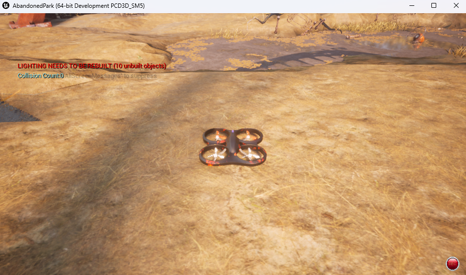
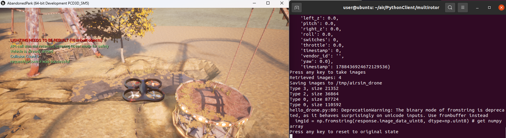

# 建立虚拟机和空域载具之间的连接


## 建立 Python 虚拟环境

* 安装 miniconda
```shell
# 切换到主目录
cd ~
# 下载 miniconda 安装包
wget https://repo.anaconda.com/miniconda/Miniconda3-latest-Linux-x86_64.sh
# 默认路径安装（用户主目录下）
bash Miniconda3-latest-Linux-x86_64.sh -b
# 将 miniconda 添加到 PATH
echo 'export PATH="~/miniconda3/bin:$PATH"' >> ~/.bashrc  && source ~/.bashrc
# 验证 miniconda 安装成功，显示：conda 26.7.1
conda --version
```

* 新建虚拟环境
```shell
conda create -n nn_3.8 python=3.8 -y
conda activate nn_3.8
```

**注意：** 

如果新建运行环境过程中报错：“CondaToSNonInteractiveError: Terms of Service have not been accepted for the following channels.”，是因为没有接受服务条款，运行以下命令可解决。
```shell
conda tos accept --override-channels --channel https://repo.anaconda.com/pkgs/main
conda tos accept --override-channels --channel https://repo.anaconda.com/pkgs/r
```

如果执行`conda activate`时报错：CondaError: Run 'conda init' before 'conda activate'

原因：其实`conda activate`不是一个独立的可执行程序，而是一个由 shell  函数实现的“伪命令”。这意味着它不能像普通命令那样直接运行——必须先让 shell “认识”这个函数。
解决方法：
```shell
conda init bash
# 立即重载配置
source ~/.bashrc
# 进入 (base) 环境
```

## 建立与 AirSim 的连接

运行模拟器：
```bat
cd AbandonedPark/WindowsNoEditor/
AbandonedPark.exe
```


```shell
# 拉取示例仓库
git clone https://github.com/OpenHUTB/ros2.git
cd ros2/src/
# 安装模拟器客户端
pip install numpy
pip install msgpack-rpc-python
pip install airsim
```
运行示例程序
```shell
git clone https://github.com/OpenHUTB/air.git
cd air/PythonClient/multirotor/
# 其中 --host 后面是宿主机的 ip 地址，通过命令（ipconfig）进行查看
python hello_drone.py --host 172.21.108.47
```



## 参考

* [Airsim in Windows with WSL2-ubuntu-ROS](https://zhuanlan.zhihu.com/p/609326694)
