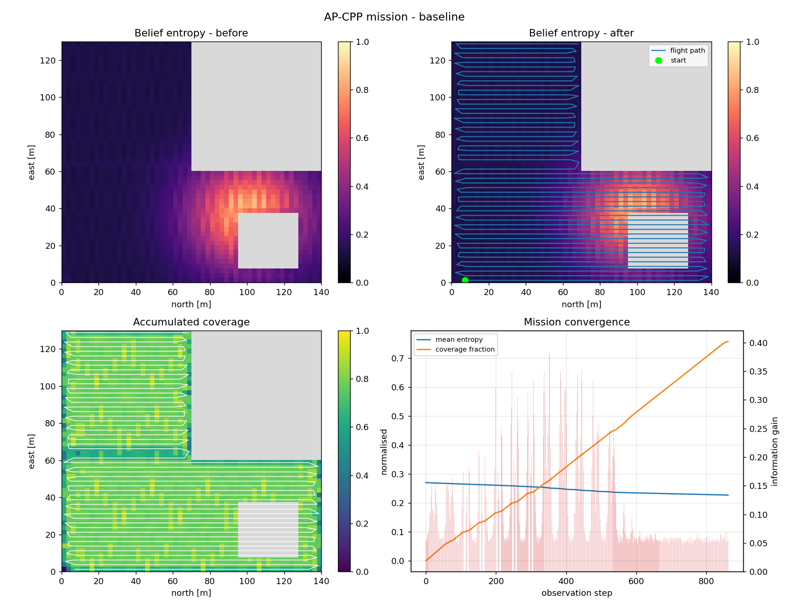
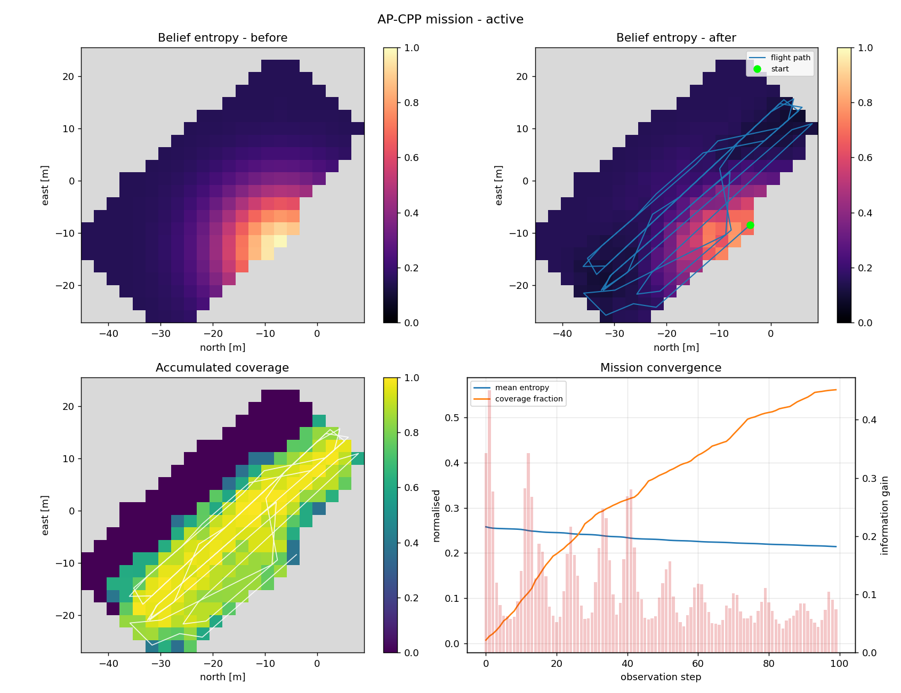
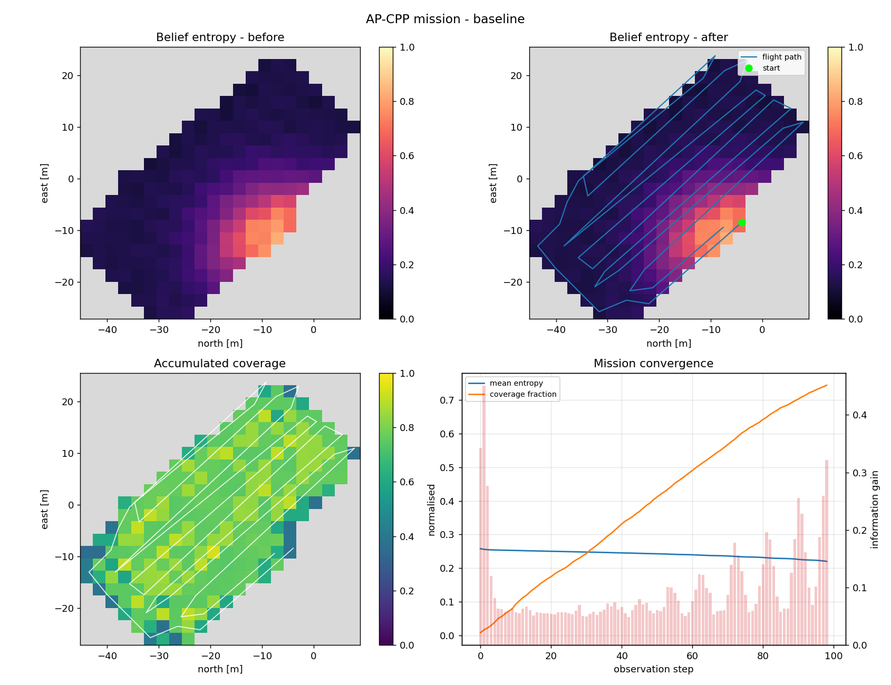

# AP-CPP：主动感知覆盖路径规划

本目录是「主动感知覆盖路径规划」（Active Perception Coverage Path Planning, AP-CPP）
作业的完整工程。它在 OverFOMO 的自适应覆盖路径规划方法之上，补上了**去哪看**这一
个自由度；原有的**飞多快**控制器被完整保留。

对应的课程文档页：[`docs/ap_cpp_overfomo.md`](../../docs/ap_cpp_overfomo.md)。

- [1. 这个作业做了什么](#1-这个作业做了什么)
- [2. 快速开始](#2-快速开始)
- [3. 实测数据](#3-实测数据)
- [4. 方法](#4-方法)
- [5. 目录结构](#5-目录结构)
- [6. 上游代码与本作业的边界](#6-上游代码与本作业的边界)
- [7. 在 RViz 中查看](#7-在-rviz-中查看)
- [8. 在 AirSim 中实飞](#8-在-airsim-中实飞)
- [9. 配置项](#9-配置项)
- [10. 引用](#10-引用)

---

## 1. 这个作业做了什么

### 要解决的问题

原论文的方法会预先算好一条往复式（boustrophedon）航带，开环飞行，再根据图像的
语义内容调节地速：识别得越确定就飞得越快，冠层越密或越模糊就飞得越慢。

它回答的是「**飞过这条航带时该飞多快**」，但没有回答「**这条航带是否值得消耗电量**」。
一块田里各个位置的信息价值并不相同——上一季的产量图、粗分辨率过飞得到的 NDVI
异常、农户报告的病害地块、上一次飞行留下的空洞，都会把不确定性集中到少数几个区域。
一个不能偏离航线的机器人，会把续航花在已经看明白的地方，最后带着「唯一重要那块
区域仍然没搞清」的地图返航。

**AP-CPP 补上的就是这一个自由度。**

### 做法概述

规划器维护一个对作业区域的显式**信念**（占据栅格 + 逐格信息熵），并用**滚动时域
（receding horizon）**对剩余航线反复重规划。每个候选动作的评分同时权衡**航程代价**
和**期望信息增益**。

由此得到的规划器是**构造性安全**的：当农田中没有任何已知信息时，一个横向偏离惩罚
项会把它牢牢压回原有的往复式航带，与已发表的结果逐点一致；只有当某处存在显著的
信息热点时，它才会主动绕行。

### 本作业自己写的部分

| 组成 | 作用 |
|---|---|
| `ap_cpp/grid_model.py` | 占据 + 熵信念栅格 |
| `ap_cpp/sensor.py` | 传感器视场与观测模型 |
| `ap_cpp/utility.py` | 航程代价 / 信息增益效用函数 |
| `ap_cpp/planner.py` | 滚动时域规划器（核心算法） |
| `ap_cpp/control.py` | 地速控制器 |
| `ap_cpp/mission.py` | 任务循环与终止条件 |
| `ap_cpp/runtime.py` | 感知后端（演示用 + U-Net 适配器） |
| `ap_cpp/geo_bridge.py` | 经纬度 ↔ 局部 NED 坐标转换 |
| `ap_cpp/airsim_driver.py` | AirSim 实飞驱动（可选） |
| `demos/run_ap_cpp_demo.py` | 一键可跑的演示 + 消融 + 出图 |
| `ros/src/ap_cpp_ros/` | ROS 1 可视化包（发布 Path + MarkerArray） |
| `tests/test_ap_cpp.py` | 43 个回归测试，只依赖 NumPy |

上游 OverFOMO 原样保留、未做修改的文件见[第 6 节](#6-上游代码与本作业的边界)。

---

## 2. 快速开始

### 2.1 环境要求

规划器、演示与测试**只依赖 NumPy**，出图时额外需要 Matplotlib。
**不需要 AirSim、不需要 TensorFlow、不需要 GDAL。**

实测通过的版本：

| 项目 | 版本 |
|---|---|
| 操作系统 | Windows 11 |
| Python | 3.12.7（Anaconda base） |
| NumPy | 1.26.4 |
| Matplotlib | 3.9.2 |

代码本身不依赖这两个包的特定版本，较新的版本都可以运行。只装核心依赖：

```sh
python -m pip install -r requirements-core.txt
```

> 如果要跑完整的 OverFOMO 仿真流程（AirSim + 语义分割 + 正射影像），才需要
> `requirements.txt` 里的全套依赖。那套依赖对应 **Python 3.6 / 3.7**
> （TensorFlow 1.15 的最高支持版本），在 Python 3.8 以上装不上。
> 其中的 GDAL 不在 PyPI 上以源码分发，需要按自己的 Python 版本单独下载预编译
> wheel 安装，`requirements.txt` 里对此有说明。

### 2.2 运行演示（无需仿真器）

```sh
# 自带的合成地块（不依赖仓库数据）
python demos/run_ap_cpp_demo.py

# 使用仓库中的真实地块（CPP/002/Polygon002.geojson + 预生成的 TurnWPs.txt 航线）
python demos/run_ap_cpp_demo.py --source geojson --field 002

# 同时运行消融基线，量化主动感知带来的收益
python demos/run_ap_cpp_demo.py --compare
```

每次运行会输出一份 JSON 任务报告与一组四联诊断图（信念熵前后对比、累计覆盖率、
地块上的规划航迹、任务收敛过程）。第 3 节的数字由 `--compare` 生成。

### 2.3 运行测试

```sh
python -m unittest discover -s tests -v
# 或者
python -m pytest tests/ -q
```

43 个测试，覆盖栅格化、信念融合、传感器几何、效用函数的正向模型、A\* 与航带重采样、
速度律一致性、任务不变量以及 WGS84 往返转换。不需要仿真器，也不需要 TensorFlow。

---

## 3. 实测数据

本节数字由 `demos/run_ap_cpp_demo.py --compare` 在不依赖仿真器的 Python 环境下生成，
与 `results/` 中提交的图片一一对应。

> **两套指标不可混用。** ROS 节点在 `roslaunch` 下运行时另有一组日志指标，那是另一次
> 运行，和这里的数字不能互换。本节只讲 Python 演示的这组。

### 3.1 合成地块（864 步，默认参数）

```
metric                           active    reference      delta
------------------------------------------------------------------
flight distance [m]              5183.1       5047.4       +135.7
mean entropy                     0.2084       0.2273      -0.0190
coverage fraction                0.5805       0.7580      -0.1776
information gain                122.327       84.935      +37.392
```

怎么读这组数：**AP-CPP 多收集了 44% 的信息**（+37.4 nats），信念也收得更紧
（平均熵 0.2084 对 0.2273），代价是**覆盖率少了 0.178**——参考航带飞完后覆盖了
76% 的地块，主动感知只覆盖 58%。按飞行里程折算，信息收益是 +40%。

两条臂飞的基本是同一次任务（864 对 863 个观测步，5183 m 对 5047 m），所以这是一次
同口径的取舍，不是「一条臂单纯飞得更久」。这个取舍就是使用者买到的东西，而且付出
的覆盖率代价是真实的：如果更看重作业面积而不是地图质量，把 `frontier` / `information`
权重调大，或者把任务步数上限调长即可。

在先验没有任何信息的地块上，两种配置**按设计完全一致**，
见 `test_active_mode_does_not_degrade_a_uniform_prior_mission`。

### 3.2 真实地块（`CPP/002`，`--source geojson`）

```sh
python demos/run_ap_cpp_demo.py --source geojson --field 002 --compare
```

```
metric                           active    reference      delta
------------------------------------------------------------------
flight distance [m]               572.7        562.2        +10.5
duration [s]                      217.9        221.8         -4.0
observation steps                   100           99           +1
mean entropy                     0.2143       0.2203      -0.0060
coverage fraction                0.5605       0.7445      -0.1839
information gain                 10.987        9.518       +1.469
```

真实地块上呈现出同样的定性取舍：信息更多（+15%），覆盖率更低（−0.184）。
信息优势比合成地块小得多，因为 002 号地块的航线很短（591.6 m，99 个观测步），
两条臂在航线走完之前都没有多少绕行空间。报告与图片输出到
`results/ap_cpp_demo_geojson/`。

### 3.3 消融图

<div align="center">
  
  <br />
  <em>合成地块上的主动感知与仅参考航带对比（seed 7，864 步预算）。两条臂飞的
  是接近同一次任务——864 对 863 个观测步，5183 m 对 5047 m——所以 +44% 的信息
  增益是靠<b>看哪里</b>换来的，不是靠飞得更远。代价是覆盖率：0.580 对 0.758。</em>
</div>

<div align="center">
  <table>
    <tr>
      <th align="center">AP-CPP（主动感知）</th>
      <th align="center">Reference-only 基线</th>
    </tr>
    <tr>
      <td align="center"></td>
      <td align="center"></td>
    </tr>
    <tr>
      <td align="center"><em>主动离开航带以消除异常热点，<br />随后重新并回参考航带。</em></td>
      <td align="center"><em>被约束在已发表的往复式航带上，<br />从不偏离。</em></td>
    </tr>
  </table>
</div>

真实地块 `CPP/002` 上跑同一组消融（两条臂看到同样的异常先验，只有 AP-CPP 可以离开
航带）。差异在「熵-后」面板上看得最清楚：基线用平行航线扫过地块，热点只解决了一半；
AP-CPP 则切进热点的对角线，随后并回航线。

<div align="center">
  <table>
    <tr>
      <th align="center">AP-CPP（主动感知）</th>
      <th align="center">Reference-only 基线</th>
    </tr>
    <tr>
      <td align="center"></td>
      <td align="center"></td>
    </tr>
    <tr>
      <td align="center"><em>切进热点，随后并回。<br />信息增益 10.99，覆盖率 0.561</em></td>
      <td align="center"><em>平行航线，被约束在航带内。<br />信息增益 9.52，覆盖率 0.744</em></td>
    </tr>
  </table>
</div>

### 3.4 演示脚本的常用参数

```sh
--source {synthetic,geojson}   # 地块几何来源
--field 002                    # 地块编号，source=geojson 时使用
--prior {none,anomaly,two_zones}
                               # 待探索的非均匀不确定性先验
--prior-weight FLOAT           # 先验混合权重，默认 0.85
--horizon INT                  # 滚动时域长度，默认 6
--execute-steps INT            # 每次重规划前提交的位姿数，默认 2
--step-length FLOAT            # 观测间距，单位 m，默认 6.0
--entropy-bias FLOAT           # A* 边代价中的不确定性折扣
--coverage-target / --entropy-target
--max-steps INT                # 步数预算；默认 = 沿参考航线跑一趟
--max-time FLOAT               # 墙钟预算；默认调到让步数先生效
--no-plots                     # 跳过出图
--compare                      # 同时运行仅参考航带的消融
```

> 消融的两条臂必须飞**同一次任务**，所以默认预算由参考航线本身推导，而不是取一个
> 固定常数。仓库里的 `TurnWPs.txt` 航线比它覆盖的地块短得多：固定 400 步预算会让
> 两条臂都飞出航线几百步，基线就会把已发表航带根本不会执行的覆盖率也记进去。

---

## 4. 方法

### 4.1 数据流

```
                      ┌───────────────────────────────────────────┐
   parameters.py ───▶ │  GeoBridge                                │
   *.geojson     ───▶ │  WGS84 ──▶ NED (handleGeo.ConvCoords)     │──▶ CoverageGrid
   TurnWPs.txt   ───▶ │  rasterise polygon + obstacles            │    (occupancy,
                      └───────────────────────────────────────────┘     entropy, coverage)
                                        │
                                        ▼
   ┌────────────────────────────────────────────────────────────────────────┐
   │  RollingHorizonPlanner.plan(pose)             ◀── receding horizon     │
   │                                                                        │
   │   candidate generators                    UtilityModel.evaluate_path   │
   │   ┌──────────────────────┐                ┌──────────────────────────┐ │
   │   │ reference_sweep      │                │ + w_i · IG(pose)         │ │
   │   │ frontier_astar_{k}   │─── scored ───▶ │ + w_f · frontier(pose)   │ │
   │   │ fan_{±θ}             │   against      │ − w_d · travel           │ │
   │   │ coverage_repair      │   the belief   │ − w_t · |Δyaw|           │ │
   │   └──────────────────────┘                │ − w_r · revisit          │ │
   │            ▲                              │ − w_c · corridor deviation│ │
   │            │                              └──────────────────────────┘ │
   │            │  entropy-biased A*, 8-connected, corner-cut-safe          │
   │            └───────────────────────────────────────────────────────────│
   │                                                                        │
   │   commit first `execute_steps` poses  ──▶  next replanning epoch       │
   └────────────────────────────────────────────────────────────────────────┘
                                        │
                                        ▼
   ┌────────────────────────────────────────────────────────────────────────┐
   │  SensorModel.observe(pose, measurement_entropy)                        │
   │  Bayesian multiplicative fusion:  H ← H · (1 − w · η · (1 − h_meas))   │
   │  Coverage accum.:                 C ← C + η · g · (1 − C)              │
   └────────────────────────────────────────────────────────────────────────┘
                                        │
                    ┌───────────────────┴───────────────────┐
                    ▼                                       ▼
        APCPPSpeedController                     Updated belief ──▶ next epoch
        baseline G(conf, cr) + active term
```

### 4.2 各模块说明

**信念栅格** `ap_cpp/grid_model.py`

在 `handleGeo` 已经在用的局部 NED 系里建一张栅格，每个可通行格携带：

- `entropy ∈ [0, 1]` —— 语义信念的归一化 Shannon 熵。`1.0` 表示「完全不知道」，
  `0.0` 表示「分割模型很确定」。这是已发表方法中标量 *confidence level* 的空间化推广。
- `coverage ∈ [0, 1]` —— 累计观测质量。`1.0` 表示拍得够多、地面采样距离也够高，
  可以认为做完了。是标量 *coverage ratio* 的推广。

不可通行的格子被设成哨兵值（`entropy = 0`、`coverage = 1`），这样它们既不会被
信息驱动的运动吸引，又仍然是合法的路径搜索节点。

**融合** —— 规划时的更新和实际执行时的更新是**同一条代码路径**：

```
H_posterior = H_prior · (1 − w · η · (1 − h_meas))
```

其中 `w` 是视场内权重，`η` 是观测效率，`h_meas` 是网络给出的该帧熵。对确定性格子的
完美观测（`h_meas → 0`）会完全压掉信念；无信息的观测（`h_meas → 1`）则不动它。
因为 `SensorModel.predict_update` 调用的就是 `CoverageGrid.fuse`，而不是另写一份，
规划器优化的就是真实目标函数，这一点由回归测试钉住。

**传感器模型** `ap_cpp/sensor.py`

视场是正下视相机的有向地面矩形。**幅宽**（横航向）由 46° 水平视场角算出，决定航带
间距；**沿航向**范围由 35° 垂直视场角算出，决定观测节奏。效率按 `1/sqrt(1 + t²)`
随归一化离轴坐标 `t` 衰减，这正是「**看哪里**」而不只是「**有没有看**」会影响结果的原因。

**效用函数** `ap_cpp/utility.py`

```
U(π) = Σ_k γ^k [ w_i·IG(pose_k) + w_f·Φ(pose_k)
               − w_d·d(pose_{k−1}, pose_k)/L
               − w_t·|Δyaw|/180
               − w_r·mean C(pose_k)
               − w_c·dev(pose_k, corridor)/L ]
```

信念会在一份临时副本上向前推演，所以一个重复观测自身计划中已覆盖地面的候选动作，
会正确地拿不到第二份信息增益。

**滚动时域** `ap_cpp/planner.py`

候选生成器在评分前都会被归一化到同一时域长度——否则提前停下的候选会因为没飞完的
那段不记航程代价而「因为偷懒」胜出：

- `reference_sweep` —— 已发表的航线，按**弧长**以精确的 `step_length` 重采样。
  （改成吸附到航线*顶点*会在航线采样比 `step_length` 粗时活锁——仓库里的
  `TurnWPs.txt` 就是这种情况。投影是投到最近的线段，不是最近的顶点。）
- `frontier_astar_{k}` —— 用熵偏置的 A\* 走到排序后的不确定前沿，再用普通 A\* 走回
  航线。绕行是一条连通的路径，所以航程惩罚会算上完整的来回；不能并回航线的绕行是
  覆盖空洞，不是计划。前沿排序用的是不确定密度的积分图，因此孤立的单个格子不会
  压过一整片真正没观测过的区域。
- `fan_{±θ}` —— 沿角度扇形的直线推进，用于「小幅调一下航向比绕一大圈更划算」的常见情形。
- `coverage_repair` —— 按 `(1 − C) / distance` 走到最该补的格子。这个生成器由
  `enable_coverage_repair` 控制，演示里把它绑到 `active` 标志上。它要补的洞正是
  主动感知*自己*离开航带造成的，所以仅参考航带的基线不能拿到它：一旦放开，基线会在
  航线走完后继续飞，把已发表航带根本不会执行的覆盖率记进去，把消融悄悄变成两次不同
  任务的比较。真正的仅参考航带运行在航线走完后应当原地待命。

只有前 `execute_steps` 个位姿会被提交。下一次重规划**从实际到达的位姿开始**，
风扰、控制器滞后和模型误差就是在这里进入回路并被修正的。

**速度** `ap_cpp/control.py`

已发表的速度律被精确保留：

```
v = v_nominal + (1 − 2·cr_norm) · Q_max
```

AP-CPP 在此基础上加了一个有界的主动感知项，让飞行器在*地图*尚未解决的地方也减速，
即使当前这一帧碰巧看起来很确定：

```
v = clip(v_nominal + (1 − 2·cr_norm)·Q_max − Q_max·(tanh(IG/IG₀) + ρ·H̄))
```

---

## 5. 目录结构

```
ap_cpp_overfomo/
├── ap_cpp/                      # 本作业的核心：主动感知覆盖路径规划
│   ├── __init__.py              # 对外 API
│   ├── grid_model.py            # 信念栅格：占据、熵、覆盖率与融合
│   ├── pose.py                  # 位姿原语与航向 / 角度辅助函数
│   ├── sensor.py                # 相机视场、效率衰减与前向模型
│   ├── utility.py               # 复合目标函数、路径评估、G(x,y) 桥接
│   ├── planner.py               # 滚动时域规划器、A*、候选生成器
│   ├── control.py               # 基线速度律 + 主动感知项
│   ├── runtime.py               # 感知后端（演示用 + U-Net 适配器）
│   ├── mission.py               # 任务驱动与飞行日志
│   ├── geo_bridge.py            # WGS84 ⇄ NED 任务读写、栅格构建
│   └── airsim_driver.py         # AirSim 实飞集成
│
├── demos/
│   └── run_ap_cpp_demo.py       # 一键可跑的演示 + 消融 + 出图
│
├── ros/                         # catkin 工作空间：RViz 可视化，不含 AirSim
│   └── src/ap_cpp_ros/
│       ├── package.xml
│       ├── CMakeLists.txt
│       ├── scripts/ap_cpp_rviz_node.py   # 发布 Path + MarkerArray
│       ├── launch/rviz_demo.launch       # 独立启动，不需要仿真器
│       └── config/rviz_demo.rviz
│
├── tests/
│   └── test_ap_cpp.py           # 43 个回归测试，只依赖 NumPy
│
├── CPP/                         # 每个地块的任务数据
│   └── 00{0..4}/
│       ├── Polygon00N.geojson   #   作业多边形（QGIS 导出）
│       └── TurnWPs.txt          #   预生成的往复式航线（WGS84）
│
├── results/                     # 任务输出与文档图（由演示脚本生成）
│
├── parameters.py                # 仿真流程配置（路径全部相对本文件拼接）
├── requirements-core.txt        # 规划器 / 演示 / 测试的依赖（仅 NumPy + Matplotlib）
├── requirements.txt             # 完整仿真流程的依赖（Python 3.6/3.7）
│
├── handleGeo/                   # 上游：WGS84 / NED / ECEF 坐标转换
├── main.py, get_new_speed.py,   # 上游：原始 OverFOMO 仿真流程
├── keras_tools.py, speed_function.py,
├── check_g_func.py, parallel_vwps.py,
├── plot_vwps_on_field.py        # 上游：分析脚本
└── inputVariables.json          # 上游：QGIS=False 时的多边形 / 障碍物定义
```

---

## 6. 上游代码与本作业的边界

本作业基于 [emmarapt/Adaptive_Coverage_Path_Planning](https://github.com/emmarapt/Adaptive_Coverage_Path_Planning)
（对应论文 Krestenitis et al., 2023）。**下面的文件是从上游原样保留下来的，不是本作业
写的**，保留它们是为了让 `ap_cpp/airsim_driver.py` 能对接原始的仿真流程：

| 文件 / 目录 | 说明 |
|---|---|
| `main.py` | 原始 OverFOMO 的 AirSim 任务主流程 |
| `get_new_speed.py` | U-Net 速度推断 |
| `keras_tools.py`、`speed_function.py`、`check_g_func.py` | 速度函数分析 |
| `parallel_vwps.py`、`plot_vwps_on_field.py` | 航点并行化与地块绘图 |
| `handleGeo/` | WGS84 / NED / ECEF 坐标转换 |
| `inputVariables.json` | QGIS=False 时的多边形 / 障碍物定义 |
| `CPP/00{0..4}/*.geojson`、`TurnWPs.txt` | 各地块的几何与预生成航线 |

需要注意的是，`parameters.py` **已经过本作业整理**：上游版本里写死了
`D:\Conv-CAO\...` 之类的绝对路径，换一台机器必然跑不起来；现在所有路径都由本文件
所在目录拼接得出，必要时可以用环境变量覆盖（见该文件顶部注释）。

大体积的权重与数据集（`weights0500.hdf5`、`CPP/00{0..4}/viewpoints_map.jpg` 等）
**不在版本库中**，仓库约定「尽量保存文本文件，大体积数据通过永久网盘链接提供」。
获取方式见课程文档页的「关于大体积数据文件」一节。

**本作业的核心部分（`ap_cpp/`、`demos/`、`tests/`、`ros/`）不依赖上述任何文件，
可以直接运行。**

---

## 7. 在 RViz 中查看

`ros/` 是一个标准的 catkin 工作空间，里面只有一个包 `ap_cpp_ros`。节点**无头**运行
规划器，对同一套地块定义求解，然后把结果发布给 RViz。这条路径不需要 AirSim、不需要
Unreal，也不需要 TensorFlow / GDAL 那一套，只需要一个 source 过的 ROS 1 环境和 NumPy。

### 7.1 先决条件

> **这一步不做，直接 `roslaunch` 会报错。** `ap_cpp_ros` 是 ROS 1 的 catkin 包，
> 必须先编译并 source 工作空间的 `setup.bash`，`roslaunch` 才找得到它。

需要 ROS 1（Noetic）。**Ubuntu 22.04 上 ROS Noetic 不是原生支持的**——Noetic 只发布
到 20.04（Focal），在 22.04 上 `sudo apt install ros-noetic-desktop-full` 找不到候选包。
按优先级有几种做法：

1. **用 20.04，或者 `ros:noetic` 容器**（后者基于 20.04）。这是受支持的路径，不需要
   任何取巧手段，**推荐**。
2. **换 22.04 + ROS 2 Humble**，Jammy 上原生支持的发行版。但本包是 ROS 1 的 catkin
   工作空间，需要先移植，不能直接替换。
3. **把 Focal 的 ROS 1 源加到 Jammy 上并做 apt pin。** 实践中可行，很多人这么干，
   但这是不受支持的混装：

   ```sh
   sudo sh -c 'echo "deb http://packages.ros.org/ros/ubuntu focal main" \
     > /etc/apt/sources.list.d/ros1-latest.list'
   sudo apt install curl
   curl -sSL https://raw.githubusercontent.com/ros/rosdistro/master/ros.asc \
     | sudo apt-key add -

   # 把该源优先级压低，让 apt 在其它所有包上优先选 Jammy 自带的版本。
   sudo tee /etc/apt/preferences.d/ros1-pin >/dev/null <<'EOF'
   Package: *
   Pin: release n=focal
   Pin-Priority: 1
   EOF

   sudo apt update
   sudo apt install ros-noetic-desktop-full python3-numpy
   source /opt/ros/noetic/setup.bash
   ```

   pin 不是可选项：不加 pin，Focal 源会让 apt 在 Jammy 机器上考虑无关系统库的 Focal
   版本。把优先级压到 1 之后，apt 只会到 Focal 去取 Jammy 完全没有提供的包名——也就是
   `ros-noetic-*` 这一组。

### 7.2 编译工作空间

在 source 过 ROS 环境的终端里，**从仓库根目录**出发：

```sh
# 1. source ROS 1
source /opt/ros/noetic/setup.bash

# 2. 进入本模块的 catkin 工作空间
cd src/air/ap_cpp_overfomo/ros

# 3. 编译
catkin_make

# 4. source 编译产物（每个新终端都要做）
source devel/setup.bash
```

Node 是纯 Python 的，`catkin_make` 只是把脚本装到 catkin 的 bin 路径上、并注册这个包，
不会真正编译什么东西。但**第 4 步必须做**，否则 `roslaunch` 会报
`[ap_cpp_ros] is not a launch file name` 或 `package not found`。

### 7.3 启动

```sh
roslaunch ap_cpp_ros rviz_demo.launch                              # AP-CPP
roslaunch ap_cpp_ros rviz_demo.launch reference_only:=true         # 消融（仅参考航带）
roslaunch ap_cpp_ros rviz_demo.launch source:=geojson field:=002   # 真实地块
roslaunch ap_cpp_ros rviz_demo.launch rviz:=false                  # 只跑节点，不开 RViz
```

也可以直接跑节点、自己起 RViz：

```sh
rosrun ap_cpp_ros ap_cpp_rviz_node.py --source geojson --field 002
rviz -d $(rospack find ap_cpp_ros)/config/rviz_demo.rviz
```

### 7.4 发布的话题

| 话题 | 类型 | 内容 |
|---|---|---|
| `/ap_cpp_rviz/path` | `nav_msgs/Path` | 实际飞行的观测航迹 |
| `/ap_cpp_rviz/markers` | `visualization_msgs/MarkerArray` | 覆盖栅格、障碍物、参考航带、端点、汇总标签 |

节点在 NED 米制系里规划，发布成 ENU 给 RViz（`ros.x = ned.y`、`ros.y = ned.x`、
`ros.z = −ned.z`），地块因此落在 `z = +altitude` 平面、正北朝 `+y`。
加 `--no-frame-swap` 可以发布原始 NED。地块较大时用 `--decimate N` 抽稀栅格 marker。

> **把仓库搬进虚拟机。** ROS 那台机器只需要仓库本身——`ap_cpp/`、`CPP/` 和 `ros/`。
> 既可以在虚拟机里 clone，也可以共享宿主机目录后在共享副本里 `catkin_make`。
> 这条路径不会 import `airsim`，不需要装 AirSim。

---

## 8. 在 AirSim 中实飞

```sh
python -m ap_cpp.airsim_driver              # 实飞
python -m ap_cpp.airsim_driver --dry-run    # 不连 Unreal，只校验配置
```

`--dry-run` 会对着真实的正射影像跑完整套信念回路，但不连接模拟器——这是在启动 Unreal
之前检查某块地配置是否合理的最快方式。这条路径需要 `requirements.txt` 的全套依赖
（AirSim、TensorFlow、GDAL）以及 `weights0500.hdf5`。

---

## 9. 配置项

任务参数都在 `parameters.py` 里。AP-CPP 自己的可调项通过 dataclass 暴露，都有合理默认值：

| Dataclass | 模块 | 用途 |
|---|---|---|
| `GridConfig` | `grid_model.py` | 栅格分辨率与范围 |
| `SensorConfig` | `sensor.py` | 视场角、高度、效率衰减 |
| `UtilityWeights` | `utility.py` | 目标函数各项权重 |
| `PlannerConfig` | `planner.py` | 时域长度、执行节奏、A\* 参数 |
| `MissionConfig` | `mission.py` | 终止条件 |

实践中最关键的两个：

- **`UtilityWeights.corridor`**（默认 `1.15`）—— 保持贴着已发表航线的强度。
  保守作业调大，想让规划器更凶地追信息就调小。
- **`UtilityWeights.information`**（默认 `1.0`）—— 单位不确定性被解决掉的价值，
  相对于一米飞行而言。

### 用地块先验驱动规划

规划器在有先验时最有用，因为一个没有先验知识的机器人没有什么可好奇的。
用 `CoverageGrid.set_uncertainty_prior`：

```python
from ap_cpp.grid_model import CoverageGrid
from ap_cpp.geo_bridge import GeoBridge, load_qgis_polygon

polygon, obstacles, _ = load_qgis_polygon("CPP/002/Polygon002.geojson")
grid = GeoBridge(polygon, obstacles).build_grid(resolution=2.5)

# 任意形如栅格尺寸的 [0, 1] 风险图层：上一季产量图、NDVI 异常、
# 巡田报告、上一次飞行留下的空洞。
grid.set_uncertainty_prior(ndvi_anomaly_normalised, weight=0.85)
```

之后按演示脚本的方式把栅格交给任务即可。

---

## 10. 引用

本模块扩展的是下面的工作，使用时请引用原文：

*M. Krestenitis, E. K. Raptis, A. C. Kapoutsis, K. Ioannidis, E. B. Kosmatopoulos,
and S. Vrochidis, "Overcome the fear of missing out: Active sensing UAV scanning
for precision agriculture," Robotics and Autonomous Systems, p. 104581, 2023.*
[[Link]](https://www.sciencedirect.com/science/article/pii/S0921889023002208)

```bibtex
@article{krestenitis2023overcome,
  title={Overcome the fear of missing out: Active sensing UAV scanning for precision agriculture},
  author={Krestenitis, Marios and Raptis, Emmanuel K and Kapoutsis, Athanasios Ch and Ioannidis, Konstantinos and Kosmatopoulos, Elias B and Vrochidis, Stefanos},
  journal={Robotics and Autonomous Systems},
  pages={104581},
  year={2023},
  publisher={Elsevier}
}
```

### 致谢

原文研究由欧盟欧洲区域发展基金及希腊国家基金通过「竞争力、创业与创新」运营计划
（RESEARCH – CREATE – INNOVATE，T1EDK-00636）资助。

本作业扩展了上游的 [Adaptive_Coverage_Path_Planning](https://github.com/emmarapt/Adaptive_Coverage_Path_Planning)，
其 `handleGeo` 坐标工具、RedEdge-M 载荷参数与分割网络被原样复用。

### 贡献方式

1. Fork 本仓库
2. 建特性分支（`git checkout -b feature/AmazingFeature`）
3. 推送前先跑测试（`python -m unittest discover -s tests`）
4. 提交信息用 [Conventional Commits](https://www.conventionalcommits.org/)
   （`feat(planner): ...`、`fix(sensor): ...`、`docs: ...`）
5. 发起 Pull Request

请保持 `ap_cpp/` 在模块层面不 import 仿真器和 TensorFlow——演示与测试必须继续能在
只有 NumPy 的环境里跑起来。

### 许可

MIT License，见 [LICENSE](LICENSE)。

### 人工智能使用声明

本作业的代码与文档编写过程中使用了大型语言模型进行辅助（代码整理、文档撰写与
英文翻译）。作者已对提交的全部内容进行复核，并对其正确性负责。

<p align="right">(<a href="#top">回到顶部</a>)</p>
