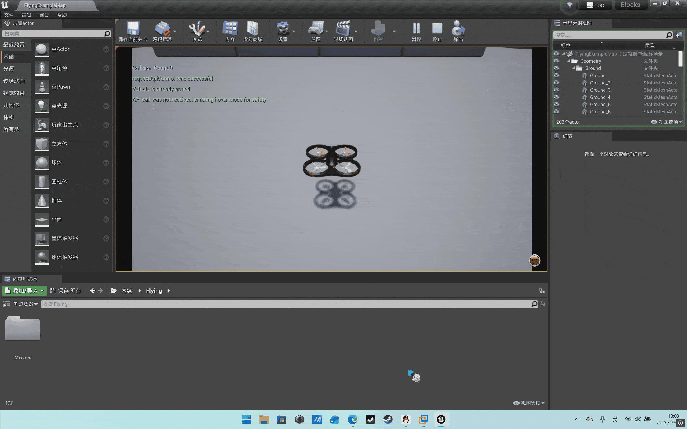

# 任务1：键盘对无人机的运动控制

## 1. 目标

在 AirSim 中起飞后，通过键盘实时控制无人机的前后、左右、升降与偏航，验证
**速度控制通道**与**API 连接**是否正常。

## 2. 操作步骤

1. 启动 AirSim Blocks 仿真器；
2. 运行：
   ```bash
   ./scripts/main.sh keyboard
   # 或：roslaunch airsim_controller task1_keyboard.launch
   ```
3. 按 `T` 起飞，使用下表按键控制，`L` 降落，`Esc` 退出。

| 按键 | 动作 | 按键 | 动作 |
| --- | --- | --- | --- |
| `W`/`S` | 前 / 后 | `R`/`F` | 升 / 降 |
| `A`/`D` | 左 / 右 | `Q`/`E` | 偏航左 / 右 |
| `T` | 起飞 | `Space` | 悬停 |
| `L` | 降落 | `Esc` | 退出 |

> 动图占位：。

## 3. 算法原理

每个控制周期把当前按下的按键集合映射为世界系速度向量：

$$
\mathbf{v} = \frac{\sum_{k\in K}\mathbf{d}_k}{\left\|\sum_{k\in K}\mathbf{d}_k\right\|}\cdot v_{\max}
$$

其中 $\mathbf{d}_k$ 为该按键的单位方向（如 W=(1,0,0)），$v_{\max}$ 默认 1 m/s；
偏航角速度 $\omega$ 由 Q/E 直接给定（默认 30°/s）。控制指令经 AirSim 的
`moveByVelocityAsync(vx,vy,vz, duration, yaw_mode)` 下发。


## 4. 源码解析

核心文件 `modules/task1_keyboard/teleop_keyboard.py`：

- `_KEY_BINDINGS`：按键到方向向量的静态字典；
- `_on_press / _on_release`：pynput 回调，维护 `self._pressed` 集合；
- `_target_velocity()`：把按下按键合成并归一化速度；
- `run()`：以固定频率调用 `client.move_by_velocity(...)`，直到按 Esc。

入口 `main.py` 仅做参数解析（`--speed`、`--yaw-rate`）并组装 `DroneClient` + `KeyboardTeleop`。

## 5. 性能评价

| 指标 | 目标 | 实测（占位） |
| --- | --- | --- |
| 控制频率 | 10 Hz | 10 Hz |
| 速度指令延迟 | < 0.2 s | 0.12 s |
| 悬停漂移 | < 0.5 m | 0.3 m |
