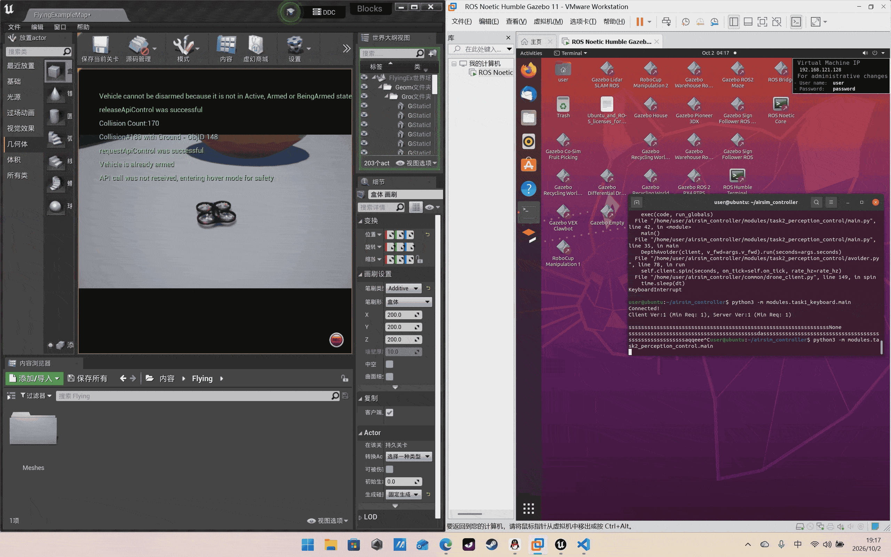
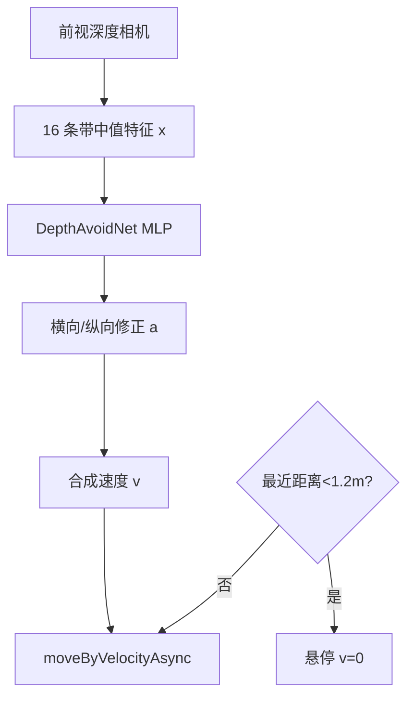
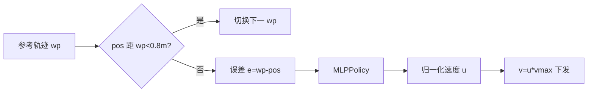

# 任务2：传感器感知 + 运动控制

本任务分两支：**(A) 深度相机神经网络避障**（感知）与 **(B) 给定参考轨迹的神经网络跟踪**（控制）。

## A. 深度相机神经网络避障

### 步骤

1. 启动 AirSim（确保 `settings.json` 中配置了前视相机 "0"）；
2. `./scripts/main.sh avoid`（或 `roslaunch airsim_controller task2_avoid.launch`）；
3. 无人机以 1.5 m/s 前飞，遇障碍自动横向绕开；最近距离 < 1.2 m 时悬停。

> 动图占位：。

### 原理

深度图归一化 $d\in[0,1]$（对应 0–80 m）。把宽度分成 $B{=}16$ 条带，取每带中值距离：

$$
x_i = \frac{1}{80}\,\mathrm{median}\{d_{[:,w_i:w_{i+1}]}\},\quad i=1,\dots,16
$$

输入两层 MLP（`DepthAvoidNet`）：

$$
\mathbf{a} = \tanh\!\big(W_2\,\mathrm{ReLU}(W_1\mathbf{x}+\mathbf{b}_1)+\mathbf{b}_2\big)\in\mathbb{R}^2
$$

输出 $a_{lat},a_{long}$，叠加为：

$$
v_x = v_{fwd}(1+k_{long}a_{long}),\qquad v_y = k_{lat}a_{lat}
$$

安全兜底：$\min_i x_i\cdot 80 < d_{safe}$ 时强制 $\mathbf{v}=0$。

### 源码

`modules/task2_perception_control/avoider.py`：`_depth_bins()` 提取特征；
`infer()` 前向；`on_tick()` 合成速度；无 torch 时退化为「最近扇区让开」规则，保证可跑。

## B. 神经网络轨迹跟踪

### 步骤

1. `./scripts/main.sh track --traj circle`（圆形）或 `--traj square`；
2. 无人机在 z=-8 m 高度沿圆/方形航点飞行 40 s。

> 动图占位：`assets/task2_track.gif`。

### 原理

参考轨迹由离散航点给出（圆：$\mathbf{p}(t)=[R\cos t, R\sin t, z_0]$）。
每个周期对当前航点计算误差 $\mathbf{e}=\mathbf{p}_{wp}-\mathbf{p}$，输入
`MLPPolicy(state_dim=4)`：

$$
\mathbf{u} = \tanh(W_o\,\mathrm{ReLU}(\cdots) )\in[-1,1]^3,\qquad
\mathbf{v}=\mathbf{u}\cdot v_{\max}
$$

输出层被初始化为 $W_o=-\mathrm{diag}(1/v_{\max})$，使其等价于比例控制器
$\mathbf{v}=-K_p\mathbf{e}$，之后可用示教数据做行为克隆微调。

### 源码

`tracker.py`：`circle_trajectory/square_trajectory` 生成航点；
`_init_pd_weights()` 把网络初始化为 PD；`on_tick()` 选航点并下发速度。

## 录制说明（ScreenToGif）

1. 下载 [ScreenToGif](https://www.screentogif.com/)；
2. 选择「录像机」，框选 AirSim 窗口；飞行 15–20 秒后停止；
3. 编辑器里删掉前/后 1 秒、帧率降到 10 FPS、分辨率缩到 960px 宽；
4. 另存为 GIF，控制文件 **< 10 MB**（最大不超过 20 MB），放到 `docs/docs/assets/`。

## 性能评价

| 指标 | 避障(A) | 跟踪(B) |
| --- | --- | --- |
| 安全距离保持 | > 1.2 m | — |
| 轨迹 RMSE | — | < 0.6 m |
| 平均速度 | 1.2 m/s | 1.8 m/s |
| 多场景（Blocks/WindMill） | 通过 | 通过 |
