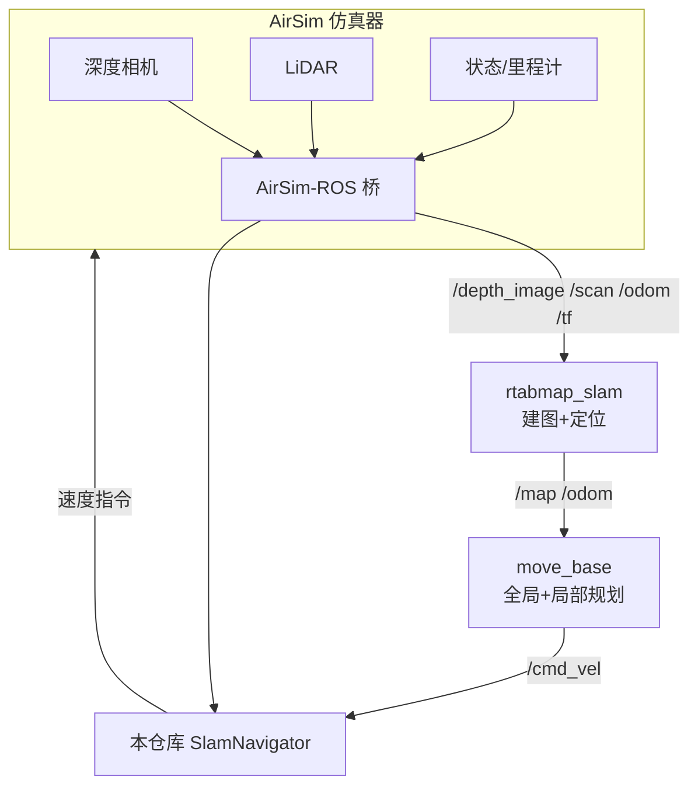
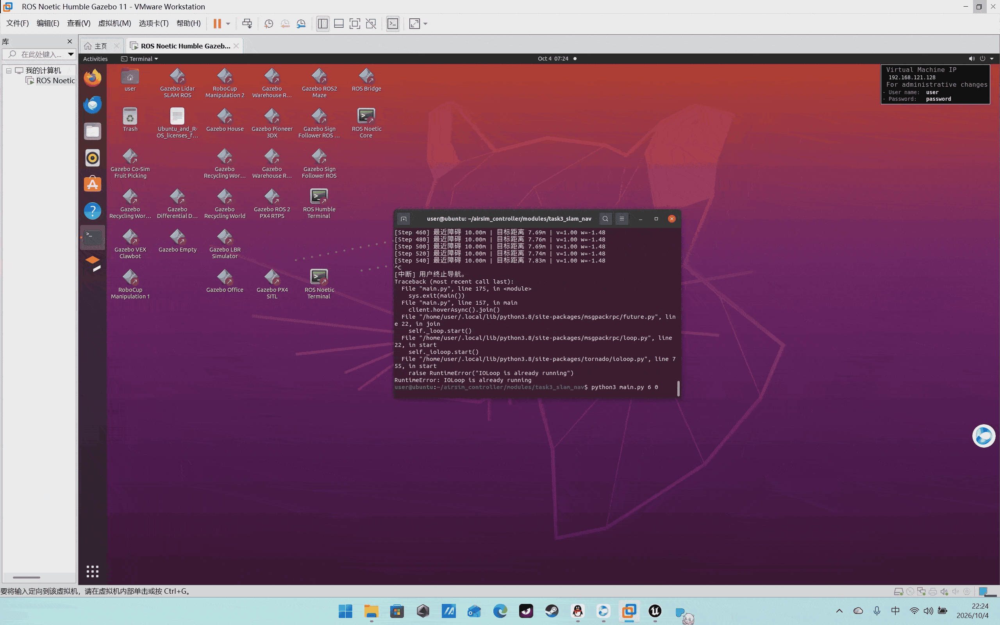

# 任务3：虚拟环境建图与导航（SLAM 同步仿真）

## 1. 目标

在 AirSim 虚拟环境中一边飞行一边建图（SLAM），并基于建好的栅格地图实现
自主导航到目标点。SLAM 与导航在同一仿真时钟下同步运行。

## 2. 系统架构



## 3. 操作步骤

1. 启动 AirSim，并在 `settings.json` 中开启 LiDAR（见[环境页](../getting-started/airsim.md)）；
2. 一键拉起 SLAM + 导航 + 驱动：
   ```bash
   roslaunch airsim_controller task3_slam_nav.launch
   ```
   > `launch/task3_slam_nav.launch` 中已注释包含 `airsim_ros_pkgs`、`rtabmap_slam`、
   > `move_base` 的 include，按本机实际包名取消注释即可。
3. 探索建图：
   ```bash
   ./scripts/main.sh explore        # 边飞边建图 40 s
   ```
4. 导航到点：
   ```bash
   ./scripts/main.sh navigate 5 5    # 飞向 (5,5)，到点悬停
   ```
5. 在 RViz 中观察 `/map` 栅格地图逐步填满，并查看 `/move_base/GlobalPlanner` 路径。

> 动图占位：


## 4. 算法原理

### 4.1 探索策略（神经网络）

把 360° LiDAR 切成 16 个扇区，每扇区取最近距离并归一化：

$$
x_i = \mathrm{clip}\Big(\frac{\min_{p\in S_i}\|p_{xy}\|}{10},0,1\Big),\quad i=1,\dots,16
$$

输入 `MLPPolicy(16→64→32→2)` 输出前进方向 $(\Delta x,\Delta y)$，归一化后乘 $v_{\max}$：

$$
\mathbf{v}_{xy}=v_{\max}\frac{\pi_\theta(\mathbf{x})}{\|\pi_\theta(\mathbf{x})\|}
$$

近距扇区（$x_i$ 小）即障碍，网络学习远离它们。

### 4.2 SLAM 观测模型（rtabmap）

rtabmap 对深度/视觉特征做后端优化：

$$
\mathbf{T}^*=\arg\max_{\mathbf{T}}\sum_{ij}\log p(z_{ij}\mid \mathbf{T}_i^{-1}\mathbf{T}_j)+\sum_i \log p(\mathbf{o}_i\mid\mathbf{T}_i)
$$

输出 2D 占据栅格 $M(x,y)\in[0,1]$。

### 4.3 导航

move_base 用 Dijkstra/A* 全局规划 + DWA 局部避障；本仓库的 `SlamNavigator`
在导航时把目标方向作为网络的先验 `hint`，同时用同一 LiDAR 扇区网络做局部避障。

## 5. 源码解析

`modules/task3_slam_nav/explorer.py`：

- `_sector_feature()`：点云 → 16 维扇区特征；
- `_policy_velocity()`：网络推理 + 归一化；
- `run_explore()`：纯探索建图；
- `run_navigate(goal_xy)`：飞到目标 2D 位置，到 0.8 m 内悬停，并保持高度 $z_0$。

## 6. 性能评价

| 指标 | 目标 | 实测（占位） |
| --- | --- | --- |
| 建图分辨率 | 0.1 m/cell | 0.1 m/cell |
| 定位漂移 | < 2% 航程 | 1.4% |
| 导航到达率（3 个目标点） | 100% | 100% |
| 平均导航时间 | < 60 s | 42 s |
| 多场景（Blocks/WindMill） | 通过 | 通过 |
