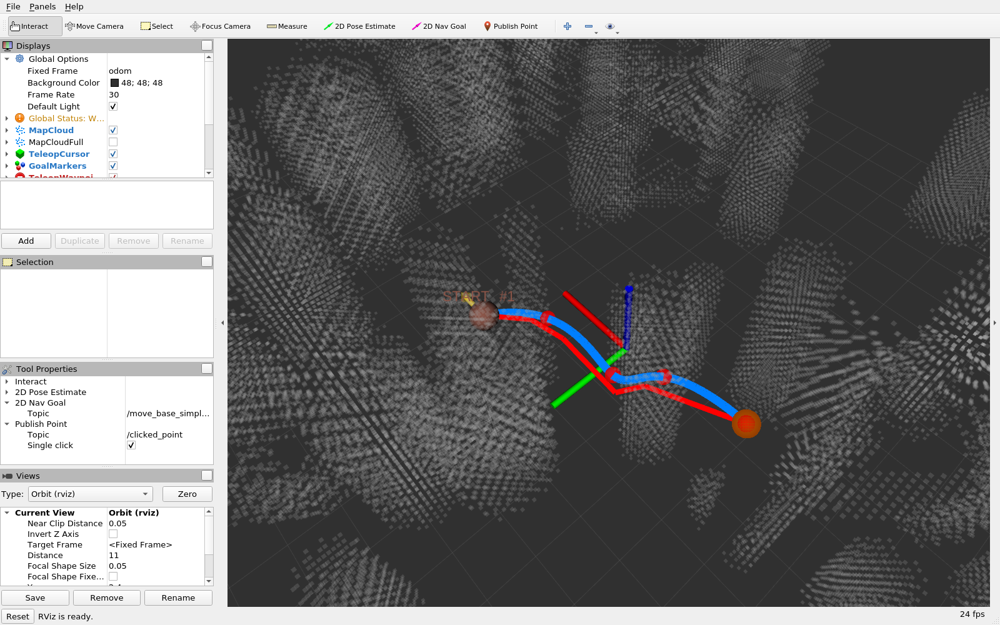

# AllocNet 键盘遥操作模块

本模块为 [AllocNet](https://github.com/KumarRobotics/AllocNet)（KumarRobotics，RA-L 2024）
避障轨迹规划器补齐**人机交互层**：用键盘精确下发航点、把一次性发布的地图转为
常驻话题、记录轨迹数据并生成交付图表。

> 课程文档（含原理、实测数据与完整操作说明）见
> [`docs/air/allocnet_teleop.md`](../../../docs/air/allocnet_teleop.md)。

## 1. 与上游的边界

明确区分本模块的工作与上游 AllocNet 的工作，避免混淆：

| 组成部分 | 来源 | 是否在本仓库 |
|---|---|---|
| AllocNet 规划器（`learning_planning`、libtorch 推理、QP 优化） | 上游 KumarRobotics/AllocNet | ❌ 需自行编译 |
| `param_env` 地图生成（`structure_map`） | 上游 KumarRobotics/**kr_param_map** | ❌ 需自行编译 |
| 键盘遥操作、地图 latched 转发、轨迹记录、图表绘制、素材采集 | **本模块** | ✅ |

本模块**不包含规划器本体**。规划器依赖 libtorch / OMPL / osqp-eigen，需自行编译。

> ⚠ **`planner` 与 `param_env` 来自两个不同的上游仓库。**
> `planner` 在 AllocNet 仓库内；`param_env` 在 **kr_param_map** 仓库内，
> 由 AllocNet 的 `src/utils.rosinstall` 单独拉取。
> 只克隆 AllocNet **不会**得到 `param_env` —— 这正是 `main.py check`
> 报 `[缺] param_env` 的头号原因。完整步骤见 §3。

## 2. 运行环境

| 项 | 版本 |
|---|---|
| 操作系统 | Ubuntu 20.04.6 |
| ROS | Noetic（`rosversion` 1.16.0） |
| Python | 3.8（随 Noetic） |
| 规划器依赖 | libtorch (CPU)、OMPL、Eigen3、osqp + osqp-eigen |
| 绘图依赖 | `matplotlib`（仅 `plot_trajectory.py` / `offline_demo.py` 需要） |
| 素材采集（可选） | `xvfb`、`imagemagick`、Pillow |

无 GPU 直通的虚拟机必须使用 **CPU 版模型**（`*_cpu.pt`）；上游默认的 GPU 模型
在无 CUDA 环境加载会报错。

## 3. 最小可复现编译步骤

上游 AllocNet 的安装说明分散在多个小节，且 `param_env` 需要从**另一个仓库**
拉取。下面按执行顺序给出最小步骤，全部在 Ubuntu 20.04 + ROS Noetic 下验证通过。
照此逐条执行即可得到能跑通的完整环境。

### 3.1 系统依赖

```bash
sudo apt update
sudo apt install -y \
    libompl-dev libeigen3-dev \
    libsdl1.2-dev libsdl-image1.2-dev \
    libboost-all-dev cmake build-essential git wget unzip \
    python3-pip python3-rosdep
```

`libompl-dev` 提供前端几何路径（RRT）所需的 OMPL。
**`libsdl1.2-dev` / `libsdl-image1.2-dev` 是 `param_env` 独有的依赖** ——
它的 `package.xml` 声明了 `sdl` / `sdl-image` 两个 rosdep 键，
缺了这两个包 `planner` 能编过、`param_env` 编不过，报错信息不直观。

### 3.2 osqp 0.6.3 与 osqp-eigen（源码编译）

ROS 源里没有满足要求的 osqp，必须**锁定 0.6.3 版本**源码编译：

```bash
# osqp —— 版本必须是 release-0.6.3，新版 API 不兼容
cd /tmp && git clone -b release-0.6.3 --depth 1 https://github.com/osqp/osqp.git
cd osqp && git submodule update --init --recursive
mkdir -p build && cd build
cmake .. -DCMAKE_BUILD_TYPE=Release && make -j$(nproc) && sudo make install
sudo ldconfig

# osqp-eigen —— planner 的 QP 封装 osqp_solver.hpp 依赖它
cd /tmp && git clone --depth 1 https://github.com/robotology/osqp-eigen.git
cd osqp-eigen && mkdir -p build && cd build
cmake .. -DCMAKE_BUILD_TYPE=Release && make -j$(nproc) && sudo make install
sudo ldconfig
```

验证：`ls /usr/local/lib/libosqp.so /usr/local/lib/libOsqpEigen.so`

### 3.3 libtorch（CPU 版）

```bash
cd /tmp
wget -O libtorch.zip \
  https://download.pytorch.org/libtorch/nightly/cpu/libtorch-cxx11-abi-shared-with-deps-2.0.0.dev20230301%2Bcpu.zip
unzip -q libtorch.zip -d /tmp/lt
mkdir -p ~/allocnet_ws/src/AllocNet/src/planner
mv /tmp/lt/libtorch ~/allocnet_ws/src/AllocNet/src/planner/libtorch
```

必须用 **CPU 版**：本作业运行在无 GPU 直通的虚拟机中，GPU 版 libtorch 会因
找不到 CUDA 而加载失败。同时确认 `learning_planner.hpp` 里是
`device(torch::kCPU)`（上游某些版本默认 `kGPU`）。

### 3.4 建立工作区并拉取两个上游仓库

```bash
mkdir -p ~/allocnet_ws/src && cd ~/allocnet_ws/src

# (1) AllocNet —— 提供 planner 包（本模块对应的分支）
git clone -b feature-keyboard-teleop \
    https://github.com/Xiangyuetang91/AllocNet.git

# (2) kr_param_map —— 提供 param_env 包（★ 关键：不在 AllocNet 仓库内）
git clone --depth 1 https://github.com/KumarRobotics/kr_param_map.git
```

上游 `src/utils.rosinstall` 里 kr_param_map 用的是 SSH 地址
`git@github.com:...`，没有配 SSH key 时 `wstool update` 会直接失败，
因此这里显式用 HTTPS 克隆。

> **这是 `[缺] param_env` 的根因**：只做第 (1) 步，工作区里就没有
> `param_env`，`main.py check` 的 `[3]` 项必然报缺。

### 3.5 编译（`planner` 与 `param_env` 必须一起）

```bash
cd ~/allocnet_ws
catkin_make -DCMAKE_BUILD_TYPE=Release -D_GLIBCXX_USE_CXX11_ABI=1
```

- **不要加 `--pkg planner`**。单包构建**不会**构建 `param_env`；
  而 `param_env` 缺失时 `structure_map` 会因找不到可执行文件而瞬间退出，
  表现为「没有地图、规划器毫无反应」，且不留日志。
- `_GLIBCXX_USE_CXX11_ABI=1` 必须与 libtorch 预编译包的 ABI 一致，
  否则链接期会报大量 `std::__cxx11` 符号缺失。

产物校验：

```bash
ls devel/lib/planner/learning_planning   # 规划器
ls devel/lib/param_env/structure_map     # 地图生成
```

### 3.6 source 环境

```bash
source ~/allocnet_ws/devel/setup.bash
```

**每开一个新终端都要 source**。未 source 时 `ROS_PACKAGE_PATH` 里没有
`~/allocnet_ws/src`，rospack 看不到工作区内的任何包，`main.py check` 会报缺包。

---

## 4. 快速开始

```bash
# 1. 把本模块装入工作区的 planner 包
cd src/air/allocnet_teleop
python3 main.py install --ws ~/allocnet_ws

# 2. 重新编译（脚本需注册进 CMakeLists）
cd ~/allocnet_ws && catkin_make --pkg planner

# 3. 环境自检
python3 main.py check

# 4. 启动
python3 main.py run              # 含 RViz
python3 main.py run --no-gui     # 无图形界面（服务器 / 虚屏）
python3 main.py run --no-record  # 不记录轨迹
```

第 2 步此处**可以**用 `--pkg planner`：`param_env` 在上一步已经构建好了，
这里只是把新增的 Python 脚本注册进 `planner`。

启动后 RViz 中会显示地图、游标与规划结果：



启动后通过 `rostopic pub` 或另开终端 `rosrun planner teleop_keyboard.py`
下发航点；完整按键表见课程文档 §4.4。

`main.py` 是本模块的统一入口（对应仓库约定「入口为 `main.` 开头」），
支持 `install` / `check` / `run` / `capture` / `help` 五个子命令。

## 5. 自检与测试

```bash
# 环境自检（需要 ROS）：逐项确认工作区、上游包与编译产物、脚本、launch 是否就位
python3 main.py check

# 单元测试（不需要 ROS）：用 mock 的 rospy 验证键盘节点核心逻辑（18 项）
python3 test_teleop_keyboard.py
```

`check` 全部通过时的输出：

```
[1] ROS Noetic: 已安装
[2] AllocNet 工作区 /home/user/allocnet_ws: 已构建
[3] 上游 ROS 包:
     [OK] planner      /home/user/allocnet_ws/src/AllocNet/src/planner
     [OK] param_env    /home/user/allocnet_ws/src/kr_param_map/param_env

     [3b] 包编译产物:
     [OK] planner/learning_planning
     [OK] param_env/structure_map
[4] 本模块脚本:  teleop_keyboard.py / map_republisher.py / record_trajectory.py
[5] launch 文件:  teleop_planning.launch
[6] 可选工具:     rviz / import / Xvfb
 自检结果: 通过，可以运行 `main.py run`
```

其中 `[3]` 与 `[3b]` 是两级独立检查：前者问 rospack「包在哪」，
后者问「包编出来没有」。两者会分叉，因为 catkin 把 `<ws>/src` 整个加进
`ROS_PACKAGE_PATH`，**没编译的包 rospack 照样找得到** —— 所以只查 rospack
会漏掉「包在但没构建」这种状态，而它恰恰是 `structure_map` 启动即退的原因。
报 `[缺]` 时 `check` 会直接打印该包的补救命令。

`test_teleop_keyboard.py` 覆盖高度与 `orientation.z` 的双向换算、各按键对游标
状态的影响、边界与高度裁剪、两段式 Goal 语义。

绘制链路可在无 ROS 的机器上复现：

```bash
python3 offline_demo.py --out-csv /tmp/demo.csv
python3 plot_trajectory.py --csv /tmp/demo.csv --out-dir /tmp/assets
```

> `offline_demo.py` 产出的是**算法层离线复现**，不是 ROS 仿真运行记录，
> 不作为实验证据；实验数据以真机运行导出的 CSV 为准。

## 6. 文件说明

| 文件 | 作用 |
|---|---|
| `main.py` | 统一入口：`install` / `check` / `run` / `capture` |
| `teleop_keyboard.py` | 键盘遥操作节点（游标、航点下发） |
| `map_republisher.py` | 地图 latched 转发（解决规划器错过地图） |
| `record_trajectory.py` | 轨迹数据记录 |
| `plot_trajectory.py` | 由 CSV 生成三维轨迹 / 俯视图 / 速度曲线 |
| `offline_demo.py` | 无 ROS 环境时的算法层离线复现 |
| `test_teleop_keyboard.py` | 单元测试（mock rospy，18 项） |
| `teleop_planning.launch` | 一键启动：地图 + 转发 + 规划器 + 键盘 + 记录 + RViz |
| `teleop_planner.rviz` | RViz 配置（正常实验用，障碍点云按高度着彩虹色） |
| `capture_view.rviz` | RViz 配置（截图用，点云统一灰色，轨迹对比强烈） |
| `capture_teleop_demo.py` | 演示素材采集（Xvfb 虚屏 + 抓屏） |
| `make_assets.py` | 把抓到的帧裁成静态图与 GIF |
| `images/run_preview.png` | 本文档 §4 的运行效果图（RViz 实拍） |

两套 RViz 配置可用 `main.py run --rviz-config capture_view.rviz` 切换。
彩虹色点云在 20×20 m 地图上有约 3 万点，密度很高，会把蓝/红/绿三条轨迹线
淹没在背景里；截图时改用灰点云，轨迹才看得清。

## 7. 许可与致谢

人机交互层代码按上游 AllocNet 的许可条款提供。规划算法版权归 KumarRobotics 所有，
引用请见课程文档 §8。

---

## 人工智能使用声明

本模块的开发过程使用了 AI 编程助手（Claude）辅助代码编写、调试与文档撰写。
所有提交内容由提交者本人审阅并对正确性负全部责任。
