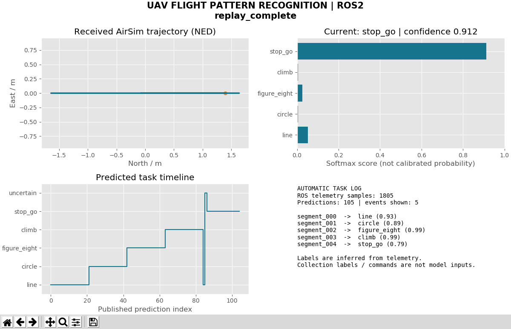
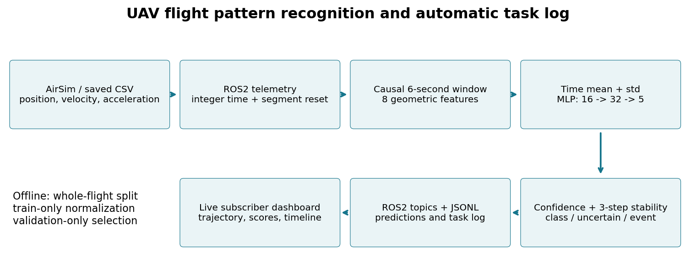
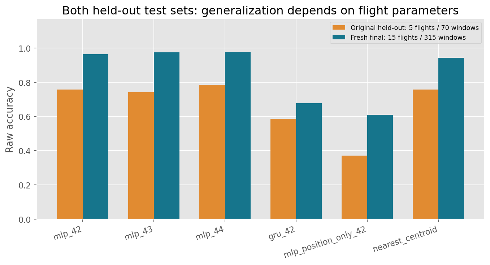
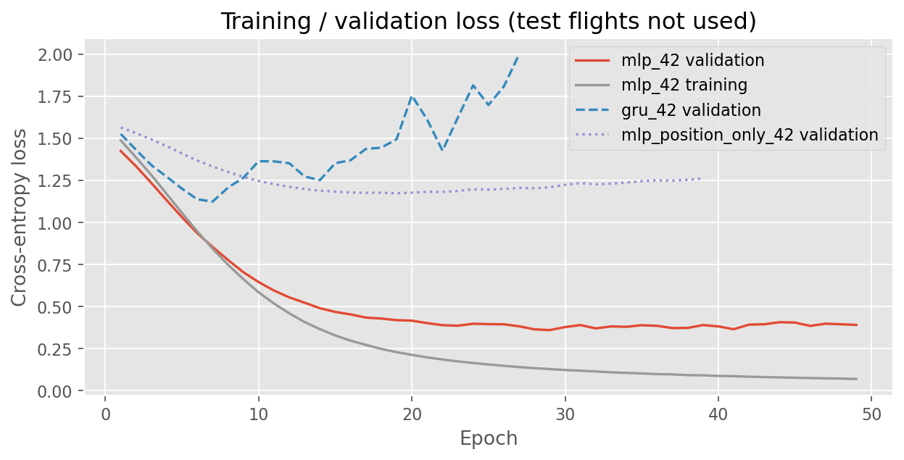
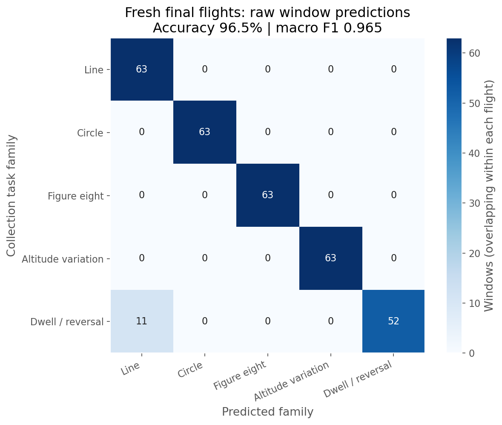
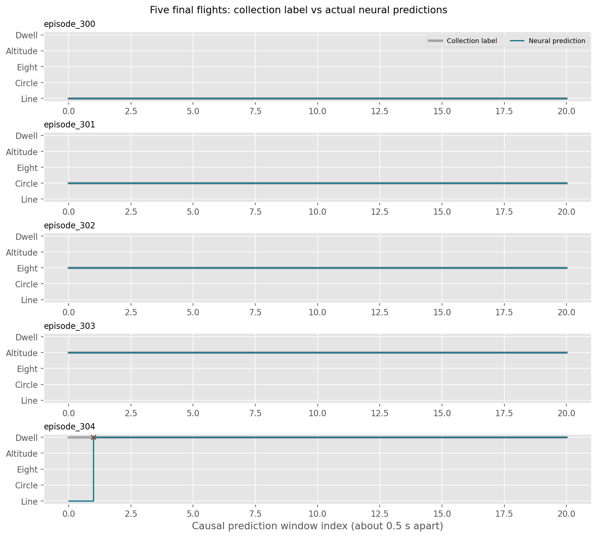

# 无人机飞行轨迹类型识别与 ROS2 自动任务日志

本模块从无人机最近 6 秒的位置、速度、加速度中识别五类飞行轨迹，通过 ROS2 发布类别、置信分数及稳定任务事件，并显示轨迹和识别时间线。包含真实 AirSim 数据、神经网络训练与测试、消融、模型、ROS2 封装和可复现入口。

主模型使用时序几何特征的均值/标准差加 MLP；GRU 为序列模型对照。任务属于**已知轨迹家族分类**，不预测未来状态，不做异常检测或路径规划。



该图是 Ubuntu 中订阅真实 ROS2 话题的窗口截图：回放 `episode_300`～`304` 的 1805 条实际仿真观测，得到 105 个预测和 5 条稳定事件。左下保留了短暂错误及低置信度预测。不是模拟绘制的成功界面，也不是直接订阅飞行指令标签。

## 1. 在 OpenHUTB 上扩展什么

复用 [OpenHUTB AirSim / ROS 连接方式](https://github.com/OpenHUTB/ros2/blob/master/docs/air/setup_and_connect.md) 和 [air_teleop 状态访问、消息解耦思路](https://github.com/OpenHUTB/ros2/blob/master/src/air/air_teleop/drone_ros_node.py)，新增 ROS2 遥测分类节点、任务事件、防抖和可视化。采集器改编自状态预测课程项目的 AirSim 采集程序，保留边界检查、稳定起点和降落确认；不依赖其他未合并模块才能运行。

| 项目方向 | 输入 / 输出 | 本项目区别 |
| --- | --- | --- |
| 状态预测（PR #121） | 历史状态 → 未来位置、速度 | 本项目输出离散轨迹类型 |
| 遥测异常检测（PR #138） | 状态 → 异常分数、告警 | 本项目训练正常任务类别，不注入故障 |
| 避障、PPO 导航、PID 跟踪 | 感知/目标 → 控制动作 | 分类和日志节点不发送飞行控制指令 |
| YOLO 图像检测 | 图像 → 目标框 | 本项目仅使用飞行遥测 |

2026-10-02 核查 OpenHUTB 主分支目录及最近 100 个 PR 标题/范围，未发现相同轨迹分类与任务日志模块；这不代表其他仓库不存在相关研究。上游基线为 `c10e1331a5b24dd2d9a0d37bafe91cecdb5ae92b`。



## 环境安装、检查与构建

在 Ubuntu 中先进入 `src/air/flight_pattern_recognition`。已有环境可跳过创建；首次安装需使用与系统 ROS2 匹配的 `/usr/bin/python3`，避免 Conda 的 `python3` 被误用：

```bash
source /opt/ros/humble/setup.bash
/usr/bin/python3 -m venv --system-site-packages ~/uav_prediction_env
source ~/uav_prediction_env/bin/activate
python -m pip install -r requirements.txt
bash main.sh doctor
bash main.sh build
```

`requirements.txt` 一次安装 CPU 版 PyTorch、NumPy、Matplotlib、colcon 构建插件和可选仿真客户端的前置依赖；不需要另装 CUDA。ROS2 的 `rclpy`/消息包和 Tk 来自系统 ROS/Python 安装，不能用 pip 安装 ROS2 代替。若创建 venv 报缺少 ensurepip，先安装系统 `python3-venv`；没有图形窗口时检查 `python3-tk`。

已经由 Conda 创建且无法导入 ROS2 的环境，建议保留原环境，另建一个系统 Python venv（例如 `~/ros2_course_env`），激活后运行同一个 requirements 命令。`main.sh` 优先使用 `UAV_ENV` 指定的目录，其次使用当前已激活的 `VIRTUAL_ENV`，最后才使用 `~/uav_prediction_env`；`ROS_SETUP` 可指定 ROS setup 文件。每个新终端都要激活环境，或使用会加载环境的 `main.sh`。

```bash
source ~/uav_prediction_env/bin/activate
```

构建通过当前 Python 调用 `colcon_core.command.main`，不依赖非标准的 `python -m colcon` 兼容模块。`doctor` 检查 ROS2、神经网络库和构建插件，打印实际解释器并保存 `artifacts/environment.json`；该环境记录已随本 PR 提交。

目录和 ROS 包已统一更名为 `flight_pattern_recognition`。请在新目录重新执行 build；旧路径生成的 `build/`、`install/`、`log/` 不要复制到新目录。回放使用随附模型和数据，**无需先启动或下载仿真器**：

```bash
bash main.sh demo
```

先在另一桌面终端运行 `bash main.sh dashboard`，再启动 demo；五类回放约 95 秒后正常结束。

## 仿真器选择与实际验证范围

新部署推荐使用维护者提供的 [OpenHUTB 模拟器发布页](https://github.com/OpenHUTB/hutb/releases)，选择支持无人机的场景及 AirSim 兼容接口。先使用现有场景和回放验证项目，再按需要下载对应平台版本。

本提交的既有训练数据、曲线和截图来自 Windows Blocks / AirSim 的实际运行，**尚未将这些结果重新标为 OpenHUTB 模拟器实测**。可复用 AirSim RPC 客户端，但具体场景、车辆名、主机地址及端口需按实际配置检查。配置示例随代码保存在 `config/airsim_settings.json`；示例中的 `192.168.239.1` 和 `PredictionDrone` 不应在其他机器盲目照抄。

只有重新采集或实时接入才需要额外安装仿真客户端。先完成核心 requirements，再运行：

```bash
python -m pip install -r requirements_airsim.txt
```

核心 requirements 已安装 `numpy` 与 `msgpack-rpc-python`，满足旧版 AirSim 安装脚本的前置导入要求；回放不导入 AirSim。重新采集程序会控制仿真无人机；回放、推理和只读桥接不下发飞控指令。

## 3. 数据、标签与防泄漏

数据来自实际运行的 AirSim `getMultirotorState`，保留 CSV、采集参数、时间戳和 SHA256。不是按轨迹方程直接生成的理想状态。轨迹方程仅生成控制目标，数据包含仿真飞行控制器实际响应。

| 划分 | 完整飞行数 | 窗口数 | 用途 |
| --- | ---: | ---: | --- |
| 旧训练集 000～019 | 20 | 280 | 归一化及模型训练 |
| 旧验证集 020～024 | 5 | 70 | 模型家族、权重和拒识阈值选择 |
| 旧保留测试集 025～029 | 5 | 70 | 独立报告原始测试表现 |
| 新最终测试集 300～314 | 15 | 315 | 冻结模型后重新采集，每类 3 次 |

旧数据 8430 条状态，新最终测试数据 5416 条，共 13846 条有效状态。另保留一次采样失败的原始记录，**不计入有效数据或测试**。源数据包的旧 `raw/manifest.json` 原样保留；其 `samples` 字段为前项目记录，本项目样本数按 CSV 实际行数统计。

五个标签是采集任务家族，来自采集元数据：

| 标签 | 采集任务含义 |
| --- | --- |
| `line` | 水平直线往返，正弦速度变化 |
| `circle` | 水平圆形轨迹 |
| `figure_eight` | 水平八字轨迹 |
| `climb` | 水平位移伴随周期性升降，不是单向爬升 |
| `stop_go` | 平滑停留/换向轨迹，不是硬切换停车 |

采样约 20 Hz，坐标统一 NED（x 北、y 东、z 向下）。输入只含 9 个位置/速度/加速度字段；类别、飞行编号、控制指令、随机种子均不进入网络。按整段飞行划分，之后才生成滑动窗口；归一化仅用训练集拟合。每段前 1 秒作为起始过渡，7 秒后开始使用过去 6 秒；以 0.1 秒网格插值为 61 点，约每 0.5 秒预测一次。仅使用预测时刻及之前的数据。

8 个几何特征为水平速度、垂直速度、切向加速度、有符号法向加速度、垂直加速度、水平相对位移、相对高度及路径效率。它们对整体平移和绕竖直轴旋转不变；这不等于对所有飞行速度或姿态变化不变。时间间隔超过 150 ms、非有限值、时钟回退或来源分段变化都会重置历史。

`results/frozen_protocol.json` 记录最终采集前固定的模型及算法 SHA256。第 308 段首次采集出现重复时间戳和 0.576 秒停顿，依据质量规则拒绝；用相同种子和任务参数重采后通过。失败 CSV 在数据包 `rejected_raw/`，原始及替代哈希在 `results/collection_quality.json`。替代发生在读取任何最终分类结果之前。

## 4. 训练、测试、消融

主模型：8 维序列取时间均值和标准差，得到 16 维输入；`Linear(16,32) → ReLU → Linear(32,5)`。训练采用交叉熵、Adam、固定随机种子、梯度裁剪，最多 120 轮，验证损失连续 20 轮不改善则停止。GRU 使用 32 维隐状态。位置特征消融保持 MLP 结构，将前五个速度/加速度通道的归一化值置零，只保留位移、高度和路径效率。

验证损失支持选择 MLP 而非 GRU；主模型固定使用种子 42，43/44 用于稳定性对比。最近质心是非神经网络基线，使用相同的 16 维统计特征。它在验证集上优于神经网络，因此结果不支持“神经网络在所有数据上都优于简单方法”。

| 模型 | 旧测试准确率 | 旧测试宏 F1 | 新最终测试准确率 | 新最终测试宏 F1 |
| --- | ---: | ---: | ---: | ---: |
| MLP，种子 42（主模型） | 75.71% | 0.716 | 96.51% | 0.965 |
| MLP，种子 43 | 74.29% | 0.675 | 97.46% | 0.975 |
| MLP，种子 44 | 78.57% | 0.751 | 97.78% | 0.978 |
| GRU，种子 42 | 58.57% | 0.510 | 67.62% | 0.607 |
| MLP，仅位置几何特征 | 37.14% | 0.317 | 60.95% | 0.605 |
| 最近质心基线 | 75.71% | 0.745 | 94.29% | 0.942 |

以上是**全部窗口的原始分类指标**，错误不会因低置信度而删除。主模型最终测试接受率为 99.37%，接受部分准确率 96.81%；旧测试接受率 82.86%，接受部分准确率 79.31%。阈值 0.53 由验证集规则确定（接受准确率至少 90%，且覆盖至少 20%）；softmax 分数没有经过概率校准，拒识机制未作为未知轨迹检测器验证。

整段多数投票准确率分别为旧测试 4/5、新测试 15/15；多数投票只用于离线统计，不是实时稳定事件的评分。CPU 模型单次前向耗时中位数约 0.021 ms、P95 约 0.029 ms，不含 ROS 传输、窗口计算和界面刷新。模型首次输出需约 7 秒历史，任务事件还需连续 3 次一致预测，通常再等待约 1 秒。






旧测试的直线样本大多被判断为停走，八字样本部分被判断为圆形，说明短时间窗口内的运动模式存在重叠。新测试任务更长（约 18 秒，旧数据约 14 秒），参数、初始稳定过程也存在差异；两组结果应分别解释，不能用新测试高分覆盖旧测试低分。窗口彼此重叠，315 个窗口不能当作 315 次独立飞行。

复现入口（先激活已有 Python/ROS2 环境）：

```bash
python main.py prepare
python main.py test
python main.py evaluate --split final --output results/recomputed_final
python main.py evaluate --split test --output results/recomputed_original
```

从头重新训练全部对照模型，保存到新目录，不覆盖随附权重：

```bash
python main.py reproduce --output models/retrained_run
```

该入口依次训练五组模型，并分别评估旧测试和新最终测试。若只训练一个模型：

```bash
python main.py train --variant mlp --seed 42 --output models/retrained_mlp_42
```

`python main.py report` 从随附实验 JSON/CSV 和 loss 记录重新绘制图表；`python verify_stream.py` 校验离线与逐条输入的预测一致性。随附结果已核对全部 315 个最终窗口，概率误差容限为 2e-6。

## 5. ROS2 接口与自动日志

| 话题 | 消息 | 内容 |
| --- | --- | --- |
| `/uav/pattern/telemetry` | `std_msgs/String` JSON | 整数纳秒时间戳、匿名分段标识、9 维状态 |
| `/uav/pattern/prediction` | 同上 | 原始类别、接受类别、5 类分数、稳定类别 |
| `/uav/pattern/task_events` | 同上 | 连续 3 次稳定后的类别变化事件 |
| `/uav/pattern/status` | 同上 | 暖机、识别、坏数据、断流、回放结束 |
| `/uav/pattern/replay_status` | 同上 | 回放完成及样本数 |

所有字段定义可在 `ros_pattern.py`、`pattern_stream.py` 中查看。使用 JSON 是为了避免额外自定义消息构建；时间戳保持整数，不经过 float 转换。CSV 回放生成的 `segment_000` 等匿名标识仅用于重置历史，不包含真实任务标签。分段边界来自数据源，本模块不声称自动发现未知任务的真实起止边界。

启动文件为 `launch/pattern.launch.py`，必填参数为 `files`（分号分隔的 CSV 路径）、`model`，可选 `log`。回放进程退出会触发识别节点退出，日志每行立即写入；虚拟机停顿超过 150 ms 时延后回放墙钟起点，保留原始仿真时间戳并避免集中补发挤满消息队列；`main.sh demo` 已封装此调用。

9 项单元测试覆盖因果性、不变性、采样间断、跨段重置、时钟回退、NaN 和防抖。真实 ROS2 集成检查另外验证 361 条消息、21 次预测、1 条事件、坏 JSON、NaN 和壁钟断流重置，结果见 `results/ros_integration.json`。重新执行：

```bash
source /opt/ros/humble/setup.bash
source ~/uav_prediction_env/bin/activate
ROS_DOMAIN_ID=76 PYTHONPATH="$PWD:$PYTHONPATH" python tests/ros_smoke.py
```

## 6. 重新采集或接入正在运行的 AirSim

`collect_final.py` 会在已有场景中实际控制仿真无人机，包含碰撞、区域边界、起点稳定和降落确认。模型推理、回放、界面和 `pattern_live.py` 均不控制无人机。主机默认 `192.168.239.1`、载具 `PredictionDrone`；配置示例见 `assets/airsim_settings.json`。

已有场景启动且无人机在地面时，可采集到独立新目录：

```bash
python collect_final.py --host 192.168.239.1 --start 400 --episodes 5 --output data/new_collection
```

采集器拒绝覆盖文件。新增数据不是随附最终测试集的一部分；若用于训练，应重新设计完整飞行划分，并保留新的未见测试集。

只读实时桥接：

```bash
python main.py live --ros-args -p host:=192.168.239.1 -p vehicle:=PredictionDrone
```

在另一个已加载 ROS 和包环境的终端启动识别节点：

```bash
ros2 run flight_pattern_recognition pattern_recognizer --ros-args -p model:="$PWD/models/mlp_42" -p log:="$PWD/results/live_predictions.jsonl"
```

飞行需要独立控制器。五类训练数据不覆盖起飞、降落、悬停、故障和任意复杂任务；这些阶段的输出没有准确性保证。当前提交的识别截图与指标来自真实仿真数据的 ROS2 回放，不冒充对新实时飞行完成了全流程精度验证。


此图为采集第 300 段时由 AirSim API 返回的原始相机帧（256×144）；不参与模型输入。两次采集程序都记录 `LANDED_VERIFIED True`，见 `results/pattern_collection.log` 和 `results/pattern_retry.log`。

## 7. 文件与限制

`assets/flight_corpus.zip` 为自包含原始数据；`models/` 为权重、训练 loss 和配置；`results/` 为实验原始指标、预测 CSV、图表、真实截图及运行日志；`tests/` 为校验；`main.py`/`main.sh` 为统一入口。`data/`、ROS 构建目录及再训练输出由本地生成。

本实验仅使用一个 AirSim Blocks / SimpleFlight 场景和有限参数范围，未验证实机、跨场景、跨控制器、风扰动或未知轨迹。类别来自采集任务元数据，不是人工逐时刻动作标注。旧测试明显低于新测试，反映样本量和分布敏感性；本模块定位为可复现的课程实验与日志原型。

AI 使用声明：代码、文档和实验流程在大模型辅助下完成；随附数据来自实际仿真采集，训练、测试、ROS2 日志和截图来自实际运行。提交者负责检查与维护提交内容。
