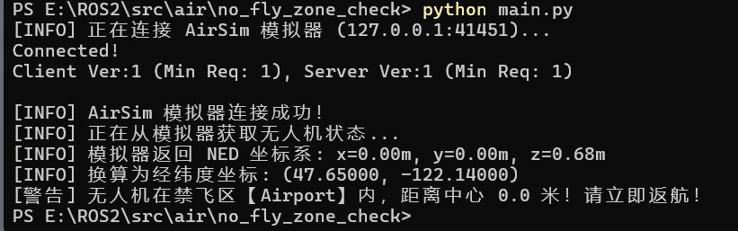

# 禁飞区检测模块 (No-Fly Zone Check)

## 简介

本模块用于无人机配送任务的禁飞区安全校验。给定取货点和送货点的经纬度坐标，判断它们是否落在预设的禁飞区内。

## 运行环境

- Python 3.6+
- 需要安装 AirSim 1.8.1 模拟器环境
- 第三方库：`airsim`
- **注意：运行前请务必先启动 AirSim 模拟器，否则程序会提示连接失败。**

## 运行步骤

1. 启动 AirSim 模拟器（确保 RPC 端口 41451 已开放）。
2. 进入模块目录：
   cd src/air/no_fly_zone_check
3. 运行程序：
   python main.py

## 运行效果

程序启动后会尝试连接 AirSim 模拟器。

**说明**：上图为本地启动 AirSim 1.8.1 模拟器并成功连接后的运行结果，获取到无人机位置并完成禁飞区检测。

## 算法说明

使用 **Haversine 公式** 计算地球表面两点之间的球面距离：

$$
a = \sin^2\left(\frac{\Delta\varphi}{2}\right) + \cos\varphi_1 \cdot \cos\varphi_2 \cdot \sin^2\left(\frac{\Delta\lambda}{2}\right)
$$

$$
c = 2 \cdot atan2\left(\sqrt{a}, \sqrt{1-a}\right)
$$

$$
d = R \cdot c
$$

其中 R = 6371000 米（地球平均半径）。

## 参数配置

禁飞区在 `main.py` 顶部的 `NO_FLY_ZONES` 列表中定义。

