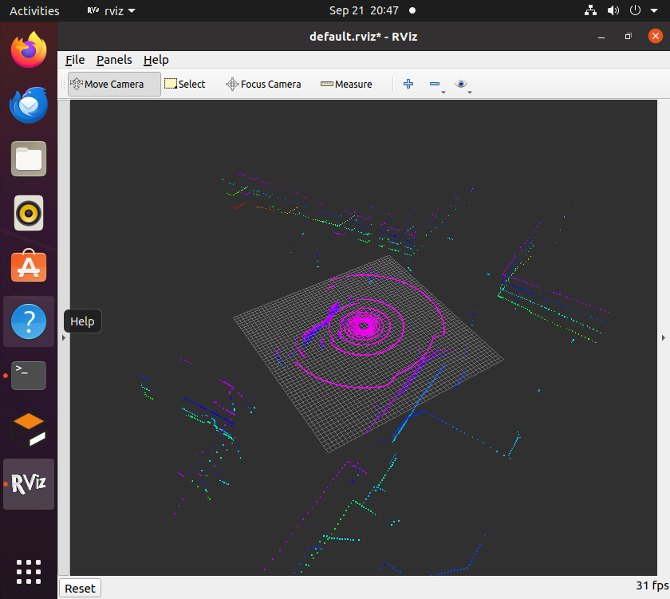
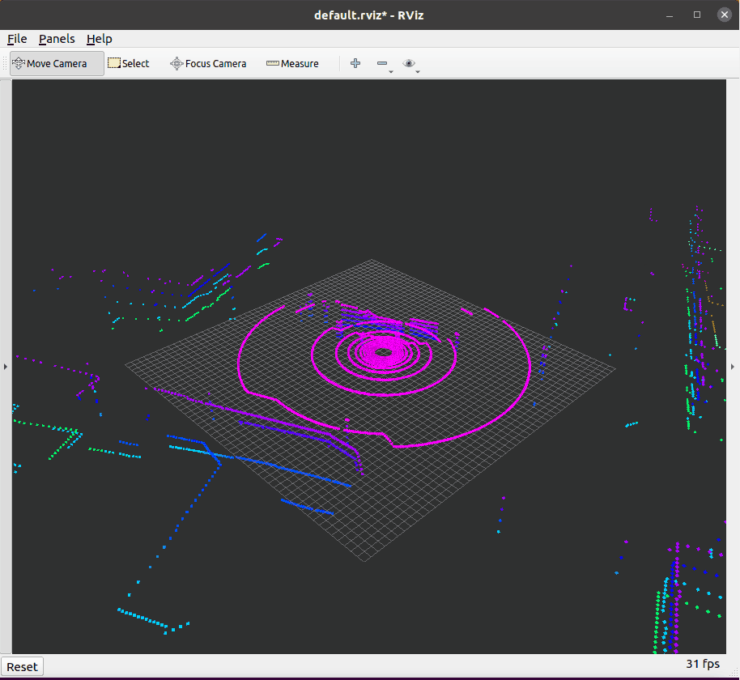

# octree_uav_3d_pathfinding

空域载具（无人机）的八叉树三维寻路模块。
从传感器点云构建八叉树占用地图，在八叉树上执行 A* 全局寻路，
并进行安全裕度处理与路径平滑，最终实现无人机的三维路径跟踪。

## 运行环境

| 位置 | 项目 | 版本 |
|---|---|---|
| 宿主 Windows | 模拟器 | **AirSim 1.8.1**（随 OpenHUTB 发行版提供） |
| 宿主 Windows | 场景 | 城市地图（含多旋翼与 3D 激光雷达） |
| 客户机 Ubuntu | 操作系统 | 20.04.6 LTS |
| 客户机 Ubuntu | ROS | Noetic（ROS 1，1.16.0） |
| 客户机 Ubuntu | 三维地图 | octomap 1.9.8 |
| 客户机 Ubuntu | 构建工具 | catkin 0.8.10 |
| 客户机 Ubuntu | Python | 3.8 |

> **模拟器跑在宿主 Windows 上，不在虚拟机里。**
> AirSim 是 Windows/Unreal 程序，没有办法搬进 Ubuntu。
> 虚拟机通过 VMnet8 网络连它的 RPC 端口（默认 `41451`），
> 数据按"模拟器 → RPC → 桥接节点 → ROS 话题"单向流入。

## 编译

在客户机（Ubuntu 虚拟机）里依次执行：

    mkdir -p ~/uav_ws/src
    cd ~/uav_ws/src && catkin_init_workspace
    # 将本模块放入 ~/uav_ws/src/
    cd ~/uav_ws && catkin_make
    source ~/uav_ws/devel/setup.bash

依赖分两部分：

    # ROS 侧：点云建图节点是 C++ 的，需要 octomap 的头文件与库
    sudo apt install liboctomap-dev ros-noetic-octomap ros-noetic-octomap-msgs \
                     ros-noetic-octomap-ros ros-noetic-visualization-msgs

    # Python 侧：桥接节点要用 AirSim 客户端
    # 注意顺序不能反：airsim 的 setup.py 会 import 自己，依赖必须先装好
    pip3 install numpy
    pip3 install msgpack-rpc-python
    pip3 install airsim

## 运行

### 前置条件：先在宿主上启动模拟器

进入模拟器的安装目录运行 `CarlaUE4.exe`（安装位置因人而异，本文不写死具体路径）：

    cd <模拟器安装目录>
    CarlaUE4.exe

**必须在安装目录里启动** —— 它要读同目录的 `settings.json`（载具与激光雷达的配置）。
该目录下应能看到 `CarlaUE4.exe`、`settings.json`、`CarlaUE4\`、`Engine\` 这几项。

启动后等 30~60 秒让场景加载完，确认 AirSim 的 RPC 端口已经监听：

    netstat -ano | findstr 41451

同时确认宿主防火墙放行 `41451` 的**入站**连接。
注意 Windows 防火墙的优先级是**显式 Block 盖过显式 Allow**，
如果之前误点过"取消"，会留下一条 Block 规则，需要先禁用它。

### 一条命令启动模块

    roslaunch octree_uav_3d_pathfinding main.launch

它会依次拉起：AirSim 桥接 → 点云建图 → 环境自检（跑完自动退出）→ RViz。

可选的启动参数：

| 参数 | 默认值 | 说明 |
|---|---|---|
| bridge | true | 是否启动 AirSim 桥接节点 |
| mapping | true | 是否启动点云建图节点 |
| check | true | 是否运行环境与链路自检 |
| rviz | true | 是否启动 RViz |

### 让飞行器飞向目标点

桥接节点订阅 `/uav/goal`，**目标点使用 ROS 世界系（ENU），单位 m**：

    rostopic pub -1 /uav/goal geometry_msgs/Point "{x: 40.0, y: 0.0, z: 5.0}"

首次收到目标点时飞行器会自动解锁起飞，随后飞向该点；
八叉树地图沿飞行轨迹不断扩展。

### 运行效果

环境与链路自检：四项依次检查 **AirSim RPC → 点云链路 → TF → 话题通信**，
全过之后节点自动退出，不影响仿真继续运行。

AirSim 接进 ROS 之后，RViz 里可以看到激光点云，以及桥接节点广播的
`base_link` / `lidar_link` 坐标系：

向 `/uav/goal` 下发目标点（ROS 世界系 ENU），飞行器自动解锁起飞并飞向该点：

    rostopic pub -1 /uav/goal geometry_msgs/Point "{x: 30.0, y: 0.0, z: 15.0}"

点云被增量地插入八叉树，RViz 中出现按高度着色的占用体素（低处偏蓝、高处偏红）：

飞行器移动时，地图沿飞行轨迹不断生长：

建图节点每 5 秒输出一次统计，可以看到点云在持续进来、体素在增长：

### 不需要模拟器的离线自检

`scripts/mock_cloud_publisher.py` 会发布一个 20×20×6 m 的假房间点云（含一个悬空方块），
用来**单独验证"点云 → 八叉树 → RViz"这半条链路**。
排障时非常有用 —— 能把"桥接/模拟器的问题"和"建图/RViz 的问题"分开：

    # 终端 1：只起建图与 RViz，不起桥接
    roslaunch octree_uav_3d_pathfinding main.launch bridge:=false check:=false

    # 终端 2：喂假点云
    python3 scripts/mock_cloud_publisher.py

应在 RViz 中看到一个彩色的空心房间。

## 模块组成

### AirSim 桥接节点 airsim_bridge.py

把宿主上的 AirSim 接成标准 ROS 话题。这是本模块唯一与模拟器耦合的地方。

* 轮询 `getMultirotorState()` → 发 `/ground_truth/odom` 与 TF `world → base_link`
* 轮询 `getLidarData()` → 发 `/cloud_in`（`sensor_msgs/PointCloud2`）
* 广播静态 TF `base_link → lidar_link`
* 订阅 `/uav/goal`，转成 NED 后调 `moveToPositionAsync` 驱动飞行器

**注意**：AirSim 的 msgpackrpc 客户端不是线程安全的，
节点内部用一把锁把所有 AirSim 调用串起来。

### 点云建图节点 pointcloud_to_octomap

把 `/cloud_in` 的点云增量地插入八叉树。每收到一帧：

1. 查 TF，把点云从 `lidar_link` 变换到世界坐标系
2. 剔除 NaN/inf 与过近的无效点，按 `point_stride` 抽稀
3. 调 `octomap::OcTree::insertPointCloud()` 做射线投射：
   射线终点记为占用、途经体素记为空闲、未扫描区域保持未知
4. 定时发布完整八叉树，并把占用叶节点转成按高度着色的立方体 Marker 供 RViz 显示

### 主入口与环境自检 main.py

这是模块的入口节点，也是**自检工具**。因为模拟器与 ROS 分处两台机器，
链路天然分两层，所以自检也分两层做，出问题时能一眼看出是模拟器的事还是 ROS 的事：

1. 直连 AirSim RPC，确认模拟器在线并列出载具
2. 订阅 `/cloud_in`，确认桥接节点把点云送进了 ROS
3. 查询 TF，确认 `world → base_link` 可用
4. 发布心跳话题 `/uav_status`，确认节点间通信正常

跑完指定时长后自动退出，不影响仿真继续运行。

### 离线点云模拟器 mock_cloud_publisher.py

不依赖模拟器，生成一个封闭房间的点云并发到 `/cloud_in`，用于排障与离线演示。

## 坐标系约定

**这是本模块最容易出错的地方**，因为 AirSim 与 ROS 用的坐标系完全不同：

| 层级 | AirSim | ROS | 转换 |
|---|---|---|---|
| 世界系 | NED（北-东-地） | ENU（东-北-天） | $(e, n, u) = (y, x, -z)$ |
| 机体系 | FRD（前-右-下） | FLU（前-左-上） | $(x, y, z) = (x, -y, -z)$ |
| 姿态 | 四元数（NED） | 四元数（ENU） | 按基变换复合：$q_{ros} = q_{Cw} \otimes q_{ned} \otimes q_{Dx}$ |

点云的坐标系由模拟器 `settings.json` 里的 `DataFrame` 决定 —— 本模块用
**`SensorLocalFrame`**（点云在雷达本体系下），这样下游建图节点可以直接套用
"本体系点云 + TF"的通用做法：一次 TF 查询同时拿到点云变换和射线原点。

## 主要话题

| 话题 | 类型 | 方向 | 说明 |
|---|---|---|---|
| /cloud_in | sensor_msgs/PointCloud2 | 桥接发布 | 激光雷达点云（`lidar_link` 系） |
| /ground_truth/odom | nav_msgs/Odometry | 桥接发布 | 位姿与速度（ENU） |
| /uav/goal | geometry_msgs/Point | 桥接订阅 | 目标点（ROS 世界系 ENU） |
| /tf | tf2_msgs/TFMessage | 桥接发布 | `world → base_link → lidar_link` |
| /uav/status | std_msgs/String | 桥接发布 | 运行状态 |
| /octomap_full | octomap_msgs/Octomap | 建图发布 | 完整八叉树地图（latched） |
| /occupied_cells_vis_array | visualization_msgs/MarkerArray | 建图发布 | 占用体素可视化 |

## 参数配置

参数位于 `config/params.yaml`，由 `main.launch` 载入。
**注意：用 `rosrun` 单独跑节点不会加载这个文件，参数会退回默认值。**

> ⚠️ **换机器必须改两项**
>
> * `host` —— 改成**你自己宿主机的 VMnet8 地址**。查法：在客户机里执行
>   `ip route | grep default`，宿主的地址就在默认网关那个网段里。
>   本文出现的 `192.168.198.1` 是本项目实测环境的值，**每台机器可能不同**。
> * `vehicle_name` / `lidar_name` —— 要与你自己模拟器 `settings.json` 里的名字一致。

`uav_env_check`（环境自检）：

| 参数 | 默认值 | 说明 |
|---|---|---|
| host / port | 192.168.198.1 / 41451 | 模拟器地址，需与 `airsim_bridge` 一致 |
| vehicle_name / lidar_name | Drone1 / LidarSensor1 | 需与模拟器的 `settings.json` 一致 |
| cloud_topic / world_frame / body_frame | /cloud_in / world / base_link | 被检查的话题与坐标系 |
| check_duration | 10.0 | 自检运行时长（秒） |
| cloud_timeout / tf_timeout | 20.0 / 10.0 | 等待点云 / TF 的超时（秒） |

`airsim_bridge`（桥接节点）：

| 参数 | 默认值 | 说明 |
|---|---|---|
| host / port | 192.168.198.1 / 41451 | 宿主机的 VMnet8 地址，**不是 `127.0.0.1`**，每台机器不同 |
| vehicle_name / lidar_name | Drone1 / LidarSensor1 | 载具与雷达名 |
| world_frame / body_frame / lidar_frame | world / base_link / lidar_link | 帧名 |
| lidar_x / lidar_y / lidar_z | 0 / 0 / -1.0 | 雷达在机体系（NED）下的安装位置 |
| world_z_offset | 24.94 | 世界系 z 校准（见下） |
| state_rate / cloud_rate | 20.0 / 10.0 | 位姿与点云的发布频率（Hz） |
| goal_velocity | 3.0 | 收到目标点后的飞行速度（m/s） |
| auto_takeoff | true | 首次收到目标点时是否自动解锁起飞 |

> **`world_z_offset` 是干什么的**：AirSim 的 NED 原点不一定在地面。
> 本机场景实测载具在 NED `z = +24.94`（即原点下方约 25 m），
> 加这个常量偏移把地图挪到 RViz 网格附近，方便观察。纯平移，不影响寻路结果。

`pointcloud_to_octomap`（建图节点）：

| 参数 | 默认值 | 说明 |
|---|---|---|
| cloud_topic / world_frame / sensor_frame | /cloud_in / world / lidar_link | 输入话题与坐标系 |
| resolution | 0.3 | 八叉树叶节点分辨率（m），**最关键的一个参数** |
| max_range / min_range | 30.0 / 0.5 | 射线量程范围（m） |
| point_stride | 2 | 抽稀：每隔 N 个点取一个做射线投射 |
| prob_hit / prob_miss | 0.7 / 0.4 | 占用概率模型 |
| clamp_min / clamp_max | 0.12 / 0.97 | 占用概率上下限 |
| publish_rate | 1.0 | 地图与可视化发布频率（Hz） |
| color_min_z / color_max_z | 0.0 / 25.0 | 体素着色的高度范围（m） |
| max_markers | 20000 | 单帧可视化的最大体素个数 |

> **性能提示**：AirSim 一帧约有一万个点，每点一条射线，射线长度除以分辨率就是
> 要更新的体素数量。逐点投射在虚拟机上跟不上，所以默认抽稀 2 倍、分辨率取 0.3 m、
> 量程收到 30 m。机器的性能富裕时可以把 `point_stride` 调回 1、`resolution` 调到 0.2。

## 目录结构

    octree_uav_3d_pathfinding/
      package.xml                      包声明与依赖
      CMakeLists.txt                   编译规则
      README.md                        本文件
      launch/main.launch               模块统一入口
      src/pointcloud_to_octomap.cpp    点云转八叉树占用地图节点（C++）
      scripts/main.py                  主入口与环境链路自检
      scripts/airsim_bridge.py         AirSim → ROS 桥接节点
      scripts/mock_cloud_publisher.py  离线点云模拟器（排障用）
      config/params.yaml               参数配置
      rviz/default.rviz                RViz 可视化预设
      docs/                            运行效果图

> 模拟器的模型与场景（`models/`）不在本包内 —— 载具、传感器与场景
> 全部由宿主上的 AirSim 提供，通过 `settings.json` 配置。

## 常见问题

| 现象 | 原因与处理 |
|---|---|
| 自检报"无法连接 AirSim" | ①宿主模拟器没启动；②防火墙没放行 41451；③`host` 写成了 `127.0.0.1`（应为宿主机 VMnet8 地址） |
| 连不上、但端口测试返回 11 | **11 是"超时/丢包"，不是"端口关闭"**（那会是 111）。查宿主防火墙的入站规则，尤其有没有 Block 规则压着 Allow |
| 自检报"/cloud_in 等待超时" | 桥接节点没起来，或 AirSim 没返回激光数据。先看桥接节点自己的日志 |
| `ModuleNotFoundError: msgpackrpc` | 安装顺序错了：先 `numpy`，再 `msgpack-rpc-python`，最后 `airsim` |
| `catkin_make` 找不到 octomap | `sudo apt install liboctomap-dev` |
| RViz 里点云/体素"看不见"，但状态是 Ok | ①相机太远（几十米外看 0.3 m 的体素只有几个像素）；②**`Style` 必须是 `Squares`，`Points` 走 OpenGL 的 `GL_POINTS`，虚拟机显卡驱动会把点大小钳到 1 像素**。Status Ok 只说明消息收到了，不代表画出来了 |
| 体素全是同一个颜色 | `color_min_z` / `color_max_z` 与实际高度范围不匹配 |
| 建图节点 CPU 跑满、日志卡顿 | `point_stride` 调大、`max_range` 调小 |
| 改了参数但不生效 | 用 `rosrun` 跑不会加载 `params.yaml`，改用 `roslaunch` |

## 后续计划

| 提交 | 内容 | 状态 |
|---|---|---|
| 1 | 模块骨架、launch 入口、环境自检 | 已完成 |
| 2 | 飞行器与传感器（**已从 Gazebo 迁移到 AirSim**） | 已完成 |
| 3 | 点云转八叉树占用地图 | 已完成 |
| 4 | 八叉树上的 A* 全局寻路 | 待开发 |
| 5 | 安全裕度与路径平滑 | 待开发 |
| 6 | 路径跟踪与闭环飞行 | 待开发 |

## 参考

- [AirSim 激光雷达文档](https://microsoft.github.io/AirSim/lidar/)
- [AirSim ROS 封装](https://microsoft.github.io/AirSim/airsim_ros_pkgs/)
- [OpenHUTB 低空模拟器文档](https://openhutb.github.io/air_doc/)
- [OctoMap 官网](https://octomap.github.io/)
- Hornung et al., OctoMap: An Efficient Probabilistic 3D Mapping Framework Based on Octrees, Autonomous Robots, 2013
