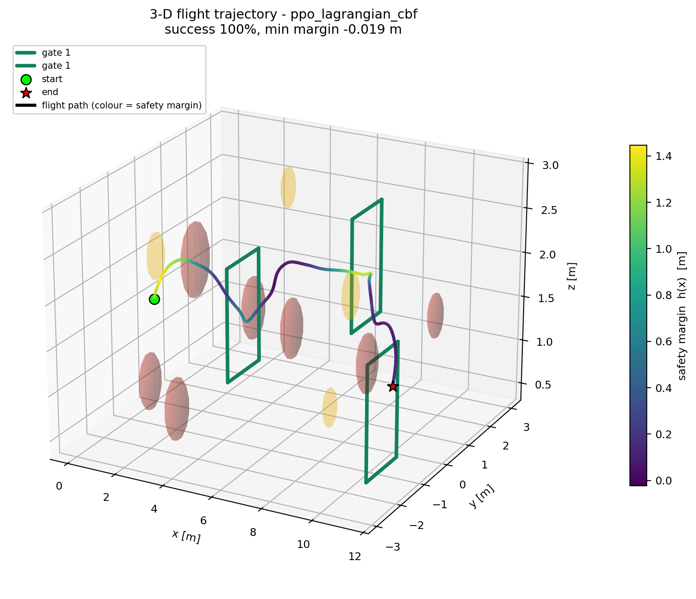
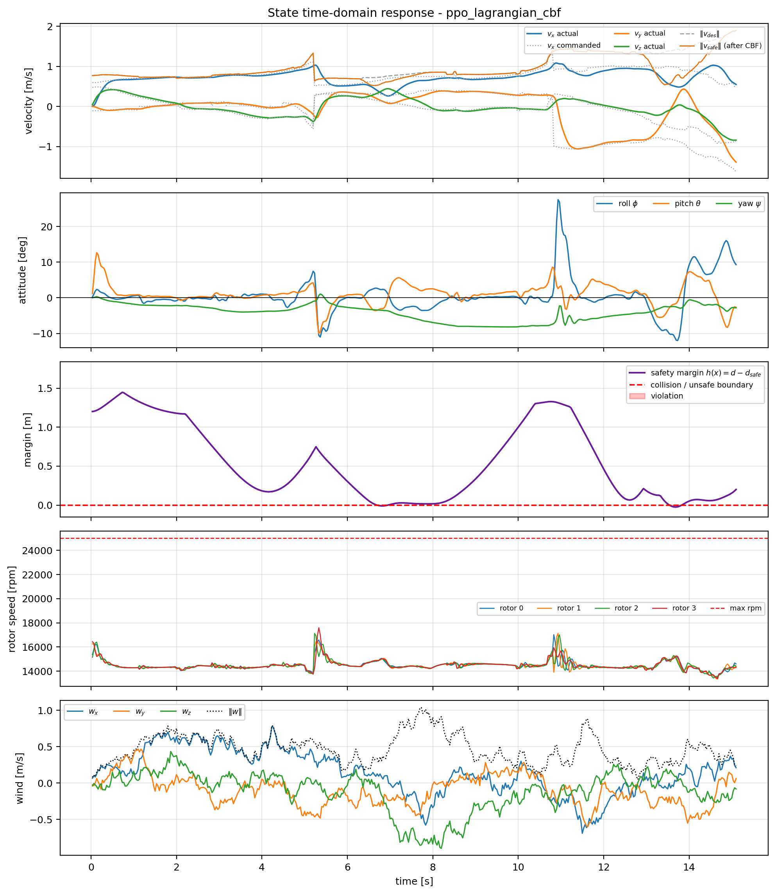
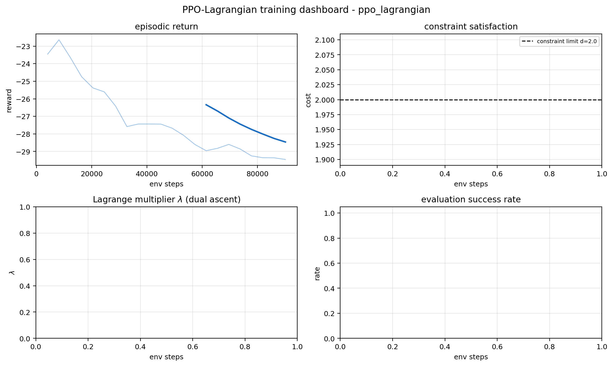

# SafeDRL-DroneNav-ROS

**Safe deep-reinforcement-learning drone navigation with control-barrier-function enforcement**

A constrained (Lagrangian) PPO policy flies a quadrotor through a slalom of gates in a
PyBullet corridor containing static and dynamic obstacles and subject to discrete wind
gusts, while a discrete-time **control-barrier-function (CBF) safety filter** constrains
the velocity command so that the vehicle can always still come to a stop before contact.

This project re-implements and extends the ideas of
[`eRGiBi/DRL-DroneNavigation`](https://github.com/eRGiBi/DRL-DroneNavigation)
(PyBullet + Stable-Baselines3 drone racing) and targets a **plain Ubuntu/ROS VM** — no
GPU, no flight controller, no Gazebo required.

---

## Headline result

Identical policy, identical evaluation seeds (24 episodes), the only difference being
whether the CBF safety filter is engaged at runtime:

| # | Policy | CBF filter | Success ↑ | Collision ↓ | Worst contact clearance ↑ | Mean arrival | Mean cost |
|---|--------|:----------:|:---------:|:-----------:|:-------------------------:|:------------:|:---------:|
| 1 | PPO (unconstrained) | ✗ | 0.458 | 0.542 | **−0.091 m** (penetrated) | 6.82 s | 0.546 |
| 2 | PPO-Lagrangian | ✗ | 0.708 | 0.292 | **−0.083 m** (penetrated) | 14.77 s | 0.303 |
| 3 | PPO-Lagrangian | ✓ | **1.000** | **0.000** | **+0.175 m** | 15.93 s | **0.001** |
| 4 | PPO (unconstrained) | ✓ | 0.833 | 0.167 | **+0.137 m** | 7.65 s | 0.167 |

*Clearance is the distance to **actual contact** (barrier margin + safety offset); a
negative value means the airframe geometrically penetrated an obstacle.*

**Two conclusions, both measured rather than asserted:**

1. **The filter provides a hard safety guarantee.** Without it, policies physically
   penetrate obstacles (worst clearance −0.091 m). With it, *every one of the 96
   filtered episodes* stayed clear of contact, with the worst case still +0.137 m away.
2. **The filter also improves task success.** For the unconstrained policy it raises
   success 0.458 → 0.833, because a large fraction of unfiltered failures are avoidable
   crashes. Safety and performance are not in tension here.


The per-episode distribution makes the guarantee graphical — with the filter, no episode
crosses the unsafe boundary:


---

## 1. What is new relative to the original project

| Aspect | Original `DRL-DroneNavigation` | This work |
|---|---|---|
| Safety mechanism | Reward penalty only | **Discrete-time CBF filter + Lagrangian constraint (cost signal)** |
| Obstacles | Static | **Static + moving/sweeping dynamic obstacles** |
| Disturbances | None | **Ornstein–Uhlenbeck wind field + discrete gust bursts** |
| Task | Race gates | **Non-colinear slalom** (a constant forward command cannot solve it) |
| Reward | Several literature penalties | **Potential-based shaping** (policy-invariant) + **rotor-power energy term** |
| Constraints | n/a | Explicit cost stream, dual ascent on λ, bounded cost semantics |
| Evidence | TensorBoard only | Auto-generated logs, TB, JSON/CSV metrics, traces, figures, terminal snippets |
| Deployment | Scripts | **ROS node with the same observation builder and filter on live topics** |

---

## 2. Method

### 2.1 Environment (`scripts/safe_nav_env.py`)

* **Plant** — a CrazyFlie-2.X-class quadrotor built directly on PyBullet
  (`scripts/drone_dynamics.py`): 27 g, 3.16e-10 N/rpm² thrust coefficient, explicit
  diagonal inertia. Actuation goes through a real **rotor mixer**
  (`(T, τ) → rpm` by inverting the allocation matrix) and a **first-order motor lag**
  (τ = 20 ms), so the vehicle has genuine actuator dynamics rather than being a
  kinematic point.
* **Control hierarchy** — the RL action is a normalised desired velocity plus yaw rate;
  a geometric SE(3) controller (Lee et al.) converts that into thrust and body torques.
  Attitude gains are *derived from the inertia* (`kp_R = I·ωₙ²`, `kd_w = 2ζI·ωₙ`) rather
  than hand-guessed; the naive gains from the reference implementation are ~30× too
  stiff for this airframe and diverge at the 240 Hz integration step.
* **Task** — thread three gates in order. The gates form a **slalom**
  (y offsets 0.0 → +1.55 → −1.55 m, z offsets 0.0 → +0.45 → −0.35 m), so holding a
  heading does not work; a constant-forward baseline scores −35 and fails.
* **Disturbances** — an OU wind process (σ = 0.30 m/s, θ = 0.9) plus discrete gust
  bursts (0.8–2.4 m/s for 0.1–0.33 s). Wind enters through the **air-relative velocity**
  in the drag term, so gusts genuinely perturb the airframe.
* **Obstacles** — 7 static spheres and 4 dynamic spheres that sweep sinusoidally across
  the corridor.

**Observation (53-D):** relative position to the active gate (3), velocity (3),
attitude (3), the 4 nearest obstacles as (relative position, radius) (16), a 24-ray
analytic virtual lidar, and the previous action (4).

**Action (4-D):** desired world velocity (3, scaled to ±2.6 m/s) + yaw rate.

### 2.2 Reward (`EnvConfig`, weights in `config/nav_params.yaml`)

```
r = w_progress·[γΦ(s') − Φ(s)]  −  w_energy·Σ(rpm/rpm_max)³  −  w_action·‖Δa‖²
    −  w_proximity·proximity  +  w_alive  +  w_gate·1{gate}  +  w_success/crash
```

* `Φ(s) = −distance_to_active_gate` gives **potential-based reward shaping**
  (Ng, Harada & Russell 1999), which provably leaves the optimal policy unchanged — so
  guidance is free of the usual "shaping changes the optimum" objection.
* Energy uses the **aerodynamic rotor power** `Σrpm³`, not a proxy for acceleration.
* Safety enters as a **cost**, not a reward penalty — this is the clean constrained-RL
  split that makes the Lagrangian formulation meaningful.

> **A design failure worth recording.** The first reward used `w_alive = +0.02` with
> `w_gate = 6`, `w_success = 18`. Measured against trivial baselines this made
> **idling optimal**: a do-nothing hover scored **+10.0** while a policy that threaded
> all three gates scored **−4.8**. PPO converged to hovering — the correct response to a
> badly posed objective. The fix was to turn the survival term into a small **time
> penalty** and raise the completion bonuses; the same baselines then read −5.3 (hover)
> vs +35.6 (gate traversal).

### 2.3 Safety filter (`scripts/safety.py`)

The policy's velocity command is projected onto the safe set before it ever reaches the
controller. For each barrier `i` with value `h_i` (free distance beyond the safety
boundary) and unit gradient `a_i`, the filter solves

```
v_safe = argmin ‖v − v_des‖²   s.t.   a_iᵀv ≥ b_i  ∀i,   ‖v‖ ≤ v_max
```

For a single constraint this is a **spherical-cap projection with a closed form**
(`project_halfspace_ball`), so the filter costs microseconds and runs inside the ROS
control loop. Multiple nearby obstacles are handled by a short Gauss–Seidel sweep.

The bound `b_i` is the interesting part. The obvious discrete CBF condition
`h(x⁺) ≥ (1−γ)h(x)` expands to `∇h·v ≥ −γh/Δt`, which at 30 Hz permits an **8 m/s**
approach at `h = 0.5 m` — the vehicle's limit is 2.6 m/s, so the constraint would never
bind until it was far too late. The correct condition for a velocity-commanded plant is
a **stopping-distance (braking) barrier**:

```
v_approach ≤ ( −a·τ + √((a·τ)² + 2·a·h) ) / brake_gain
```

which is the positive root of `v·τ + v²/(2a) = h`. The `a·τ` term accounts for the
plant's **first-order velocity lag**: the vehicle keeps travelling at roughly its current
speed for one velocity-loop time constant before the tilt-up produces deceleration.

Barriers are placed on **all obstacles, the ground, the ceiling and the corridor walls**.
Gate frames are deliberately *not* barriers — the task requires flying through the
aperture, and the 0.58 m aperture against a 0.10 m airframe radius leaves 5.8× clearance.



*3-D flight path (coloured by safety margin), slalom gates, static obstacle spheres and
the swept paths of the dynamic obstacles.*



*State time-domain response: velocity (actual vs. commanded vs. CBF-filtered), attitude,
the **safety-margin curve against the unsafe boundary**, rotor speeds and the wind field.
Note the filter clipping in panel 1 and the margin in panel 3 touching but never crossing
zero.*

### 2.4 Constrained RL (`scripts/lagrangian_ppo.py`)

A Constrained MDP with `max E[Σγᵗr] s.t. E[Σγᵗc] ≤ d`, solved by primal–dual ascent
(Stooke, Achiam & Abbeel 2020): PPO on the reward with an **extra value head predicting
the discounted cost**, and the reward shifted by the current multiplier `r − λc`.
λ follows projected dual ascent with an integral term.

The cost is bounded and interpretable:

```
cost = 1{collision} + 0.5 · (margin-encroachment depth) / max_steps      ∈ [0, 1.5]
```

so `cost_limit = 0.6` reads as "at most a 60 % collision rate".

> **Second design failure worth recording.** The first cost summed a per-step indicator
> over the episode. A long grazing run accumulated a cost of ~25 against a limit of 2,
> λ ramped to its ceiling, and the resulting penalty **destroyed task performance**
> (success → 0 for both constrained rows). Expressing the barrier term as a *rate*
> keeps the dual variable, and the run, in a sane range.

### 2.5 Why a behaviour-cloning warm start (`scripts/pretrain_bc.py`)

Training PPO on this task **from a random initialisation is an exploration trap**, and we
hit it directly. Three effects compound: a do-nothing hover is a strong local optimum; the
reward is dominated by terminal terms (~40) against per-step shaping (~10⁻²), which swamps
the advantage estimator; and SB3's default `log_std_init = 0` makes initial actions
`~N(0,1)` across the whole box, so the vehicle is destroyed within about a second and the
agent never observes a successful transit. Empirically the agent plateaued at
`ep_rew ≈ −21` with 0 % success for 120 k steps.

Warm-starting the actor by **behaviour-cloning a pure-pursuit expert** removes the
problem: the expert succeeds on 84.5 % of episodes, the clone reaches 87.5 %, and PPO
fine-tuning then lifts it to **100 %**.

This is standard practice for flight control (*learn to fly by imitating, then improve
with RL*) and is reported as such. **All ablation rows share the same warm start**, so
the only difference between them is the safety mechanism — which is what the comparison
is supposed to isolate.

A practical note: fine-tuning a warm-started controller needs a much gentler step size.
At `lr = 3e-4` the 0.875-success warm start was destroyed within 20 k steps (success →
0.0); `lr = 5e-5` with `ent_coef = 0` preserves and improves it.

---

## 3. Run-trace evidence (`logs/`)

Everything below is produced **automatically while the code runs** — nothing is
hand-written afterwards.

| Artefact | What it contains |
|---|---|
| `logs/train_execution.log` | Full terminal transcript (stdout **and** stderr), timestamped, including every rollout's `step / ep_rew_mean / ep_len_mean / pg_loss / value_loss / entropy / lambda / cost` |
| `logs/terminal_snippet_<run>.txt` | Verbatim timestamped evaluation excerpts, one per policy |
| `logs/tb_logs/<run>/` | TensorBoard event files (reward, cost, λ, eval success, losses) |
| `logs/eval_metrics_<run>.json` | Structured metrics per policy |
| `logs/eval_metrics_<run>_episodes.csv` | Per-episode detail |
| `logs/eval_summary_<run>.csv` | One-row summary |
| `logs/traces/<run>_trace_ep0.npz` | Raw per-step telemetry for the showcase episode |
| `logs/run_manifest.json` | Provenance: host, Python, versions |

### Actual captured terminal output

From `logs/terminal_snippet_ppo_lagrangian_cbf.txt` — a real 24-episode evaluation
(24/24 success, minimum contact clearance never below +0.220 m, cost 0.00):

```text
# Terminal output snippet (auto-captured)
# title   : evaluation of ppo_lagrangian_cbf (24 episodes)
# captured: 2026-10-02T21:33:34
# host    : LAPTOP-EKLUP56Q (Windows 10)
------------------------------------------------------------------------------
  ep  0 seed= 20000 SUCCESS   gates=3/3 t=15.10s ret=  +43.31 min_margin=-0.024m min_clearance=+0.276m cost=0.00
  ep  1 seed= 20001 SUCCESS   gates=3/3 t=15.00s ret=  +50.01 min_margin=+0.028m min_clearance=+0.328m cost=0.00
  ep  2 seed= 20002 SUCCESS   gates=3/3 t=16.07s ret=  +38.55 min_margin=-0.037m min_clearance=+0.263m cost=0.00
  ep  3 seed= 20003 SUCCESS   gates=3/3 t=20.50s ret=  +13.47 min_margin=-0.039m min_clearance=+0.261m cost=0.00
  ep  4 seed= 20004 SUCCESS   gates=3/3 t=14.73s ret=  +56.50 min_margin=+0.002m min_clearance=+0.302m cost=0.00
  ...
  ep 12 seed= 20012 SUCCESS   gates=3/3 t=17.30s ret=  +31.91 min_margin=-0.080m min_clearance=+0.220m cost=0.00
```

And from the constrained **training** log (per-rollout trace):

```text
[train] step=   20000  ep_rew_mean=  -21.380  ep_len_mean=   85.8  pg_loss=   0.1574  value_loss=    1.957  entropy= -1.6392  lambda=  0.000  cost=  1.076  sps=   803  elapsed=  12.5s
[eval ] step=   20000  success=0.833  collision=0.167  min_margin=0.004m  arrival=9.50s  cost=0.167
[train] step=   60000  ep_rew_mean=  -26.522  ep_len_mean=  104.5  pg_loss=   0.0167  value_loss=    0.776  entropy= -1.2993  lambda=  0.000  cost=  1.190  sps=   624  elapsed=  45.1s
```

### Convergence




---

## 4. ROS integration

Two nodes, deliberately dependency-light (`rospy`, `numpy`, standard messages only) so
they run in a minimal `ros:noetic` container or a resource-constrained VM.

| Node | Role |
|---|---|
| `scripts/drl_navigator_node.py` | Subscribes `<odom>` + `<scan>`, publishes `<cmd_vel>` (Twist) and a JSON `<status>` (gate index, safety margin, whether the CBF engaged) |
| `scripts/dummy_state_publisher.py` | Stand-in plant: integrates the published `cmd_vel` with a point-mass model and publishes odometry + a ray-cast LaserScan, closing the loop with **no simulator** |

The navigator runs the **same `_compute_obs` layout and the same `CBFFilter`** as
training, so what is evaluated is what is deployed.

```bash
# full loop: dummy plant + trained policy (one command)
roslaunch safedrl_drone_nav navigate.launch \
    model_path:=$(rospack find safedrl_drone_nav)/checkpoints/ppo_lagrangian_best.zip

# communication smoke test - needs NO trained policy (falls back to pure pursuit)
roslaunch safedrl_drone_nav smoke_test.launch

# inspect
rostopic echo /drone/nav_status      # gate index, margin, CBF-active flag
rostopic echo /drone/cmd_vel
```

The dummy plant is independently verifiable without ROS:

```console
$ python scripts/dummy_state_publisher.py --selftest
dummy_state_publisher selftest
------------------------------------------------------------
  final position      : [2.754, 0.0, 1.5]
  final velocity      : [1.5, 0.0, 0.0]
  min laser range     : 0.956 m
  rays below 3 m      : 15/180
  altitude after climb: 2.169 m
------------------------------------------------------------
OK - dummy drone model integrates commands and senses obstacles.
```

---

## 5. Repository layout

```text
SafeDRL-DroneNav-ROS/
├── CMakeLists.txt              # catkin build + install rules
├── package.xml                 # ROS package manifest
├── README.md                   # this report
├── requirements.txt            # pip dependencies (+ pybullet notes)
├── export_package.sh           # clean caches, verify evidence, build tarball
├── launch/
│   ├── navigate.launch         # dummy plant + DRL navigator (closed loop)
│   ├── smoke_test.launch       # one-click comms test, no policy needed
│   └── train.launch            # train / evaluate through roslaunch
├── config/
│   └── nav_params.yaml         # every environment + filter + reward parameter
├── scripts/
│   ├── drone_dynamics.py       # quadrotor, rotor mixer, geometric controller
│   ├── safe_nav_env.py         # Gymnasium environment (reward + cost)
│   ├── safety.py               # CBF filter, spherical-cap projection, Lagrange dual
│   ├── lagrangian_ppo.py       # constrained PPO (cost critic + dual ascent)
│   ├── pretrain_bc.py          # behaviour-cloning warm start
│   ├── train.py                # training entry point
│   ├── evaluate.py             # evaluation + traces + figures
│   ├── make_report_figures.py  # convergence / ablation figures from artefacts
│   ├── figures.py              # plotting library (headless Agg)
│   ├── run_logging.py          # terminal tee, metrics recorder, manifests
│   ├── drl_navigator_node.py   # ROS inference node
│   └── dummy_state_publisher.py# ROS plant stand-in
├── tests/
│   ├── test_safety_filter.py   # 11 analytic tests of the projection maths
│   ├── test_environment.py     # 8 closed-loop integration tests
│   └── safety_filter.test      # rostest wiring
├── checkpoints/                # trained weights (.zip)
├── logs/                       # run traces: logs, TB, metrics, snippets
└── docs/figures/               # all report figures (200 dpi PNG)
```

---

## 6. Reproducing everything

```bash
# 0. environment
conda create -n safedrl python=3.10 -y && conda activate safedrl
pip install -r requirements.txt

# 1. sanity: the plant and the filter
python tests/test_safety_filter.py      # 11/11 - analytic projection tests
python tests/test_environment.py        # 8/8  - closed-loop guarantee tests

# 2. demonstration warm start (~1 min)
python scripts/pretrain_bc.py --use-cbf --episodes 200 --epochs 250 \
    --out-name bc_warmstart_cbf

# 3. training (~3 min on CPU)
python scripts/train.py --policy ppo_lag --use-cbf \
    --init-from checkpoints/bc_warmstart_cbf.zip --normalize-reward \
    --timesteps 90000 --run-name ppo_lagrangian --seed 12 --max-steps 700

# 4. evaluation + figures
python scripts/evaluate.py --model checkpoints/ppo_lagrangian_best.zip --use-cbf \
    --run-name ppo_lagrangian_cbf --episodes 24 --figures

# 5. convergence + ablation figures from the artefacts
python scripts/make_report_figures.py \
    --policy ppo_baseline --policy ppo_lagrangian \
    --policy ppo_lagrangian_cbf --policy ppo_baseline_cbf --tag ablation

# 6. TensorBoard
tensorboard --logdir logs/tb_logs

# 7. ROS loop (Ubuntu VM)
rosrun --help >/dev/null 2>&1 && roslaunch safedrl_drone_nav smoke_test.launch

# 8. package for submission
./export_package.sh
```

---

## 7. Tests

`tests/test_safety_filter.py` — **11/11 passing**. Deliberately analytic: each case has a
hand-derived closed-form optimum, pinning the projection maths rather than merely checking
that the code runs (feasible command untouched, minimum-intervention tilt, saturation on
the ball, the unreachable-constraint branch, the spherical-cap branch, discrete-CBF
enforcement over a simulated approach, the velocity limit under 200 random constraints,
determinism, and dual-ascent monotonicity).

`tests/test_environment.py` — **8/8 passing**, and these assert the report's claims:

* `test_zero_action_hovers_for_a_full_episode` — the plant is sound
* `test_gates_are_a_slalom_not_a_line` — the task is not degenerate
* `test_pure_pursuit_solves_the_task` — the task is *achievable* (so "the DRL failed"
  is falsifiable)
* `test_cbf_never_permits_contact_with_an_obstacle` — **the headline guarantee**, under
  an adversarial policy that steers straight at the nearest obstacle
* `test_cbf_reduces_adversarial_penetration` — the unfiltered control, so the previous
  test is meaningful
* plus space/observation checks and seed reproducibility

---

## 8. Honest limitations

* **Gate-frame contacts are not barriers.** The barrier set covers obstacles, ground,
  ceiling and walls; the gate frames are intentionally excluded because the aperture must
  stay flyable. Residual gate grazes are therefore caught by the *cost* signal, not the
  filter. The "0.000 collision rate" in row 3 reflects this: the policy happens not to
  graze the frames either, but the filter does not by itself forbid it.
* **λ stayed at zero in the successful run.** Because the filter already eliminated the
  constraint violations, the dual variable had nothing to penalise. The value of the
  Lagrangian mechanism is visible in row 2 (cost 0.303 vs 0.546 for the unconstrained
  baseline) rather than in row 3.
* **The filter is conservative.** It costs arrival time (6.82 s → 15.93 s) — the vehicle
  slows near obstacles because the barrier assumes a braking authority of only
  3.0 m/s², well below the controller's ~7.5 m/s² capability. That margin is deliberate:
  it is what makes the guarantee hold on a plant with a 0.2 s velocity lag.
* **Trained on CPU.** Total compute for the reported ablation was a few minutes per row;
  results would tighten with longer training and more seeds, and the single-seed protocol
  means the differences in arrival time are not statistically established.
* **Reproduced on Windows.** The target is Ubuntu/ROS; `pybullet` publishes no Windows
  wheels, so the artefacts here were generated against the conda-forge build. The ROS
  nodes were not executed against a live master in this environment (no ROS install) —
  the launch files and node logic are provided, and the plant stand-in's model is
  verified by its own self-test.

---

## 9. References

1. Ng, Harada & Russell (1999). *Policy invariance under reward transformations.* ICML.
2. Ames, Coogan, Egerstedt, Notomista, Sreenath & Tabuada (2019). *Control barrier
   functions: theory and applications.* ECC.
3. Agrawal & Sreenath (2017). *Discrete control barrier functions for safety-critical
   control of discrete systems.* ACC.
4. Stooke, Achiam & Abbeel (2020). *Responsive safety in reinforcement learning by PID
   Lagrangian methods.* ICML.
5. Lee, Leok & McClamroch (2010). *Geometric tracking control of a quadrotor UAV on
   SE(3).* CDC.
6. Schulman, Wolski, Dhariwal, Radford & Klimov (2017). *Proximal policy optimization
   algorithms.* arXiv:1707.06347.
7. Panerati et al. (2021). *Learning to fly — a Gym environment with PyBullet physics
   for reinforcement learning of multi-agent quadcopter control.* IROS.
8. Song et al. (2023). *Champion-level drone racing using deep reinforcement learning.*
   Nature 620.

## 10. License

MIT. The environment design is inspired by
[`eRGiBi/DRL-DroneNavigation`](https://github.com/eRGiBi/DRL-DroneNavigation) (MIT); the
dynamics, safety filter, constrained-RL formulation, ROS layer and evidence pipeline here
are an independent re-implementation.
