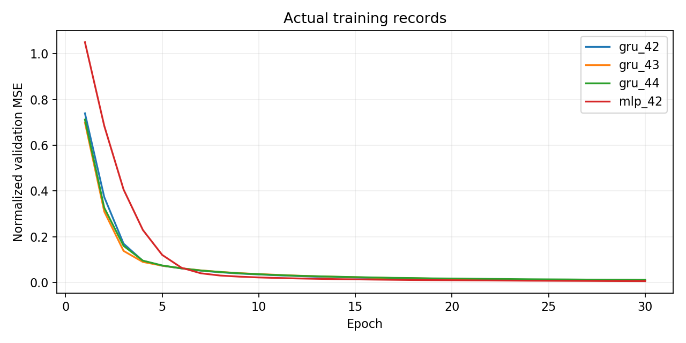
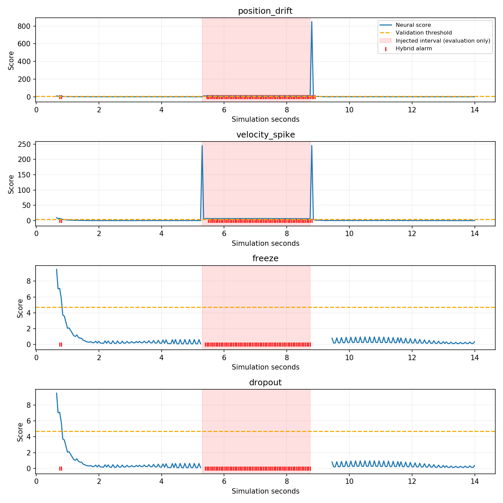
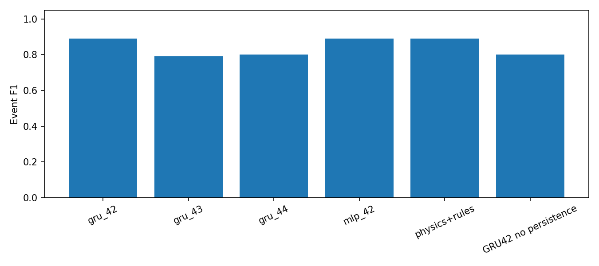
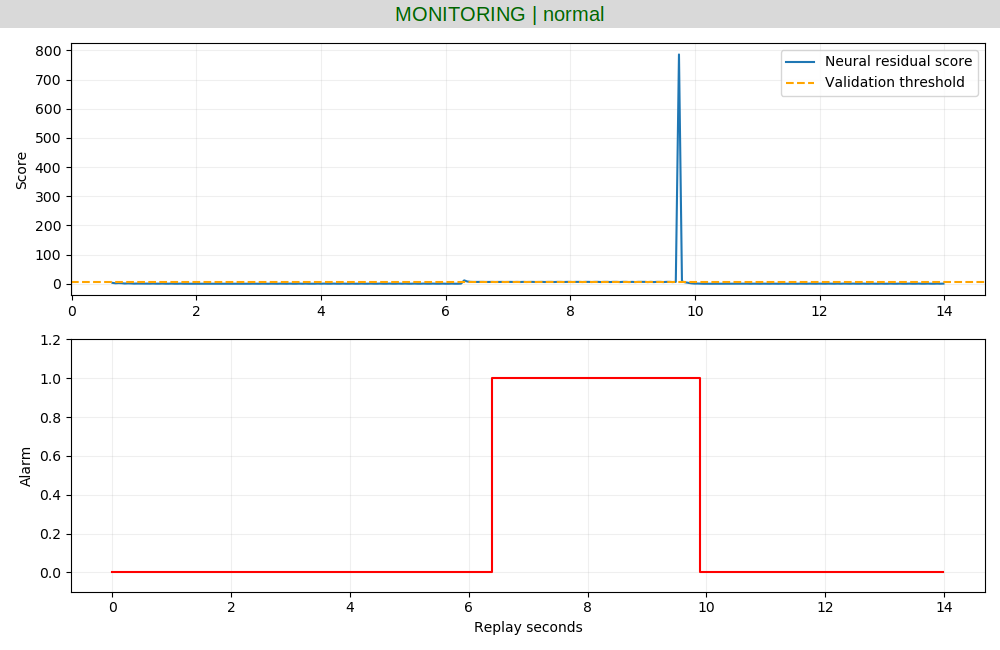

# 第一版实验记录（已由一致性网络改进）

以下是历史记录，不代表当前部署模型。结果文件位于模块 results 根目录及 results/holdout；最新结果见 results/final。

# 无人机遥测异常检测与 ROS2 在线诊断

状态：已完成首轮神经网络训练、离线测试、ROS2 漂移/丢包回放与桌面看板验证。扩展原有
OpenHUTB 无人机状态预测项目，研究遥测可靠性，不执行导航或避障。

复用实际 AirSim 飞行数据，观测层软件注入位置漂移、速度突跳、冻结和丢包。
这些异常不代表真实 GPS/IMU 或电机硬件故障。原始记录不修改。

## 数据协议

先继承原数据按回合划分的 20/5/5 训练/验证/测试集合，再注入异常。
训练集仅正常；验证、测试各含正常和四类异常。测试漂移/突跳幅度与验证不同。
所有同源变体留在同一集合，模型归一化只拟合训练集。

`observations.csv` 是检测器唯一输入；`evaluation_only.csv` 中的标签和原始参考状态
只能用于离线评估，禁止输入模型。时间戳用整数纳秒保存。
丢包采用 delivered=0 的调度记录；ROS 发布端应跳过该记录，检测端用独立定时器判超时。
冻结重复原始数据及源时间戳。回放到达时间使用仿真时钟，并不冒充真实网络延迟采样。

准备数据：
```text
python telemetry_data.py --source ../state_prediction/data --output data/prepared
python -m unittest discover -s tests -v
```

## 已运行的原型与复现

Ubuntu 20.04.6 / 现有 ROS2 Humble / Python 3.8 / PyTorch 2.4.1+cpu。
使用原项目虚拟环境 `~/uav_prediction_env`。不需要新增大型仿真环境。

```bash
source ~/uav_prediction_env/bin/activate
python train_evaluate.py --seed 42 --output models/gru_42
python train_evaluate.py --seed 43 --output models/gru_43
python train_evaluate.py --seed 44 --output models/gru_44
python train_evaluate.py --variant mlp --output models/mlp_42
python report.py
bash main.sh test
bash main.sh build
bash main.sh demo
```

训练仅使用正常数据。网络从历史 12 帧的位移速度、速度、加速度预测下一帧位置/速度增量。
源时间严格递增才更新模型。残差尺度和 99.5% 分位阈值使用正常验证数据确定，连续 3 次异常触发。
固定种子 42 用于首轮演示，并非依据测试集选择最佳模型。

| 模型 | 事件 Precision | Recall | F1 | 正常时间误报/分钟 |
|---|---:|---:|---:|---:|
| GRU seed42 + 时间戳规则 | 0.800 | 1.000 | 0.889 | 1.067 |
| GRU seed43 + 时间戳规则 | 0.739 | 0.850 | 0.791 | 1.280 |
| GRU seed44 + 时间戳规则 | 0.720 | 0.900 | 0.800 | 1.494 |
| MLP seed42 + 时间戳规则 | 0.800 | 1.000 | 0.889 | 1.067 |
| 物理增量残差 + 时间戳规则 | 0.800 | 1.000 | 0.889 | 1.067 |

本实验尚未证明 GRU 优于物理规则。seed42 检出事件平均延迟 0.262 秒，物理基线为 0.112 秒。
冻结/丢包主要由新鲜度规则发现，不能归功于神经网络。
每个异常场景有一次事件，共 20 个测试事件；正常时段报警起点计为假阳性。
检测延迟只对检出事件计算，漏检单独报告。各变体重复使用正常前后缀，
故这些指标是场景加权的原型结果，并非 25 次独立飞行统计。
位置漂移在注入结束时恢复参考值，可能产生恢复瞬态；未来应补充平滑恢复与持续漂移测试。





ROS2 话题：`/uav/telemetry`、`/uav/anomaly_score`、`/diagnostics`。
`python check_ros.py` 订阅真实话题并保存检查记录、曲线；需在另一终端先启动，然后启动 demo。
`results/drift/` 保存漂移回放实际话题记录：281 条状态、评分及诊断，70 条报警。
丢包回放跳过数据发布，接收端 0.15 秒无数据后由定时器检测，因此在线丢包延迟与离线调度步实验不同。
实际丢包回放收到 211 条遥测、279 条评分/诊断，66 条报警；数量受定时器调度影响。
连续执行 demo 已验证退出清理，避免残留诊断进程重复发布。

在 Ubuntu 桌面另开终端，进入项目并加载 ROS 和虚拟环境后运行：
```bash
source /opt/ros/humble/setup.bash
source ~/uav_prediction_env/bin/activate
python dashboard.py
```
然后在原终端运行 `bash main.sh demo`。下图仅截取实际看板窗口，不包含桌面敏感信息：



## 尚需完成的课程增强与验收

1. 补采不同速度和不规则机动，检查正常转弯误报及异常强度泛化；旧测试已查看，后续新增实验应使用新的最终留出集。
2. 增加更轻微异常、仅规则对照以及多个强度分层结果，避免只测试易检出的人工异常。
3. 增加新一轮现场仿真接入；当前使用真实 AirSim 历史数据回放，图形窗口已实际验证。
4. 整理上游文档/架构图、独立复测和提交材料。当前尚未新建或修改上游 PR。

当前数据是单场景短轨迹，只能用于原型验证，不能声明实机泛化。
