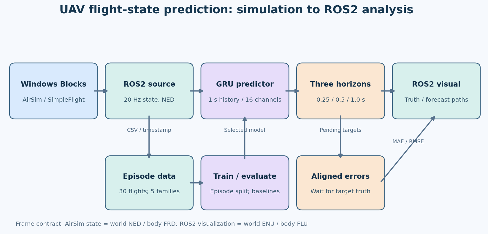
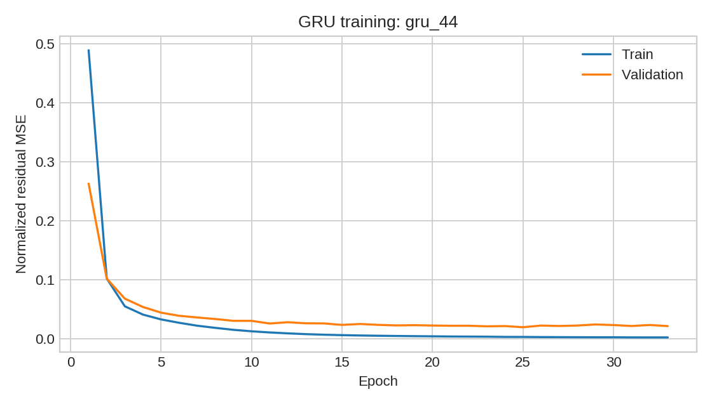
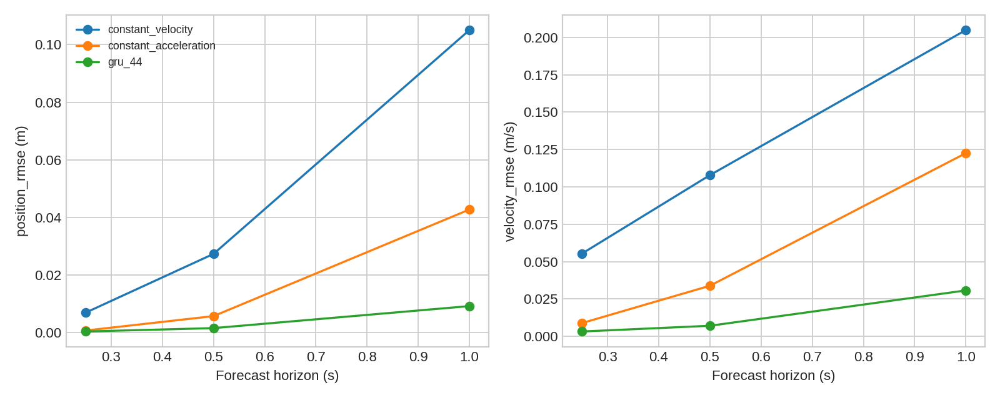
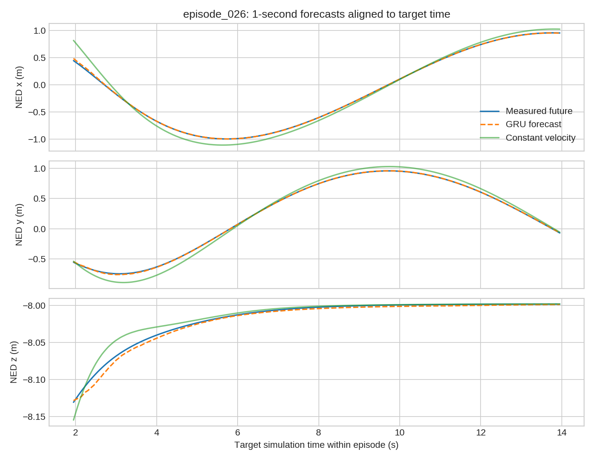

# 基于 GRU 的无人机多时域飞行状态预测与 ROS2 在线误差分析

在 OpenHUTB/ros2 现有 [AirSim 无人机 ROS 桥接示例](https://github.com/OpenHUTB/ros2/tree/master/src/air/air_teleop) 的连接方式和话题解耦思想上扩展。原示例使用 ROS1 `rospy`、相机和速度指令；本模块使用 ROS2 `rclpy`、飞行状态、神经网络预测及未来时刻真实值对齐评估。任务是 **预测**，不执行避障或 PPO 导航。

已在 Windows 11 宿主机 + VMware Ubuntu 20.04.6 + ROS2 Humble + Windows Blocks/AirSim 1.8.1 实际运行。该 Humble/20.04 虚拟机是现有环境，ROS2 节点可运行，但其 RViz2 缺少 Ogre 1.12 图形库；本机使用包内 `topic_plot` 从 ROS2 话题实时绘图。保留 `rviz/prediction.rviz` 供图形依赖完整的 ROS2 环境使用。未因 RViz 故障更换或重装整个虚拟机。

## 功能及文件

| 阶段 | 入口 | 输出 |
|---|---|---|
| 仿真采集 | `python main.py collect` | `data/raw/episode_*.csv/.json` |
| 数据集 | `python main.py prepare` | `data/processed/*.npz`、`manifest.json` |
| 神经网络 | `python main.py train` | `models/<variant>_<seed>/model.pt`、loss CSV |
| 独立测试 | `python main.py evaluate` | `results/metrics.csv`、曲线、消融 |
| ROS2 | `python main.py build`，`./main.sh demo` 或 `./main.sh live` | `/uav/state`、预测路径、误差和可视化 |

`main.py` 为统一入口。`demo` 使用仓库内少量真实仿真数据 `data/sample/episode_026.csv` 回放，能展示完整的 **状态发布 → ROS2 → GRU → 预测发布 → 未来真实值到达 → 误差发布 → 绘图** 流程；`live` 直接从 Windows AirSim RPC 取状态。`collect` 才会控制仿真无人机；演示和实时状态桥接本身不下发飞控指令。

## 环境与复现

1. 在 Windows 运行 Blocks/AirSim，设置 `SimMode=Multirotor`、`VehicleType=SimpleFlight`、`ApiServerPort=41451`。虚拟机 NAT 时，把 `LocalHostIp` 设为 Windows VMware NAT 网卡 IP；本机是 `192.168.239.1`，不能在其他电脑照抄。`settings.json` 示例见项目交付目录中的 `airsim_settings.json`，或在 Windows 的 AirSim 用户设置中写入对应配置。
2. Ubuntu 中已有 ROS2 Humble、Python 3.8 和 `colcon`。建立环境：`python3 -m venv --system-site-packages ~/uav_prediction_env`。在该环境中**先**安装 `numpy==1.24.4`、`msgpack-rpc-python==0.4.1`，再安装 `airsim==1.8.1`；AirSim 的旧版安装脚本要求先有 `msgpackrpc`。安装 `matplotlib==3.7.5` 和来自 [PyTorch 官方 CPU 索引](https://pytorch.org/get-started/previous-versions/)的 `torch==2.4.1`。已运行的精确环境记录在 `artifacts/environment_freeze.txt`。不需要下载 CUDA 包。
3. 把整个模块放在上游仓库的 `src/air/uav_state_prediction/`，进入该目录。执行 `./main.sh build`，然后执行 `./main.sh demo`。若克隆代码后 `main.sh` 无执行位，用 `bash main.sh build` 和 `bash main.sh demo`。在有完整 Ogre 库的机器可用 `./main.sh demo --rviz` 打开 RViz。
4. 要重新采集，先在仿真窗口确认无人机已落地，执行 `./main.sh collect --host <Windows-VMware-NAT-IP>`；采集完成后依次执行 `./main.sh prepare`、`./main.sh train`、`./main.sh evaluate`。采集约需数分钟，默认 30 个回合，每回合 14 秒。训练和测试完成后再次构建包并演示。

当前虚拟机完整项目在 `/home/user/uav_state_prediction`，已用 `colcon build` 成功构建。Windows 交付目录有相同源代码、完整采集数据和结果。本机约 8.3 GiB 虚拟机内存，可用 CPU 训练，无需配置 GPU 透传。

## 数据定义与方法

每回合包含 `timestamp_ns`、位置 `px/py/pz`、线速度 `vx/vy/vz`、加速度 `ax/ay/az`、四元数 `qw/qx/qy/qz`、角速度 `wx/wy/wz`、本次命令速度、碰撞标志和采集时钟。位置、线速度和线加速度使用 AirSim 世界 **NED** 坐标系（米、米/秒、米/秒²）；姿态是机体 **FRD** 到世界 NED 的四元数；角速度为机体 FRD。ROS2 绘图时转换为 **ENU**，并在 `Odometry` 中给出匹配的姿态与机体系速度。训练输入没有未来控制指令。

飞行轨迹有直线往返、圆形、8 字、升降、平滑停走五类；振幅、频率和相位按记录的种子变化。每类 6 次，共 30 个独立回合、8,430 条真实 AirSim 状态。采集时检查时间戳单调、碰撞和安全范围；所有回合碰撞数为 0。采样中位间隔约 0.051 秒；数据处理用真实仿真时间戳插值到 20 Hz，最大间隔超过 0.15 秒则拒绝回合。四元数先做符号连续化，再插值和归一化。

先按**完整回合**划分训练/验证/测试：各类分别为 4/1/1 回合，即 20/5/5 回合。再从每个回合生成过去 20 帧（约 1 秒）输入、未来 0.25/0.5/1.0 秒位置与速度标签。最终窗口数为 4,820 / 1,205 / 1,205。窗口不跨回合。标准化参数仅从训练窗口拟合，验证集用于提前停止及从 3 个随机种子中选部署模型；测试集不用于模型选择。随机种子为 42/43/44。

模型是 1 层、48 隐单元 GRU，预测相对于**恒速模型**的残差；损失是归一化残差 MSE，Adam，学习率 0.002，批量 128，最多 45 轮，验证损失连续 8 轮无改善即停止。两个物理基线分别是假定恒速、恒加速度。消融：`no_acc_att` 去掉加速度、姿态和角速度，只用位置与速度历史；`mlp` 只使用当前帧完整状态。部署模型 `gru_44` 由验证损失最小原则选出。

## 真实实验结果

独立测试集共 5 回合、1,205 个**重叠**预测窗口。下表 RMSE/MAE 是 XYZ 三轴、所有窗口的平均，位置单位米，速度单位米/秒；逐回合结果和向量范数 RMSE 在 `results/episode_metrics.csv`、`results/metrics.csv`。重叠窗口不是独立样本，不能把 1,205 当作独立飞行次数。

| 模型 | 时域 | 位置 MAE | 位置 RMSE | 速度 MAE | 速度 RMSE |
|---|---:|---:|---:|---:|---:|
| 恒速 | 0.25 s | 0.004302 | 0.006983 | 0.034224 | 0.055405 |
| 恒速 | 0.5 s | 0.016950 | 0.027381 | 0.066956 | 0.107859 |
| 恒速 | 1.0 s | 0.065469 | 0.105059 | 0.127754 | 0.204840 |
| 恒加速度 | 0.25 s | 0.000416 | 0.000781 | 0.004648 | 0.008948 |
| 恒加速度 | 0.5 s | 0.002950 | 0.005787 | 0.016972 | 0.033891 |
| 恒加速度 | 1.0 s | 0.021354 | 0.042784 | 0.061036 | 0.122541 |
| GRU `gru_44` | 0.25 s | 0.000287 | 0.000444 | 0.002145 | 0.003305 |
| GRU `gru_44` | 0.5 s | 0.001026 | 0.001624 | 0.004304 | 0.007145 |
| GRU `gru_44` | 1.0 s | 0.005363 | 0.009265 | 0.016877 | 0.030767 |

1 秒位置 RMSE 的三种子平均±标准差：完整 GRU **0.00899±0.00030 m**；去加速度/姿态/角速度 **0.04709±0.00453 m**；单帧 MLP **0.01203±0.00035 m**。这说明本任务中惯性与姿态信息、历史序列都提供了增益；在当前简单轨迹中，单帧 MLP 仍然表现较好，不能推广到任意动态任务。

模型在同一 Blocks 场景、规则小范围轨迹与同一 SimpleFlight 控制器上训练和测试。未评估强风、碰撞、随机遥控、不同地图和真实无人机；数毫米误差只在本实验条件下成立。若未来控制动作不可知，复杂机动的 1 秒预测通常会更难。`data/raw`、数据清单、种子、全部训练检查点和环境记录随完整课程交付保存；提交上游时遵循仓库对二进制与大数据的限制，仅建议提交小样例和选定模型，完整数据另行提供。

## ROS2 话题与验证

`/uav/state`：含 `schema_version`、整数纳秒时间戳、16 维 NED/FRD 状态的 JSON `std_msgs/String`；`/uav/odometry`：已转换为 ENU/FLU 的标准 `nav_msgs/Odometry`；`/uav/truth_path` 和 `/uav/predicted_path`：ENU `nav_msgs/Path`；`/uav/prediction_markers`：未来位置与指标；`/uav/forecast`：3 个时域预测值和推理耗时；`/uav/errors`：真实值到达时发布的累计 MAE/RMSE。保留 JSON 原始时间戳是为了不丢纳秒精度；演示用的回放文件与该话题遵循同一数据结构。

在线节点保存待评估预测，每个目标时间 `t+0.25/0.5/1.0 s` 到达后，在相邻真实状态间插值并计算误差。回放实测 281 条状态、83 次预测、236 条对齐误差，三个时域都有有效匹配；CPU 推理耗时中位数约 1.05 ms。`results/replay_flow_check.json` 是机器检查记录，`ros2_window.png` 是真实 Ubuntu 窗口截图。`results/online_errors.jsonl` 可保存逐次误差，运行生成，不作为固定离线测试结果。

## 仓库提交说明

将本目录放入 `src/air/uav_state_prediction/`，将配套 `docs/air/uav_state_prediction.md` 加到 `mkdocs.yml` 空域载具导航和 `docs/index.md` 首页。按上游约定验证 `mkdocs serve --livereload`，提交前检查大文件与截图尺寸；上游要求另一台机器由其他人测试并同意才可合并。`data/raw`、`data/processed` 和所有实验检查点默认由 `.gitignore` 排除；选定小模型及样例数据可提交。维护者：zijuan xiao（2535030075@stu.hutb.edu.cn）。

本项目部分设计、代码与文档使用 OpenAI Codex 辅助生成与检查；测试数据、曲线和截图均来自本机实际运行。提交者需审核代码并对提交内容负责。
