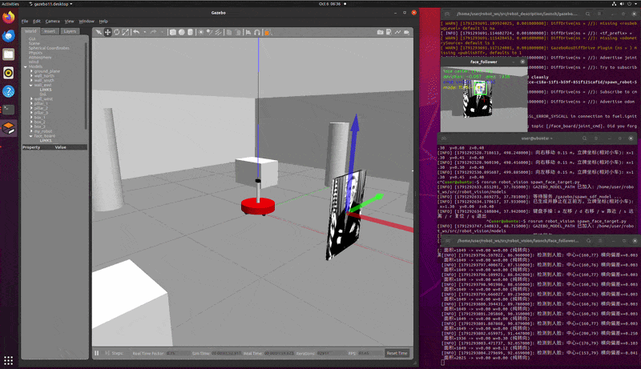
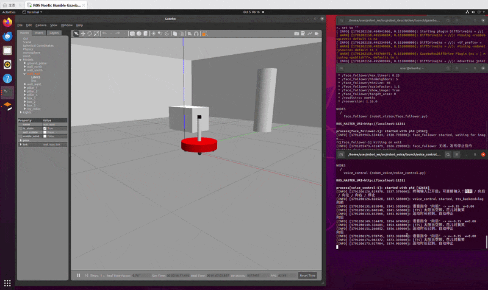

# 第五章：ROS + OpenCV 视觉追踪与语音控制

本章在第四章两轮差速小车（mbot）底盘之上，实现两大部分实验：

1. **视觉追踪**（`robot_vision`）：通过 OpenCV 人脸检测识别顶置 Kinect 相机采集到的图像，
   计算人脸中心偏离图像中心的横向偏差与人脸面积，使用比例控制器（P 控制）发布
   `/cmd_vel` 速度指令，使小车自动转向面朝目标并保持距离跟随。
2. **语音控制**（`robot_voice`）：接收“向前 / 向后 / 向左 / 向右 / 停止”等语音命令，
   发布对应的 `/cmd_vel` 运动指令，并通过语音合成（TTS）播报反馈文本
   （如“太阳当空照，花儿对我笑”）。

> 环境说明：本章为 ROS1（Melodic / Noetic）功能包，依赖 `rospy`、`cv_bridge`、
> `sensor_msgs`、`geometry_msgs`、`std_msgs` 等；语音部分同时兼容**离线无声卡的虚拟机**
> 与**真实讯飞语音 SDK** 接入。

---

## 目录结构

```
src/chap5/
├── README.md
├── robot_vision/                     # 第一部分：视觉识别与控制
│   ├── CMakeLists.txt
│   ├── package.xml
│   ├── launch/
│   │   ├── face_follower.launch      # 人脸追踪（P 控制）启动文件
│   │   ├── mbot_intelligence.launch  # 一键拉起视觉 + 语音
│   │   ├── face_detector.launch      # 人脸检测（仅画框演示）
│   │   ├── usb_cam.launch            # USB 相机驱动
│   │   └── freenect.launch           # Kinect (freenect) 驱动
│   ├── scripts/
│   │   ├── face_follower.py          # ★ 人脸追踪 + P 控制 + /cmd_vel
│   │   ├── face_detector.py          # 人脸检测（画框发布图像）
│   │   ├── motion_detector.py        # 运动检测
│   │   └── cv_bridge_test.py         # cv_bridge 用法示例
│   ├── data/haar_detectors/          # Haar 级联分类器
│   └── config/                       # rviz 配置
└── robot_voice/                      # 第二部分：语音识别与输出
    ├── CMakeLists.txt
    ├── package.xml
    ├── launch/
    │   └── voice_control.launch      # 语音控制启动文件
    ├── scripts/
    │   └── voice_control.py          # ★ 语音命令 -> /cmd_vel + TTS 反馈
    ├── src/                          # 讯飞 SDK C++ 节点（真实 SDK 接入）
    │   ├── iat_publish.cpp           # 语音识别（发布 voiceWords）
    │   ├── tts_subscribe.cpp         # 语音合成（订阅 voiceWords）
    │   └── voice_assistant.cpp       # 语音助手整合
    ├── include/robot_voice/          # 讯飞 SDK 头文件
    └── libs/                         # 讯飞 SDK 动态库 libmsc.so
```

---

## 第一部分：视觉追踪 `face_follower`

**演示效果**：



### 节点逻辑

1. 订阅相机 RGB 图像（`input_rgb_image`，launch 中重映射为 `/camera/rgb/image_raw`），
   通过 `cv_bridge` 转换为 OpenCV 的 BGR 格式。
2. 灰度化 + 直方图均衡后，使用 Haar 级联分类器
   `haarcascade_frontalface_default.xml` 检测人脸（正面失败时可用侧面分类器兜底）。
3. 计算人脸中心 `(cx, cy)` 与图像中心的**横向偏差**及**人脸面积**。
4. 比例控制：
   - 角速度 `w = kp_angular * err_x`（人脸偏右 → 右转），带死区与限幅（±0.5 rad/s）；
   - 线速度默认关闭（`only_turn=true` 纯原地转向）；设为 `false` 后按
     `v = kp_linear * (target_area - area) / target_area`（面积过小/太远 → 前进）保持距离，
     并叠加防贴脸死区（过近时停止/倒退）。
5. 发布 `geometry_msgs/Twist` 到 `/cmd_vel`，同时弹出 OpenCV 调试窗口，
   标注人脸框、图像中心、人脸中心与偏差/面积/速度等信息。

### 话题接口

| 方向 | 话题 | 类型 | 说明 |
| ---- | ---- | ---- | ---- |
| 订阅 | `input_rgb_image`（→ `/camera/rgb/image_raw`） | `sensor_msgs/Image` | 相机 RGB 图像 |
| 发布 | `/cmd_vel` | `geometry_msgs/Twist` | 差速底盘速度指令 |
| 发布 | `~image_out` | `sensor_msgs/Image` | 标注后的图像 |

### 关键参数（launch 可配）

| 参数 | 默认值 | 说明 |
| ---- | ------ | ---- |
| `kp_angular` | 1.2 | 横向偏差 → 角速度比例系数 |
| `kp_linear` | 0.6 | 面积偏差 → 线速度比例系数 |
| `max_linear` / `max_angular` | 0.25 / 0.5 | 速度限幅 |
| `target_area` | 0（自动） | 目标人脸面积（像素），0 表示取图像面积的 1/16 |
| `dead_zone` | 0.05 | 横向偏差死区（归一化） |
| `only_turn` | true | 纯原地转向模式（线速度恒 0）；`false` 启用距离保持 + 防贴脸死区 |
| `cascade_frontal` | OpenCV 默认 | 正面人脸分类器路径 |

---

## 第二部分：语音控制 `voice_control`

**演示效果**：



### 节点逻辑

1. 通过 `/voice_cmd` 话题（`std_msgs/String`）或**交互式终端**接收命令。
2. 将命令映射为差速底盘速度：`向前/向后 → 线速度`，`向左/向右 → 角速度`，`停止 → 零速`。
3. 发布 `geometry_msgs/Twist` 到 `/cmd_vel`（10Hz 持续发布，`move_duration` 后自动停止）。
4. 收到命令后触发 TTS 反馈，默认播报“太阳当空照，花儿对我笑”。

### 命令映射

| 语音命令 | 等价英文 | 动作 |
| -------- | -------- | ---- |
| 向前 / 前进 | forward | `linear.x = +linear_speed` |
| 向后 / 后退 | backward | `linear.x = -linear_speed` |
| 向左 / 左转 | left | `angular.z = +angular_speed` |
| 向右 / 右转 | right | `angular.z = -angular_speed` |
| 停止 / 停下 / 停 | stop | 全零（立即停车） |

### 话题接口

| 方向 | 话题 | 类型 | 说明 |
| ---- | ---- | ---- | ---- |
| 订阅 | `voice_cmd`（→ `/voice_cmd`） | `std_msgs/String` | 语音命令文本 |
| 发布 | `/cmd_vel` | `geometry_msgs/Twist` | 差速底盘速度指令 |
| 发布 | `~tts_topic`（→ `/voice_tts`） | `std_msgs/String` | 待合成的反馈文本 |

### TTS 兼容策略（`tts_backend` 参数）

| 取值 | 说明 |
| ---- | ---- |
| `log`（默认） | 离线/无声卡环境：日志输出 + 发布到 `~tts_topic` |
| `espeak` / `festival` | Linux 命令行语音合成（需自行安装） |
| `say` | macOS 自带语音合成 |
| `sdk` | 交由讯飞 SDK 节点 `tts_subscribe.cpp` 订阅 `~tts_topic` 播报 |

`voice_control.py` 始终把反馈文本发布到 `~tts_topic`，因此无论使用哪种后端，
都能把文本交给下游真实 SDK 节点（把 `tts_topic` 重映射为 `voiceWords` 即可对接
`tts_subscribe.cpp`）。

---

## 运行与测试指南

### 0. 编译

```bash
cd ~/catkin_ws        # 或你的工作空间
catkin_make
source devel/setup.bash
```

### 1. 启动底盘与相机

**Gazebo 仿真（推荐，用于视觉追踪演示）**：启动带 Kinect 的 mbot 仿真环境
（Kinect RGB 话题为 `/kinect/rgb/image_raw`）：

```bash
roslaunch mbot_gazebo view_mbot_with_kinect_gazebo.launch
```

**真实相机（freenect / usb_cam）**：

```bash
# Kinect（freenect）：RGB 话题为 /camera/rgb/image_raw
roslaunch robot_vision freenect.launch

# 或 USB 相机：RGB 话题为 /usb_cam/image_raw
roslaunch robot_vision usb_cam.launch
```

### 2. 视觉追踪（第一部分）

**Gazebo 仿真人脸目标**：先在小车前方生成一个人脸立牌，再启动追踪：

```bash
# 生成人脸立牌（默认静止在 x=1.3 y=0.0 z=0.4 正前方；
# 键盘手操：a 左移 / d 右移 / w 靠近 / s 远离 / r 复位 / q 退出）
roslaunch robot_vision spawn_face_target.launch

# 启动人脸追踪（Gazebo Kinect 话题为 /kinect/rgb/image_raw）
roslaunch robot_vision face_follower.launch cam_image_topic:=/kinect/rgb/image_raw
```

立牌是一个标准 Gazebo 模型（`models/face_board/`，含 `model.config`/`model.sdf`/OGRE 材质
脚本 + 高对比度人脸纹理），spawn 脚本会自动把模型目录加入 `GAZEBO_MODEL_PATH` 并改用
`file://` 绝对路径，保证纹理 100% 渲染。

**真实相机**：

```bash
# 默认订阅 /camera/rgb/image_raw（freenect Kinect）
roslaunch robot_vision face_follower.launch

# 或 USB 相机
roslaunch robot_vision face_follower.launch cam_image_topic:=/usb_cam/image_raw
```

验证：让人脸出现在相机前，小车应自动转向面朝人脸并保持距离；
弹出的窗口会显示人脸框、中心坐标与速度指令。

### 3. 语音控制（第二部分）

```bash
roslaunch robot_voice voice_control.launch
```

三种触发方式任选：

```bash
# (a) 交互式终端：直接在终端输入命令
向前
停止

# (b) 话题发布
rostopic pub /voice_cmd std_msgs/String "data: '向前'"
rostopic pub /voice_cmd std_msgs/String "data: '停止'"

# (c) 真实语音识别 SDK：将 iat_publish 的识别结果接入 /voice_cmd
rosrun robot_voice iat_publish
# （识别结果经 voiceWords 重映射到 /voice_cmd 即可）
```

### 4. 一键拉起（演示）

```bash
roslaunch robot_vision mbot_intelligence.launch
```

> ⚠️ 视觉与语音节点都发布 `/cmd_vel`，**实际运行请二选一**，
> 避免速度指令互相冲突；一键启动仅用于验证两个节点均可正常拉起。

---

## 常见问题

- **报错 `cv2.data` 不存在 / 找不到默认分类器**：较老 OpenCV 无 `cv2.data`，`face_follower.py`
  已做多路径容错（launch 指定 → 包内自带 `data/haar_detectors/` → 系统
  `/usr/share/opencv4|opencv/haarcascades` → `cv2.data`），会自动回退到包内的
  `haarcascade_frontalface_alt.xml`，无需手动改 launch。
- **虚拟机无声卡、`espeak` 未安装**：保持 `tts_backend=log`，反馈文本仅以日志输出，
  同时发布到 `/voice_tts`，可被下游真实 SDK 节点消费。
- **`catkin_make` 编译 `robot_voice` 的讯飞 C++ 节点报错 / 无 SDK**：这些 C++ 节点已改为
  **可选编译**（`option(ROBOT_VOICE_BUILD_SDK)`，默认 `ON` 且自动检测）。找不到 `libmsc.so`
  或 `libasound` 时会自动跳过对应节点并告警，不影响纯 Python 节点 `voice_control.py`。
  也可强制关闭：`catkin_make -DROBOT_VOICE_BUILD_SDK=OFF`。
- **人脸检测不稳定**：调整 `scaleFactor`、`minNeighbors`、`minSize`，或改善光照、
  正对相机。
