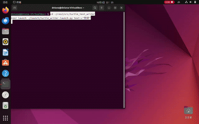

# turtle_text_writer（小海龟写字机）

一个 ROS2 示例模块：输入一段文字（中英文均可），控制 turtlesim 小海龟把它书写出来。

## 环境要求

- Ubuntu 22.04 + ROS2 Humble
- 依赖包：
  - `ros-humble-turtlesim`（Humble 自带）
  - `python3-pil`、`fonts-noto-cjk`：`sudo apt install -y python3-pil fonts-noto-cjk`

## 目录结构

```
turtle_text_writer/
├── main.py                      # 主程序入口（书写逻辑）
├── launch/
│   └── turtle_writer.launch.py  # 一键启动文件
├── demo.gif                     # 运行效果演示
└── README.md                    # 本说明
```

## 运行方法

方法一：一键启动（推荐）
```
cd src/turtle_text_writer
ros2 launch ./launch/turtle_writer.launch.py
```
默认书写 "HUTB"，可指定文字：
```
ros2 launch ./launch/turtle_writer.launch.py text:="你好"
```

方法二：直接运行主程序（需要 turtlesim 已在运行）
```
source /opt/ros/humble/setup.bash
python3 main.py --text "HELLO"
```

## 原理说明

1. 用 Pillow 把文字渲染成位图；
2. 提取笔画轮廓（空心描边），横竖双向扫描成线段；
3. 海龟通过 `teleport_absolute` 和 `set_pen` 服务逐段画线，形成文字笔迹。

## 效果演示


